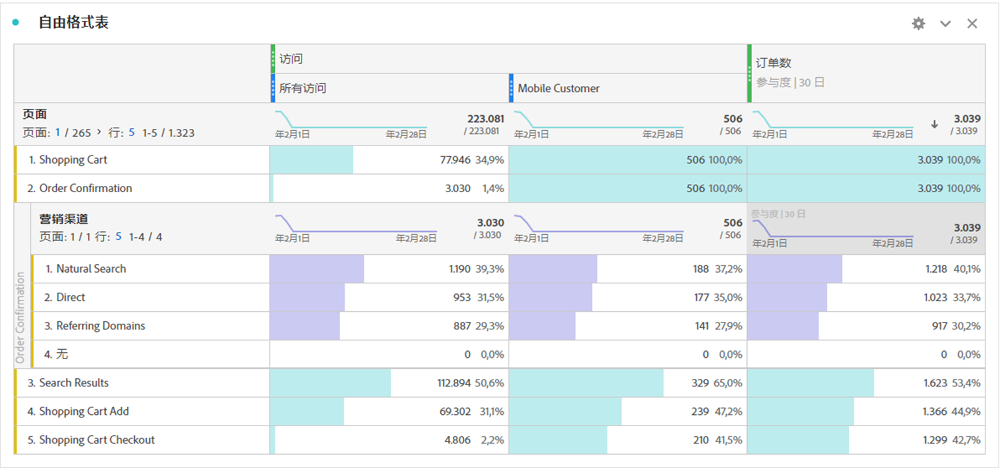

# 自由格式表 {#freeform-table-overview}

<!-- markdownlint-disable MD034 -->

>[!CONTEXTUALHELP]
>id="workspace_freeformtable_button"
>title="自由格式表"
>abstract="创建一个您可以使用维度、区段、量度和日期范围来生成的空的自由格式表可视化图表。您可以使用自由格式表作为其他可视化图表的基础。"

<!-- markdownlint-enable MD034 -->

>[!BEGINSHADEBOX]

_本文记录了_  _**Adobe Analytics** 中的自由格式表可视化图表。_ _请参阅[自由格式表](https://experienceleague.adobe.com/zh-hans/docs/analytics-platform/using/cja-workspace/visualizations/freeform-table/freeform-table)以获取本文的_  _**Customer Journey Analytics** 版本。_

>[!ENDSHADEBOX]

在 Analysis Workspace 中，**[!UICONTROL 自由格式表]**&#x200B;可视化视图是进行交互式数据分析的基础。可以将[组件](/help/analyze/analysis-workspace/components/analysis-workspace-components.md)组合拖放到行和列中，以创建自定义表格供您分析。在拖放每个组件后，表都会立即更新，以便您能够快速分析和深入探索。

要创建并配置[!UICONTROL 自由格式表]：

* 添加**[!UICONTROL 自由格式表]**&#x200B;可视化图表。请参阅[将可视化图表添加到面板](../freeform-analysis-visualizations.md#add-visualizations-to-a-panel)。

## 自动化表

生成表最快捷的方法便是将组件直接拖到空白项目、面板或自由格式表中。以建议的格式为您生成自由格式表。[观看教程](https://experienceleague.adobe.com/zh-hans/docs/analytics-learn/tutorials/analysis-workspace/building-freeform-tables/auto-build-freeform-tables-in-analysis-workspace)。

## 自由格式表生成器

如果您希望先向表中添加多个组件，然后再渲染数据，可以选择&#x200B;**[!UICONTROL 启用表生成器]**。启用该生成器后，您可以通过拖放维度、细分、量度和过滤器来生成可解答更复杂业务问题的表。选择&#x200B;**[!UICONTROL 生成]**&#x200B;后数据会更新。

## 交互

您可以通过各种方式与自由格式表进行交互并进行自定义设置：

### 过滤和排序

* 您可以[过滤和排序](filter-and-sort.md)表中的数据。

### 行

* 您可以使用  在一行或多行中快速[创建新的可视化图表](../freeform-analysis-visualizations.md#visualize)。
* 您可以通过调整项目的[视图密度](/help/analyze/analysis-workspace/build-workspace-project/view-density.md)，将更多行放入单个屏幕中。
* 在执行分页之前，每个维度行最多可显示 400 行。在第一列标题中选择&#x200B;**[!UICONTROL 行]**&#x200B;旁边的数字，以在页面上显示更多行。使用第一列标题中的  导航到其他页面。
* 您可以按其他组件划分行。要同时划分多行，请选择多行，然后将下一个组件拖到选定行顶部即可。了解有关[划分](/help/analyze/analysis-workspace/components/dimensions/t-breakdown-fa.md)的更多信息。
* 可以[过滤](/help/analyze/analysis-workspace/visualizations/freeform-table/filter-and-sort.md)行，以显示缩减的项目集。在[行设置](/help/analyze/analysis-workspace/visualizations/freeform-table/column-row-settings/table-settings.md)下，提供了其他设置。

### 列

* 可以将组件堆放在列中，以创建过滤量度、跨标签分析等。
* 可以在[列设置](/help/analyze/analysis-workspace/visualizations/freeform-table/column-row-settings/column-settings.md)下调整每列的视图。
* 可通过[上下文菜单](/help/analyze/analysis-workspace/visualizations/freeform-analysis-visualizations.md#context-menu)执行多个操作。根据您选择表标题、行或列的情况，菜单可提供不同的操作。

## 设置

选择以显示&#x200B;**[!UICONTROL 表设置]**。可以使用以下特定可视化图表[设置](../freeform-analysis-visualizations.md#settings)：

### 数据源

| 选项 | 描述 |
|---|---|
| **[!UICONTROL 链接的可视化图表]**。 | 列出所有链接的可视化图表。 |
| **[!UICONTROL 显示数据源]** | 取消选中时，作为可视化图表数据源的自由格式表会隐藏在 Workspace 中。 |

### 设置

| 选项 | 描述 |
|---|---|
| **[!UICONTROL 将每列的日期调整为全部从同一行开始]** | 将每列的日期调整为全部从同一行开始或不做调整。 |

## 上下文菜单

可视化图表标题中提供了以下[上下文菜单](../freeform-analysis-visualizations.md#context-menu)选项：

| 选项 | 描述 |
| --- | --- |
| **[!UICONTROL 插入复制的可视化图表]**n | 将复制的可视化图表粘贴（插入）到项目中的其他位置或完全不同的项目中。 |
| **[!UICONTROL 将数据复制到剪贴板]** | 将可视化图表中的数据复制到剪贴板上。 |
| **[!UICONTROL 将选择复制到剪贴板]** | 将可视化图表中的选择复制到剪贴板上。 |
| **[!UICONTROL 将项目下载为 CSV（*维度名称*）]** | 将可视化图表的维度项（最多 50,000 个）立即下载到本地设备。所选维度最多可有 50,000 个维度项。 |
| **[!UICONTROL 复制可视化图表]** | 复制可视化图表，您可以将其插入到项目中的其他位置或完全不同的项目中。 |
| **[!UICONTROL 下载数据 CSV]** | 将可视化图表显示的数据立即下载到本地设备。 |
| **[!UICONTROL 重复可视化图表]** | 生成一个与可视化图表完全相同的副本。 |
| **[!UICONTROL 编辑描述]** | 添加（或编辑）可视化图表的文本描述。请参阅[文本](../text.md)。 |
| **[!UICONTROL 获取可视化图表链接]** | 将链接直接复制并共享到可视化图表。共享链接对话框会显示该链接。选择“复制”将链接复制到剪贴板。 |
| **[!UICONTROL 从头开始]** | 删除当前可视化图表的设置，以便您从头开始重新配置。 |

## 视频

>[!BEGINSHADEBOX]

请参阅  [自由格式表生成器概述](https://video.tv.adobe.com/v/33276?quality=12&learn=on&captions=chi_hans){target="_blank"}以获取演示视频。

>[!ENDSHADEBOX]

>[!BEGINSHADEBOX]

请参阅  [自由格式表过滤器](https://video.tv.adobe.com/v/327360?quality=12&learn=on&captions=chi_hans){target="_blank"}以获取演示视频。

>[!ENDSHADEBOX]

>[!BEGINSHADEBOX]

请参阅  [自由格式表总计](https://video.tv.adobe.com/v/32733?quality=12&learn=on&captions=chi_hans){target="_blank"}以获取演示视频。

>[!ENDSHADEBOX]

>[!MORELIKETHIS]
>
>[将可视化图表添加到面板](/help/analyze/analysis-workspace/visualizations/freeform-analysis-visualizations.md#add-visualizations-to-a-panel)
>[可视化图表设置](/help/analyze/analysis-workspace/visualizations/freeform-analysis-visualizations.md#settings)
>[可视化图表上下文菜单](/help/analyze/analysis-workspace/visualizations/freeform-analysis-visualizations.md#context-menu)
>

