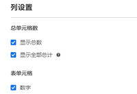
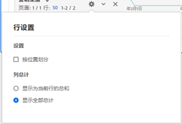

# 工作区总计

在自由格式表中，每个划分级别都显示一个总计行，可以显示两个总计行：

* **[!UICONTROL 显示总计]**（灰色的“共”数字）- 此总计表示已收集的所有点击，有时称为“报表包总计”。当在面板级别或自由格式表中应用区段时，此总计会进行相应的调整以反映符合区段标准的所有点击。
* **[!UICONTROL 表总计]**（黑色数字）- 此总计通常等于[!UICONTROL 总计]或是其子集。它反映自由格式表内应用的任何表筛选器，包括[!UICONTROL 不包含任何内容]选项。

## 显示总计设置 {#display-total}

在&#x200B;**[!UICONTROL 列设置]**&#x200B;下，有&#x200B;**[!UICONTROL 显示总数]**&#x200B;和&#x200B;**[!UICONTROL 显示总计]**&#x200B;选项。如果未选中这些设置，则将从表中删除总计。当总计不合理（例如，在某些[计算量度方案](https://experienceleague.adobe.com/docs/analytics/components/calculated-metrics/calcmetrics-reference/cm-totals.html?lang=zh-Hans)中）时，可能需要此操作。

## 静态行总计设置 {#static-row-total}

[静态行](https://experienceleague.adobe.com/docs/analytics/analyze/analysis-workspace/visualizations/freeform-table/column-row-settings/manual-vs-dynamic-rows.html?lang=zh-Hans)总计的行为方式不尽想同，可采用&#x200B;**[!UICONTROL 行设置]**&#x200B;来进行控制。

* **[!UICONTROL 将当前行的总和显示为总计]** — 此设置将显示表中行的客户端总和，这意味着总计将&#x200B;**不会**&#x200B;消除重复的量度，如访问次数或访客。
* **[!UICONTROL 显示总计]** — 此设置将显示服务器端总和，这意味着总计将消除重复的量度，如访问次数或访客。

## 常见问题解答

| 问题 | 回答 |
|---|---|
| 灰色列百分比基于哪个“总计”？ | 此值取决于&#x200B;**[!UICONTROL 行设置]**&#x200B;下的&#x200B;**[!UICONTROL 百分比]**&#x200B;设置选择：<ul><li>按列计算百分比 — 这是默认设置。百分比将基于表总数。</li><li>按行计算百分比 — 百分比将基于总计。</li></ul> |
| **[!UICONTROL 包括未指定（无）]**&#x200B;设置对总计有何影响？ | 如果未选中&#x200B;**[!UICONTROL 包括未指定（无）]**&#x200B;设置，则将从表、表总计中删除“无”/“未指定”行，并将执行使用[“总计”量度类型](https://experienceleague.adobe.com/docs/analytics/components/calculated-metrics/calcmetric-workflow/m-metric-type-alloc.html?lang=zh-Hans)的任何计算量度 |
| 将自定义表筛选器应用于自由格式表后，我的所有计算量度和条件格式是否都将筛选器考虑在内？ | 当前不是。将计入&#x200B;**[!UICONTROL 包括未指定（无）]**，但自定义表筛选器不会影响以下内容：<ul><li>条件格式使用的列最大/最小范围将分析所有数据。</li><li>利用&#x200B;**[!UICONTROL 总计]**&#x200B;量度类型的计算量度。</li><li>使用函数计算自由格式表中各行的计算量度 — 即，列总和、列最大值、列最小值、计数、平均值、中间值、百分位数、四分位数、行计数、标准偏差、方差、累积、累积平均值、回归变量、T 分数、T 检验、Z 分数、Z 检验。</li></ul> |
| 在计算指标中，**[!UICONTROL 总计]**&#x200B;指标类型反映什么？ | **[!UICONTROL 总计]**&#x200B;仍就是指&#x200B;**[!UICONTROL 总计]**，并未反映应用于表或&#x200B;**[!UICONTROL 表总计]**&#x200B;的筛选器。 |
| 从自由格式表复制和粘贴数据或通过 CSV 下载数据时，显示的总计是多少？ | 总行将仅反映&#x200B;**[!UICONTROL 表总计]**，并遵循列&#x200B;**[!UICONTROL 显示总计]**&#x200B;设置。 |
