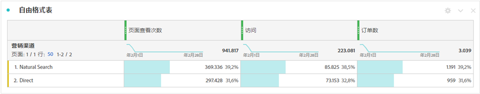

# 总计 {#workspace-totals}

>[!CONTEXTUALHELP]
>id="workspace_freeformtable_grandtotal"
>title="总计"
>abstract="带有统计行的表或细分不支持全部总计。"

在自由格式表中，每个划分级别都显示一个总计行，可以显示两个总计行：

* **[!UICONTROL 表总计]** ➊ — 此总计通常等于[!UICONTROL 总计]或为其子集。 该总计反映的是自由格式表内应用的任何表过滤器，包括[!UICONTROL 不包含任何内容]选项。
* **[!UICONTROL 总计]** （**[!UICONTROL 个，共]**&#x200B;个&#x200B;*数字*） ➋ — 此总计表示已收集的所有事件。 当在面板级别或自由格式表中应用过滤器时，此总计会进行相应的调整以反映符合过滤器的所有事件。

## 显示总计

在  **[!UICONTROL 列设置]**&#x200B;下，有&#x200B;**[!UICONTROL 显示总计]**&#x200B;和&#x200B;**[!UICONTROL 显示全部总计]**&#x200B;的选项。如果这些设置未勾选，总计将从表格中移除，这在总计没有意义的情况下可能是需要的。

[静态行](/help/analyze/analysis-workspace/visualizations/freeform-table/column-row-settings/manual-vs-dynamic-rows.md)总计的行为方式不尽相同，并可使用  **[!UICONTROL 行设置]**&#x200B;来进行控制。

| 选项 | 描述 |
|---|---|
| **[!UICONTROL 将当前行的总和显示为总计]** | 显示表格中所有行的客户端求和结果。此总计&#x200B;**不会**&#x200B;去除会话或人员等重复量度。 |
| **[!UICONTROL 显示全部总计]** | 显示服务器端的总和。此总计会去除会话或人员等重复量度。 |

请参阅[自由格式表中的动态维度项与静态维度项](column-row-settings/manual-vs-dynamic-rows.md)。

## 常见问题解答

| 问题 | 回答 |
|---|---|
| 灰色列百分比基于哪个&#x200B;*总计*？ | 此&#x200B;*总计*&#x200B;取决于&#x200B;**[!UICONTROL 行设置]**&#x200B;下的&#x200B;**[!UICONTROL 百分比]**&#x200B;设置选择：<ul><li>按列计算百分比——这是默认设置。百分比是基于表格的总数得出的。</li><li>按行计算百分比——百分比是基于全部总计得出的。</li></ul> |
| **[!UICONTROL 包括未指定（无）]**&#x200B;设置对总计有何影响？ | 如果未选中包括未指定（无）设置，则将从表、表总计中删除“无”/“未指定”行，并将执行使用[“总计”度量类型](/help/components/c-calcmetrics/c-workflow/cm-workflow/c-build-metrics/m-metric-type-alloc.md)的任何计算量度。 |
| 将自定义表过滤器应用于自由格式表后，我的所有计算量度和条件格式是否都将过滤器考虑在内？ | 当前不是。**[!UICONTROL 包含Ubnspecified (None)]**&#x200B;已考虑在内，但自定义表筛选器不会影响以下内容：<ul><li>条件格式使用的列最大/最小范围将会分析所有数据。</li><li>利用&#x200B;**[!UICONTROL 全部总计]**&#x200B;量度类型的计算量度。</li><li>使用函数计算自由格式表中各行的计算度量：列总和、列最大值、列最小值、计数、平均值、中间值、百分位数、四分位数、行计数、标准偏差、方差、累积、累积平均值、回归变量、T 分数、T 测试、Z 分数和 Z 测试。</li></ul> |
| 在“计算量度”中，**[!UICONTROL 全部总计]**&#x200B;量度类型反映的是什么？ | **[!UICONTROL 全部总计]**&#x200B;仍就是指&#x200B;**[!UICONTROL 全部总计]**，并未反映应用于表或&#x200B;**[!UICONTROL 表总计]**&#x200B;的过滤器。 |
| 从自由格式表复制和粘贴数据或通过 CSV 下载数据时，显示的总计是多少？ | 总行仅会反映&#x200B;**[!UICONTROL 表总计]**，并遵循列&#x200B;**[!UICONTROL 显示总计]**&#x200B;的设置。 |
