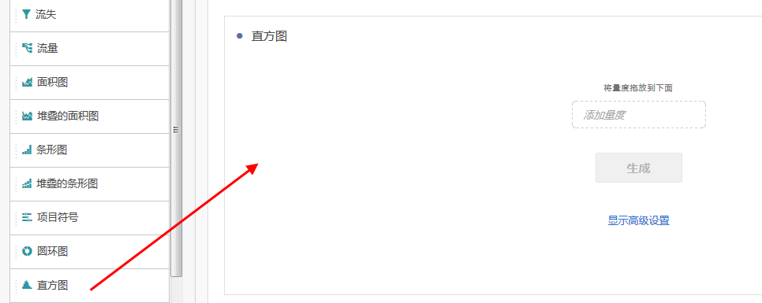
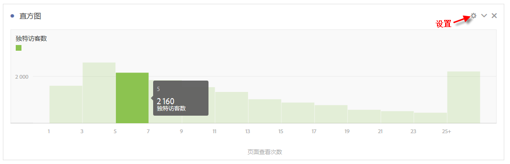
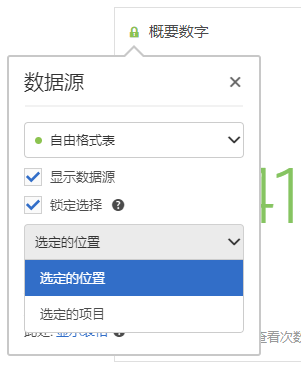
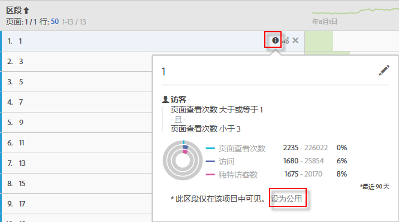

# 直方图

直方图类似于条形图，不过它可以将数字归为几组不同的范围（存储段）。Analytics 将数字的“存储”自动归为不同的范围，但您可以在[高级设置](#section_09D774C584864D4CA6B5672DC2927477)中更改相关设置。

## Build a histogram {#section_74647707CC984A1CB6D3097F43A30B45}

创建直方图的步骤如下：

1. 单击左边栏中的&#x200B;**[!UICONTROL 可视化]。**
1. 将&#x200B;**[!UICONTROL 直方图]拖到面板中。**
1. Choose a Metric to drag to the Histogram visualization and click **[!UICONTROL Build]**.

>[!NOTE]
>
>直方图仅支持标准指标，而不支持计算指标。

这里我们使用的是对应每个独特访客的页面查看次数量度。第一个（左）存储段对应每个独特访客 1 次页面查看，第二个存储段对应 2 次页面查看，依次类推。

## Advanced settings {#section_09D774C584864D4CA6B5672DC2927477}

要调整直方图设置，请单击右上角的“设置”（齿轮）图标。以下是可修改的设置：

| 直方图设置 | 它的功能 |
|---|---|
| 开始存储段 | 确定直方图从哪个存储段开始。“1”为默认值。您可以在 0 到无穷大（非负数）的范围内设置开始数量。 |
| 量度存储段 | 您可以增加/减少数据范围（存储段）的数量。存储段的最大数量为 50。 |
| 量度存储段大小 | 您可以设置每个存储段的大小。例如，您可以将存储段大小从 1 次页面查看更改为 2 次页面查看。 |
| 计算方法 | 您可以在[访客](https://marketing.adobe.com/resources/help/en_US/reference/visitors.html)、[访问](https://marketing.adobe.com/resources/help/en_US/reference/metrics_visit.html)或[点击](https://marketing.adobe.com/resources/help/en_US/reference/hit.html)中进行选择。例如，每次访问的页面查看次数或每位访客的页面查看次数，或者每次点击的页面查看次数。对于点击来说，“发生次数”可作为自由格式表中的 y 轴量度。 |

**示例**：

* 开始存储段：1；量度存储段：5；量度存储段大小：2 将生成此直方图：1-2、3-4、5-6、7-8、9-10。
* 开始存储段：0；量度存储段：3；量度存储段大小：5 将生成此直方图：0-4、5-9、10-14。

## View and edit histogram data {#section_B2CD7CDF0F6B432F928103AE7AAA3617}

To view or change the data source for the histogram chart, click the dot next to the Histogram header to go to **[!UICONTROL Data Source Settings]** &gt; **[!UICONTROL Show Data Source]**.

表格中显示的预置区段是内部区段，将不会在区段选择器中显示。单击区段名称旁边的“i”图标，然后单击&#x200B;**[!UICONTROL 设为公用]以将区段设为公用。**

要探索更多用于管理自由格式数据表及其他可视化的方法（如进行数据划分），请转到[此处](https://marketing.adobe.com/resources/help/en_US/analytics/analysis-workspace/freeform-analysis-visualizations.html)。
