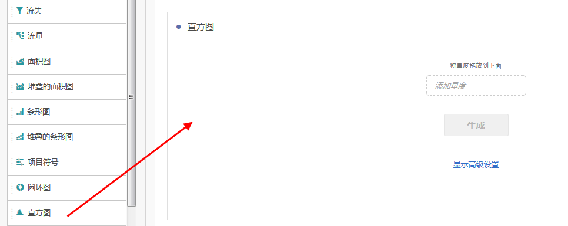

# 直方图 {#histogram}

>[!CONTEXTUALHELP]
>id="workspace_histogram_button"
>title="直方图"
>abstract="创建直方图可视化图表来表示范围组中数值数据的分布。"

>[!BEGINSHADEBOX]

_本文在_  _&#x200B;**Adobe Analytics**&#x200B;中记录了直方图可视化图表。_ _对于本文的_  _&#x200B;**Customer Journey Analytics**&#x200B;版本，请参阅[直方图](https://experienceleague.adobe.com/zh-hans/docs/analytics-platform/using/cja-workspace/visualizations/histogram)。_

>[!ENDSHADEBOX]

**[!UICONTROL 直方图]**&#x200B;可视化图表类似于[!UICONTROL 条形图]可视化图表，不过它可以将数字归为几组不同的范围（存储段）。 Analytics 将数字的“存储”自动归为不同的范围，但您可以在[高级设置](#advanced-settings)中更改相关设置。

## 使用

创建直方图的步骤如下：

1. 添加**[!UICONTROL 直方图]**&#x200B;可视化图表。 请参阅[将可视化图表添加到面板](freeform-analysis-visualizations.md#add-visualizations-to-a-panel)。
1. 从&#x200B;**[!UICONTROL 指标]**&#x200B;组件列表中拖动一个指标，或从&#x200B;[!UICONTROL *添加指标*]&#x200B;下拉菜单中选择一个指标。
1. （可选）选择&#x200B;**[!UICONTROL 显示高级设置]**。 请参阅[高级设置](#advanced-settings)。
1. 选择&#x200B;**[!UICONTROL 生成]**。

>[!NOTE]
>
>直方图仅支持标准量度，而不支持计算量度。

在下面的示例中，直方图用于统计人数的存储段会话。 直方图显示大多数人在所选日期范围内确实有 16 至 21 次会话。

## 高级设置

作为可视化图表的一部分，可以使用特定直方图设置。

| 直方图设置 | 描述 |
|---|---|
| **[!UICONTROL 开始存储段]** | 确定直方图开始的分段。 默认值为“1”。 您可以将起始数字从0设置为无限（无负数）。 |
| **[!UICONTROL 量度存储段]** | 允许您增加/减少数据范围（存储段）的数量。 存储段的最大数量为 50。 |
| **[!UICONTROL 量度存储段大小]** | 允许您设置每个分段的大小。 例如，您可以将存储段大小从1次页面查看更改为2次页面查看。 |
| **[!UICONTROL 计算方法]** | 从&#x200B;**[!UICONTROL 人员]**、**[!UICONTROL 会话]**&#x200B;或&#x200B;**[!UICONTROL 事件]**&#x200B;中选择。 例如，每次会话的页面查看次数、每人的页面查看次数或每个事件的页面查看次数。 |

<!--Russ or Meike - Check Hit Type link above. -->

**示例**：

| 开始存储段 | 量度存储段 | 量度存储段大小 | 结果 |
|:----:|:--:|:--:|:--|
| 1 | 5 | 2 |  |
| 0 | 3 | 5 |  |

>[!MORELIKETHIS]
>
>[将可视化图表添加到面板](/help/analyze/analysis-workspace/visualizations/freeform-analysis-visualizations.md#add-visualizations-to-a-panel)
>[可视化图表设置](/help/analyze/analysis-workspace/visualizations/freeform-analysis-visualizations.md#settings)
>[可视化上下文菜单](/help/analyze/analysis-workspace/visualizations/freeform-analysis-visualizations.md#context-menu)
>[使用直方图识别意外数据值](https://experienceleaguecommunities.adobe.com/t5/adobe-analytics-blogs/using-histograms-to-identify-unexpected-data-values/ba-p/596168?profile.language=zh-Hans)

