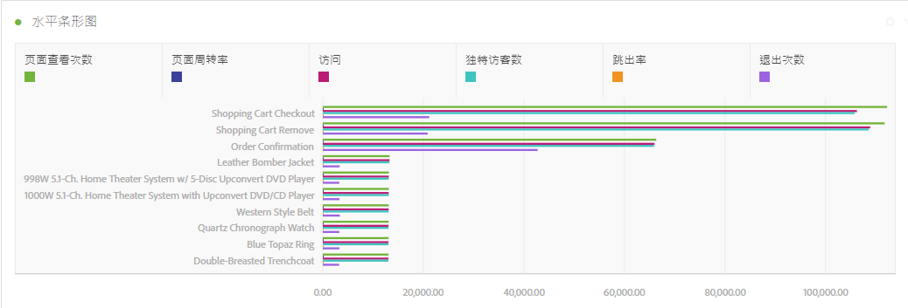
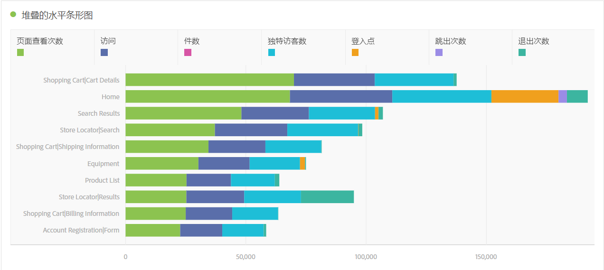
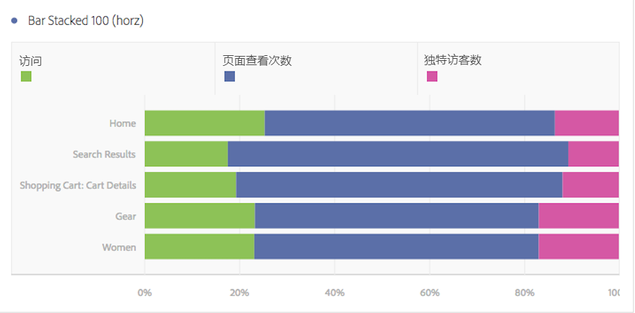

# 水平条形图和堆叠的水平条形图

## 横条 {#section_73A4D6F6C8864045A97B0B32B5FFFEDB}

此可视化显示了一些水平条，这些水平条表示一个或多个量度中的各种值。

## 堆叠的水平条形图 {#section_50C08E9E20A94024A6553BC352ADB597}

This visualization is like the [!UICONTROL Horizontal Bar Chart], but the series bars appear stacked.

The [!UICONTROL Horizontal Bar Stacked] visualization setting on bar stacked visualizations turns the chart into a "100% stacked" visualization:

