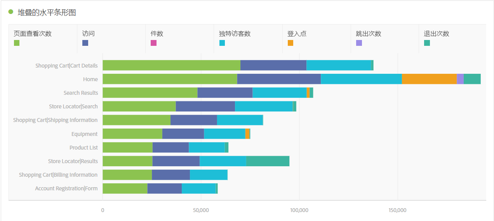

# 水平条形图（堆叠）

>[!BEGINSHADEBOX]

_本文记录了_  _**Adobe Analytics**&#x200B;中的水平条形图和栈叠的水平条形图可视化图表。_ _对于本文的_  _**Customer Journey Analytics**&#x200B;版本，请参阅[栈叠的水平条形图和水平条形图](https://experienceleague.adobe.com/zh-hans/docs/analytics-platform/using/cja-workspace/visualizations/horizontal-bar)。_

>[!ENDSHADEBOX]

水平条形图可视化图表具有标准和堆叠选项。

## 水平条形图 {#horizontal-bar}

<!-- markdownlint-disable MD034 -->

>[!CONTEXTUALHELP]
>id="workspace_horizontalbar_button"
>title="水平条形图"
>abstract="创建水平条形图可视化图表来表示一个或多个量度的各种值。"

<!-- markdownlint-enable MD034 -->

 **[!UICONTROL 水平条形图]**&#x200B;可视化图表显示了一些水平条形图，这些水平条形图表示一个或多个量度中的各种值。

## 堆叠的水平条形图 {#horizontal-bar-stacked}

<!-- markdownlint-disable MD034 -->

>[!CONTEXTUALHELP]
>id="workspace_horizontalbarstacked_button"
>title="堆叠的水平条形图"
>abstract="创建水平条形图可视化图表来表示一个或多个堆叠的量度的各种值。"

<!-- markdownlint-enable MD034 -->

 **[!UICONTROL 堆叠的水平条形图]** 可视化图表与[!UICONTROL 水平条形图]类似，只是系列条以堆叠方式显示。

使用**[!UICONTROL 设置]**&#x200B;中的 **[!UICONTROL 100% 堆叠]**&#x200B;选项可将图表转化为 100% 堆叠的可视化图表。

>[!MORELIKETHIS]
>
>[将可视化图表添加到面板](/help/analyze/analysis-workspace/visualizations/freeform-analysis-visualizations.md#add-visualizations-to-a-panel)
>[可视化图表设置](/help/analyze/analysis-workspace/visualizations/freeform-analysis-visualizations.md#settings)
>[可视化图表上下文菜单](/help/analyze/analysis-workspace/visualizations/freeform-analysis-visualizations.md#context-menu)
>

