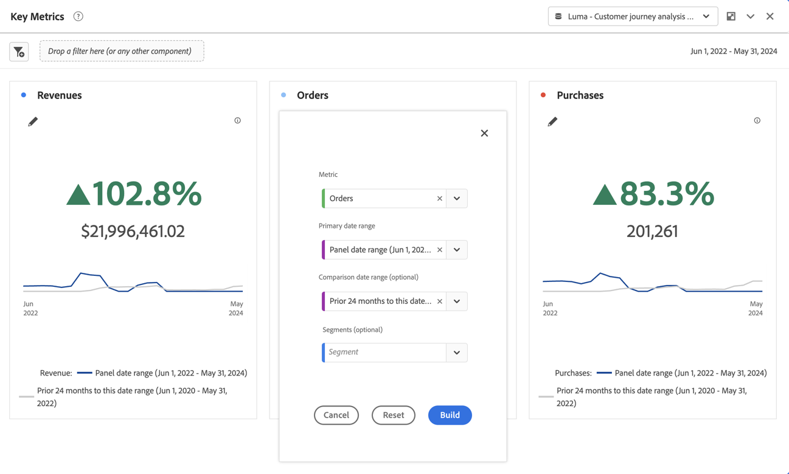

# 关键量度摘要 {#key-metric-summary}

>[!CONTEXTUALHELP]
>id="workspace_keymetricsummary_button"
>title="关键量度摘要"
>abstract="创建由线条、摘要变化和摘要数字图表组合而成的可视化图表。使用此可视化图表来比较两个时间段内重要量度的趋势。"

>[!BEGINSHADEBOX]

_本文记录了_  _&#x200B;**Adobe Analytics** 中的关键量度摘要可视化图表。_ _请参阅[关键量度摘要](https://experienceleague.adobe.com/zh-hans/docs/analytics-platform/using/cja-workspace/visualizations/key-metric)以获取本文的_  _&#x200B;**Customer Journey Analytics** 版本。_

>[!ENDSHADEBOX]

 **[!UICONTROL 关键量度摘要]**&#x200B;可视化图表让您看到重要量度在单个时间范围内的趋势。它还允许您在两个时间范围内比较量度表现。它还具备将多个可视化图表组合为一个可视化图表的优点：

* **[!UICONTROL 线形图]**&#x200B;可视化图表显示主要日期范围和比较日期范围的量度趋势

* **[!UICONTROL 摘要百分比变化]**&#x200B;显示主要日期范围和比较日期范围之间的量度增加或减少

* 度量的当前总值（[!UICONTROL **摘要数字**]）

## 用例

该可视化图表处理各种常见用例，包括：

* 一位分析师试图了解与去年同期相比，本月机会创造情况。

* 一位营销人员正在探索特定商机类型的商机开发从本月到上个月的变化。

* 一位高管想了解新预订从本季度到上季度的变化。

## 使用

1. 添加 **[!UICONTROL 关键量度摘要]**&#x200B;可视化图表。请参阅[将可视化图表添加到面板](freeform-analysis-visualizations.md#add-visualizations-to-a-panel)。

1. 通过选择&#x200B;**[!UICONTROL 量度]**、**[!UICONTROL 主要日期范围]**、**[!UICONTROL 比较日期范围]**（可选）和&#x200B;**[!UICONTROL 过滤器]**（可选）来配置可视化图表：

   

   | 选项 | 描述 |
   | --- | --- |
   | **[!UICONTROL 量度]** | 选择您希望检查的量度。支持全部量度。 |
   | **[!UICONTROL 主要日期范围]** | 自由格式表的当前日期范围。
从报表包中的任何可用日期范围中进行选择。
 
如果您想使用与可视化图表所在面板上相同的日期范围，请选择&#x200B;[!UICONTROL **面板日期范围**]。
 |
   | **[!UICONTROL 比较日期范围。]** | 要与主要日期范围进行比较的日期范围。 |
   | **[!UICONTROL 区段（可选）]** | 您对此摘要特别感兴趣的任何区段。 |

   {style="table-layout:auto"}

   >[!NOTE]
   >
   >当&#x200B;[!UICONTROL **主要日期范围**]&#x200B;字段设置为&#x200B;[!UICONTROL **面板日期范围**]&#x200B;时，根据您选择的&#x200B;**[!UICONTROL 比较日期范围]**&#x200B;选项是相对于主要日期范围还是固定日期范围，现在可自动更新&#x200B;**[!UICONTROL 比较日期范围]**。
   >
   >* **相对：** 如果将&#x200B;**[!UICONTROL 比较日期范围]** 字段设置为相对于主要日期范围的选项（如 [!UICONTROL **前一天**]、[!UICONTROL **上周同一天**]、[!UICONTROL **4 周前的同一天**]&#x200B;等），则对&#x200B;[!UICONTROL **主要日期范围**]&#x200B;字段的任何更新都会导致&#x200B;**[!UICONTROL 比较日期范围]**&#x200B;自动更新为紧跟面板日期范围之后的时间段。
   >* **固定：**&#x200B;如果将&#x200B;[!UICONTROL **比较日期范围**]&#x200B;字段设置为固定日期范围（如 **2023 年 2 月 3 日**），则对&#x200B;[!UICONTROL **主要日期范围**]&#x200B;字段或面板日期范围所做的更改不会影响&#x200B;[!UICONTROL **比较日期范围**]。但是，对面板日期范围的任何更新都会导致&#x200B;[!UICONTROL **主要日期范围**]&#x200B;自动更新。

1. 选择&#x200B;**[!UICONTROL 生成]**。

关键量度摘要的输出如下所示：

查看输出时请考虑以下事项：

* **[!UICONTROL 前期]**&#x200B;线形图（始终以灰色显示）对应于配置步骤中的&#x200B;**[!UICONTROL 比较日期范围]**。

* 如果在配置期间未指定比较日期范围，或在可视化图表设置中隐藏比较日期范围时，则仅显示主日期范围的线形图。摘要变化已被隐藏。

* 从此处，您可以将鼠标悬停在线形图上，查看各个日期的统计数据：

## 配置

生成可视化图表后，您可以编辑原始配置。

1. 选择可视化图表顶部的 **[!UICONTROL 配置可视化图表]**。

   您将返回到原始配置对话框。

1. 按需要更改设置。选择&#x200B;**[!UICONTROL 重置]**&#x200B;以重置当前设置。选择&#x200B;**[!UICONTROL 生成]**&#x200B;以重新生成可视化图表。

## 设置

作为可视化图表设置的一部分，可使用特定关键量度摘要设置。

| 设置 | 描述 |
| --- | --- |
| **[!UICONTROL 强调百分比变化]** | 在可视化图表中心以突出的粗体显示摘要更改 |
| **[!UICONTROL 强调数值]** | 在可视化图表中心以突出的粗体显示摘要数字 |
| **[!UICONTROL 图例可见]** | 显示或隐藏可视化图表底部的图例 |
| **[!UICONTROL 显示注释]** | 显示或隐藏管理员添加的注释 |
| **[!UICONTROL 隐藏标题]** | 隐藏可视化图表的标题。 |
| **[!UICONTROL 百分比]** | 以百分比而不是数字来显示可视化图表。 |
| **[!UICONTROL 显示趋势线]** | 在可视化图表中显示趋势线。 |
| **[!UICONTROL 在趋势线上显示最大值和最小值]** | 在主线形图和比较线形图上显示或隐藏最小值和最大值 |
| **[!UICONTROL 显示比较百分比和趋势线]** | 显示或隐藏比较数据。隐藏时，比较线形图和摘要变化对象在视图中隐藏。 |
| **[!UICONTROL 显示总数]** | 显示或隐藏摘要数字 |
| **[!UICONTROL 显示原始差异]** | 显示或隐藏主要日期范围和次要日期范围中量度的总值之间的原始差异 |
| **[!UICONTROL 缩写值]** | 选择&#x200B;**[!UICONTROL 缩写值]**，智能地缩写数值。选择后，输入一个数字来定义缩写量。例如： <table><tr><td>**原始值**</td><td>**缩写**</td><td>**结果**</td></tr><tr><td>$12,011,141.25</td><td>未选定</td><td align="right">$12,011,141.25</td></tr><tr><td>$12,011,141.25</td><td>选定，设置为 1</td><td align="right">$12M</td></tr><tr><td>$12,011,141.25</td><td>选定，设置为 2</td><td align="right">$12.0M</td></tr><tr><td>$12,011,141.25</td><td>选定，设置为 2</td><td align="right">$12.011M</td></tr><tr><td>$12,011,141.25</td><td>选择，设置为 3</td><td align="right">$12.011M</td></tr></table> |

## 编辑可视化图表

构建可视化图表后，您可以编辑原始配置。

1. 选择可视化图表右上角的。

   现在您将返回到原始[配置视图](#configure)。

1. 根据需要更改量度、主要日期范围、比较日期范围或区段。

>[!MORELIKETHIS]
>
>[将可视化图表添加到面板](/help/analyze/analysis-workspace/visualizations/freeform-analysis-visualizations.md#add-visualizations-to-a-panel)
>[可视化图表设置](/help/analyze/analysis-workspace/visualizations/freeform-analysis-visualizations.md#settings)
>[可视化图表上下文菜单](/help/analyze/analysis-workspace/visualizations/freeform-analysis-visualizations.md#context-menu)

