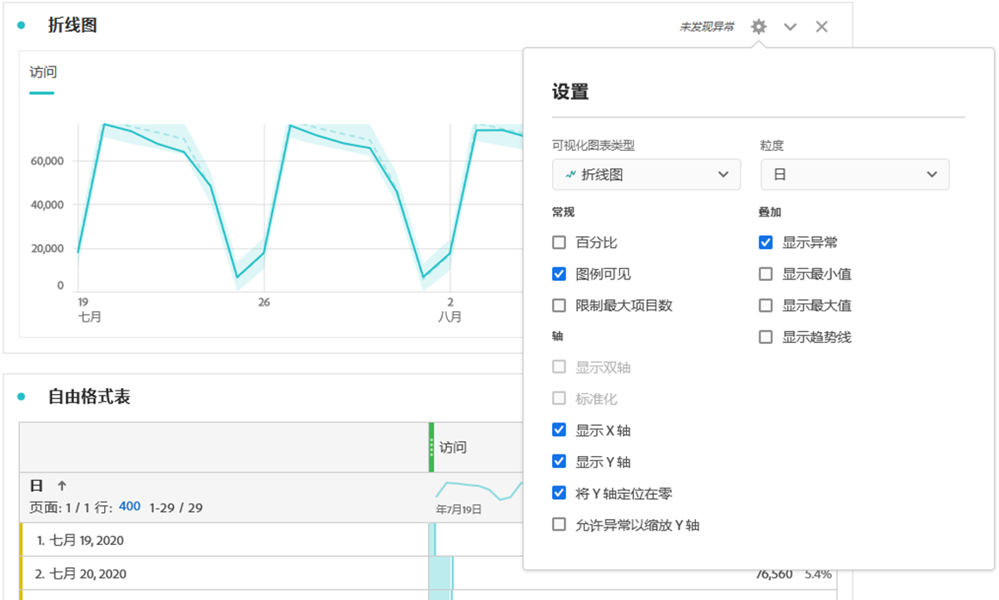

# 折线图

[!UICONTROL 折线图]可视化图表使用线条来表示量度，以显示一段时间内值的变化情况。仅当使用时间作为维度时，才可以使用[!UICONTROL 折线图]。

单击[!UICONTROL 折线图]可视化图表右上角的齿轮图标，可访问&#x200B;[**可视化设置**](freeform-analysis-visualizations.md)。设置分为以下几类：

* **常规**：各种可视化图表类型中通用的设置
* **轴**：影响折线图可视化图表的 x 轴或 y 轴的设置
* **叠加图**：用于向在折线图可视化图表中显示的系列添加其他上下文的选项。

## 更改粒度

通过[可视化设置](freeform-analysis-visualizations.md)中的粒度下拉列表，可以将趋势可视化（例如折线图、条形图）从每日更改为每周、每月等。粒度也会在数据源表中更新。

## 显示最小值或最大值

在&#x200B;**[!UICONTROL 可视化设置]** > **[!UICONTROL 叠加图]** > **[!UICONTROL 显示最小值/最大值]**&#x200B;下，您可以叠加一个最小值和最大值标签，以快速突出显示量度中的峰值和谷值。注意：最小值/最大值派生自可视化图表中的可见数据点，而不是维度中的完整值集。

## 显示趋势线叠加图

在&#x200B;**[!UICONTROL 可视化图表设置]** > **[!UICONTROL 叠加]** > **[!UICONTROL 显示趋势线]**&#x200B;下，您可以选择添加回归或移动平均趋势线到线形图系列。趋势线有助于在数据中描绘更清晰的图案。

下面是有关向折线图可视化图表添加趋势线的视频：

>[!VIDEO](https://video.tv.adobe.com/v/330176/?quality=12)

>[!TIP]
>
>建议将趋势线应用到不包含今天（部分数据）或未来日期的数据，因为这会扭曲趋势线。但是，如果您需要包括未来的日期，请从数据中删除零以防止这些日期的扭曲。为此，请转到可视化图表的数据源表，选择量度列，然后启用&#x200B;**[!UICONTROL 列设置]** > **[!UICONTROL 将零解释为没有值]**。

所有回归模型趋势线均采用普通最小二乘法拟合：

| 模型 | 描述 |
| --- | --- |
| 线性 | 为简单的线性数据集创建最适合的直线，当数据以稳定速率增加或减少时，此模型非常有用。方程式：`y = a + b * x` |
| 对数 | 创建最适合的曲线，当数据的变化率先快速增加或减少，然后趋于平稳时，此模型非常有用。对数趋势线可使用负值和正值。方程式：`y = a + b * log(x)` |
| 指数 | 创建一条曲线，当数据以不断增大的速率增加或减少时，此模型非常有用。如果数据包含零或负值，则不应使用此选项。方程式：`y = a + e^(b * x)` |
| 幂 | 创建一条曲线，对于要比较以特定速率增加的测量值的数据集，此模型非常有用。如果数据包含零或负值，则不应使用此选项。方程式：`y = a * x^b` |
| 二次方程式 | 找到最适合数据集的曲线，形状类似抛物线（下凹或上凸）。方程式：`y = a + b * x + c * x^2` |
| 移动平均 | 根据一组平均值创建平滑的趋势线。均线也称为滚动平均值，使用特定数量的数据点（由您选择的“期间”决定），对其求平均值，然后使用平均值作为线条中的点。示例包括 7 天均线或 4 周均线。 |
