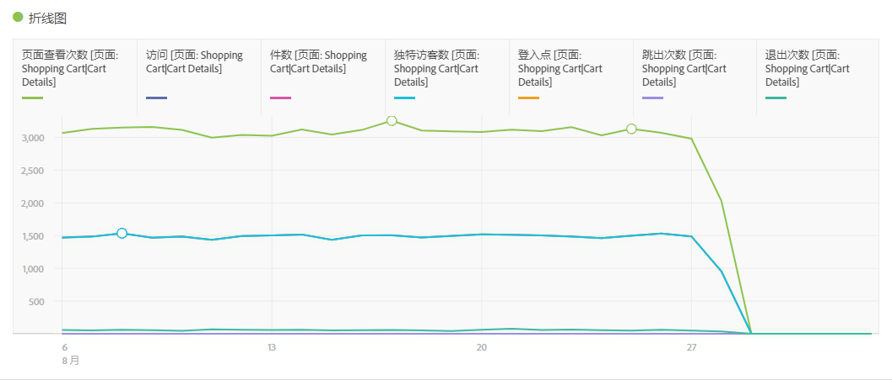
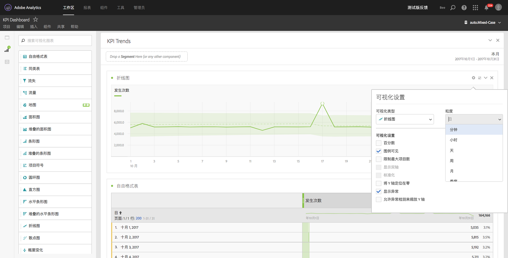

# 折线图

此可视化使用线条来表示量度，以显示一段时间内值的变化情况。仅当使用时间作为维度时，才可以使用折线图。

通过[可视化设置](../../../analyze/analysis-workspace/visualizations/freeform-analysis-visualizations.md#section_D3BB5042A92245D8BF6BCF072C66624B)中的粒度下拉列表，可以将趋势可视化（例如折线图、条形图）从每日更改为每周、每月等。

