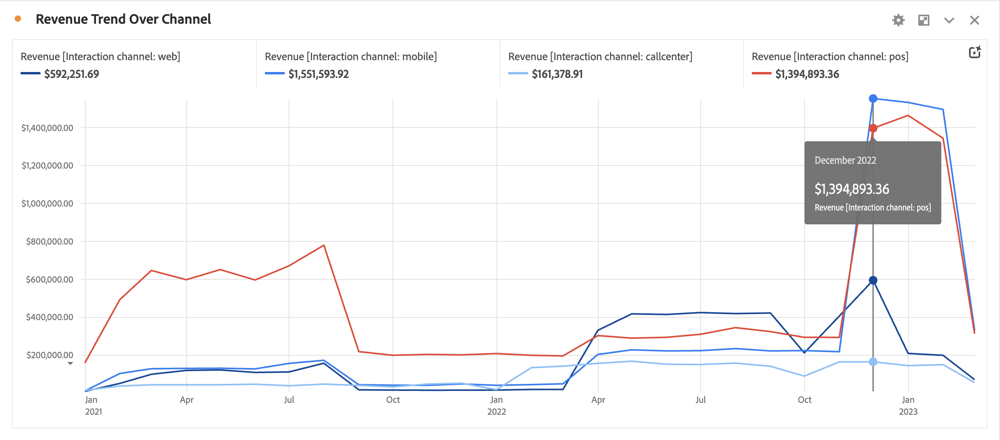

# 线形图 {#line}

<!-- markdownlint-disable MD034 -->

>[!CONTEXTUALHELP]
>id="workspace_line_button"
>title="线形图"
>abstract="创建一个线形图可视化图表，展示值在一段时间内的变化情况。仅当使用时间作为维度时，才可以使用线形图可视化图表。"

<!-- markdownlint-enable MD034 -->

>[!BEGINSHADEBOX]

_本文记录了_  _**Adobe Analytics** 中的线形图可视化图表。_ _请参阅[线形图](https://experienceleague.adobe.com/zh-hans/docs/analytics-platform/using/cja-workspace/visualizations/line)以获取本文的_  _**Customer Journey Analytics** 版本。_

>[!ENDSHADEBOX]

 **[!UICONTROL 线形图]**&#x200B;可视化图表使用线条来表示量度，以显示一段时间内值的变化情况。仅当使用时间作为维度时，才可以使用线形图可视化图表。

## 设置

作为[可视化图表设置](freeform-analysis-visualizations.md#settings)的一部分，可以使用特定线形图可视化图表设置。

| 设置 | 描述 |
|---|---|
| **[!UICONTROL 粒度]** | 从粒度下拉菜单中进行选择，将趋势可视化图表从每日更改为每周、每月等。粒度也会在数据源表中更新。 |
| **[!UICONTROL 显示最小值]**  **[!UICONTROL 显示最大值&#x200B;]** | 您可以通过叠加最小值和最大值标签来突出显示量度中的最小值和最大值。最小值/最大值派生自可视化图表中的可见数据点，而不是维度中的完整值集。  |
| **[!UICONTROL 显示趋势线]** | 您可选择将回归趋势线或均线趋势线添加到线系列。趋势线有助于在数据中描绘更清晰的图案。选择后，从列表中选择一个模型。请参阅[模型](#models)了解可用模型的概述和说明。 。 |

>[!TIP]
>
>建议将趋势线应用到不包含今天（部分数据）或未来日期的数据。今天或未来日期的数据会扭曲趋势线。但是，如果您需要包括未来的日期，请从数据中删除零以防止这些日期的扭曲。转到可视化图表的数据源表，选择量度列，然后启用&#x200B;**[!UICONTROL 列设置]** > **[!UICONTROL 将零解释为没有值]**。

### 模型

所有回归模型趋势线均采用普通最小二乘法拟合：

| 模型 | 描述 |
| --- | --- |
| **[!UICONTROL 线性]** | 为简单的线性数据集创建最适合的直线，当数据以稳定速率增加或减少时，此模型非常有用。方程式：`y = a + b * x` |
| **[!UICONTROL 对数]** | 创建最适合的曲线，当数据的变化率先快速增加或减少，然后趋于平稳时，此模型非常有用。对数趋势线可以使用负值和正值。方程式：`y = a + b * log(x)` |
| **[!UICONTROL 指数]** | 创建一条曲线，当数据以不断增大的速率增加或减少时，此模型非常有用。如果数据包含零或负值，则不应使用此选项。方程式：`y = a + e^(b * x)` |
| **[!UICONTROL 幂]** | 创建一条曲线，对于要比较以特定速率增加的测量值的数据集，此模型非常有用。如果数据包含零或负值，则不应使用此选项。方程式：`y = a * x^b` |
| **[!UICONTROL 二次方程式]** | 找到最适合数据集的曲线，形状类似抛物线（下凹或上凸）。方程式：`y = a + b * x + c * x^2` |
| **[!UICONTROL 均线]** | 根据一组平均值创建平滑的趋势线。均线也称为滚动平均值，使用特定数量的数据点（由您选择的[!UICONTROL 粒度]决定），对其求平均值，然后使用平均值作为线条中的点。示例包括七天均线或四周均线。 |

>[!MORELIKETHIS]
>
>[将可视化图表添加到面板](/help/analyze/analysis-workspace/visualizations/freeform-analysis-visualizations.md#add-visualizations-to-a-panel)
>>[可视化图表设置](/help/analyze/analysis-workspace/visualizations/freeform-analysis-visualizations.md#settings)
>>[可视化图表上下文菜单](/help/analyze/analysis-workspace/visualizations/freeform-analysis-visualizations.md#context-menu)
>

