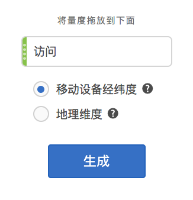
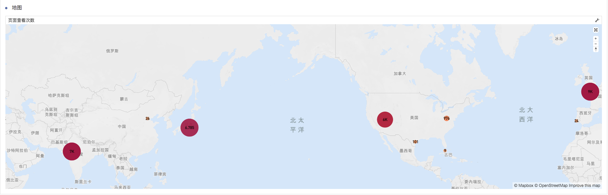
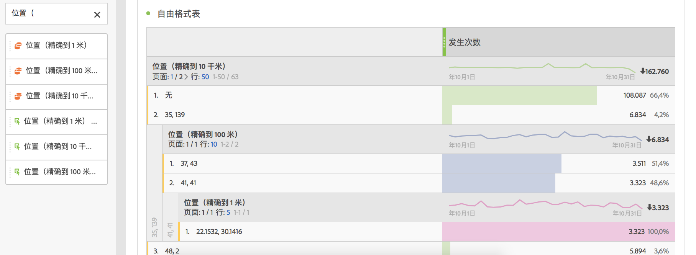
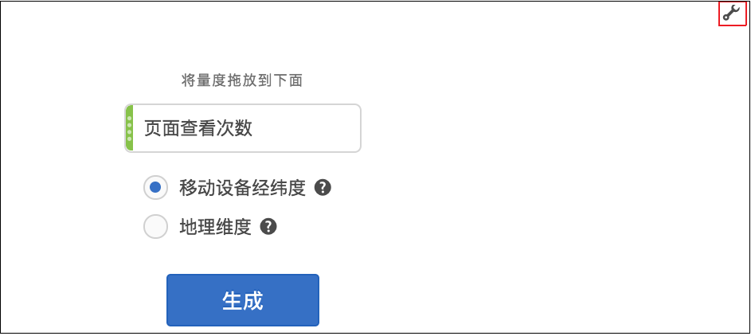

# 地图

## 概述 {#section_19F740FAF08D47B1AF1EF239A74FC75C}

Analysis Workspace 中的地图可视化

* 允许您构建任何指标的可视映射(包括计算量度)。
* 用于识别和比较不同地理区域间的量度数据。
* 可以支持两种数据源：出自移动设备使用情况的经纬度或 Web 使用情况的地理维度。
* 支持PDF导出。
* 利用 WebGL 显示图形。如果您的图形驱动程序不支持 WebGL 渲染，则可能需要更新您的驱动程序。

## Build a map visualization {#section_61BBFA3A7BFD48DA8D305A69D9416299}

1. 从可视化列表中，将&#x200B;**[!UICONTROL 地图]拖到“自由格式”面板中：**

   

1. 从量度列表中拖入一个量度（包括计算量度）。
1. 指定要从中提取内容的数据源。（只有在为移动设备应用程序数据启用了位置跟踪时，才会显示此对话框。）

<table id="table_CD54B433464B4282A7524FB187016C47"> 
 <tbody> 
  <tr> 
   <td colname="col1"> 
<b>移动设备经纬度</b> 
 </td> 
   <td colname="col2"> 
此选项表示移动设备应用程序数据。 
 
只有在通过 Analytics &gt; 管理员 &gt; 报表包 &gt; &lt;选择报表包&gt; &gt; 编辑设置 &gt; 移动设备管理 &gt; 启用位置跟踪为报表包启用该设置时，才会看到此选项。 
 
这是默认设置（如果已启用位置跟踪）。 
 </td> 
  </tr> 
  <tr> 
   <td colname="col1"> 
<b>地理维度</b> 
 </td> 
   <td colname="col2"> 
此选项表示有关访客位置（基于访客的 IP 地址）的地域划分数据。此数据将被转换为国家、地区和城市。请注意，它不会转到 DMA 或邮政编码级别。 
 
几乎所有报表包都启用了此维度。如果您的报表包还没有启用此维度，请联系 Adobe 客户关怀以启用地理报表。 
 </td> 
  </tr> 
 </tbody> 
</table>

1. Click **[!UICONTROL Build]**.

   您看到的第一个视图将是一个具有气泡图的世界视图，它类似于下图。

   

1. 您现在可以

   * 通过双击地图或使用滚轮，**放大**&#x200B;此地图以放大特定区域。地图根据光标的放置位置进行相应的缩放。通过缩放交互，所需的维度（国家/地区 &gt; 州 &gt; 城市）将会根据缩放级别自动更新。
   * 通过并排放置地图可视化，**比较**&#x200B;同一项目中的两个或更多地图可视化。
   * **显示同期（例如，年度）比较信息**：

      * 显示负数：例如，如果您绘制的是年度同比量度，地图会在纽约上方显示 -33%。
      * 对于“百分数”类型的量度，群集会计算所有百分比的平均值。
      * 绿/红颜色方案：正/负
   * 通过按住 [!UICONTROL Ctrl] 键并移动地图，**旋转** 2D 或 3D 地图。

   * 使用以下描述的[设置](../../../analyze/analysis-workspace/visualizations/map-visualization.md#section_5F89C620A6AA42BC8E0955478B3A427E)，**切换**&#x200B;到其他视图，如热图。请注意，气泡视图是默认设置。

1. **保存**&#x200B;该项目，以保存所有地图设置（坐标、缩放、旋转）。
1. 通过从左边栏拖入位置维度和量度，填充可视化下方的自由格式表：

   

## Map visualization settings {#section_5F89C620A6AA42BC8E0955478B3A427E}

映射存在以下两组设置：

单击右上方的&#x200B;**扳手图标**，可重新显示用于更改量度和数据源的初始对话框：

单击&#x200B;**齿轮图标**&#x200B;会显示以下可视化设置：

| 设置 | 描述 |
|--- |--- |
| 气泡 | 使用气泡描绘事件。气泡图是一种多变量图表，其形式介于散点图和比例面积图之间。这是默认视图。 |
| 热图 | 使用热图描绘事件。热图是对数据的图形化呈现，其中以不同颜色表示矩阵中包含的单独值。 |
| 样式：颜色主题 | 显示热图和气泡的颜色方案。您可以选择珊瑚色、红色、绿色或蓝色。默认为珊瑚色。 |
| 样式：地图样式 | 您可以选择基本、街道、明亮、浅色、深色和卫星。 |
| 集群半径 | 将像素数量在指定范围之内的数据点组合在一起。默认值为 50。 |
| 自定义最大值 | 允许您更改映射的最大值阈值-调整此值可调整气泡/热图值(颜色和大小)相对于自定义最大值设置的缩放比例。 |