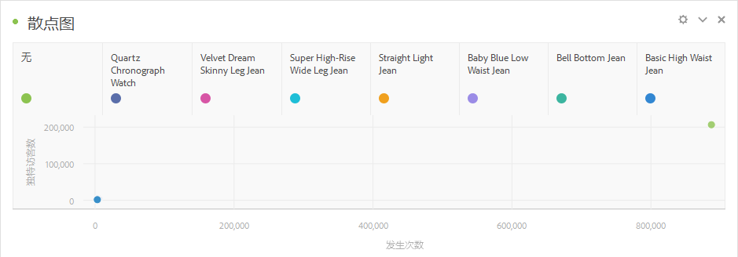

# 散点图 {#scatter}

<!-- markdownlint-disable MD034 -->

>[!CONTEXTUALHELP]
>id="workspace_scatter_button"
>title="散点图"
>abstract="创建一个可视化散点图，显示维度项与最多三个量度之间的关系。"

<!-- markdownlint-enable MD034 -->

>[!BEGINSHADEBOX]

_本文记录了_  _**Adobe Analytics**&#x200B;中的散点图可视化图表。_ _请参阅本文的_  _**Customer Journey Analytics**&#x200B;版本的[散点图](https://experienceleague.adobe.com/zh-hans/docs/analytics-platform/using/cja-workspace/visualizations/scatterplot)。_

>[!ENDSHADEBOX]

 **[!UICONTROL Scatter]**&#x200B;可视化图表可帮助您识别数据中不同量度之间的关联和模式。 可视化图表显示维度项目与最多三个量度之间的关系。 可视化图表需要三个组件，并且最多支持四个组件的可视化。

* 行组件（通常为维度）表示图表上的每个点。 不同的行显示为不同的彩色点。
* 最左侧的列（通常是量度）绘制点在 Y 轴（垂直）上的位置。
* 第二列绘制点在 X 轴（水平）上的位置。
* 第三列确定点的半径。
* 散点图可视化图表将忽略自由格式表中的所有后续列。

>[!BEGINSHADEBOX]

请参阅  [散点图可视化图表](https://experienceleague.adobe.com/en/docs/analytics-learn/tutorials/analysis-workspace/visualizations/scatterplot-visualization){target="_blank"}以观看演示视频。

>[!ENDSHADEBOX]

>[!NOTE]
>
>当您[将图例配置为在散点图表中可见](/help/analyze/analysis-workspace/visualizations/freeform-analysis-visualizations.md#settings)时，仅当数据源包含有限数量的（选定的）维度项时，才会显示图例。

>[!MORELIKETHIS]
>
>[将可视化图表添加到面板](/help/analyze/analysis-workspace/visualizations/freeform-analysis-visualizations.md#add-visualizations-to-a-panel)
>[可视化图表设置](/help/analyze/analysis-workspace/visualizations/freeform-analysis-visualizations.md#settings)
>[可视化图表上下文菜单](/help/analyze/analysis-workspace/visualizations/freeform-analysis-visualizations.md#context-menu)
>
