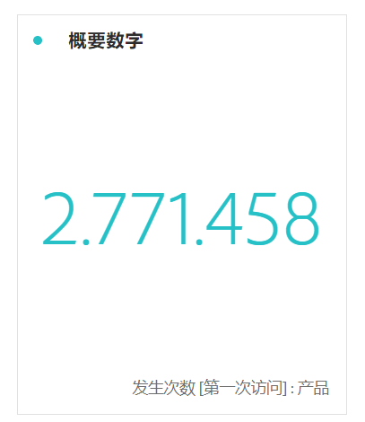

# 概要数字和概要变化

## 摘要编号可视化

* 如果未选中单元格，此可视化则会选择总列数。
* 如果选中了单个单元格，此可视化则会显示该单元格的概要。
* 如果选中了多个单元格，此可视化则会显示所选单元格的第一个单元格。
* 如果选中了列，此可视化则会选择列中的第一个单元格值。

## 摘要更改可视化

* 如果未选中单元格，此可视化会比较列中的前两个单元格值。
* 如果选中了一个单元格，此可视化会显示 0，因为它将单元格值与其自身进行比较。
* 如果选中了两个单元格，则第一个选定的单元格将作为分子，第二个单元格将作为分母。
* 如果选中了两个以上的单元格，则会仅考虑比较前两个单元格。
* 如果选中了单元格范围，则会将范围内选定的第一个单元格与最后一个单元格进行比较。
* 如果选中了列，会将第一个值与其自身进行比较，结果会显示变化为 0。
* 可通过以下方式控制概要更改的绿色和红色：

   * [自定义事件极性](https://marketing.adobe.com/resources/help/en_US/reference/success_event.html)。
   * 计算量度的[将上升趋势显示为](https://marketing.adobe.com/resources/help/en_US/analytics/calcmetrics/cm_build_metrics.html)选项。

## Summary Change settings {#section_2581AC0107634FB4990AB8347E5897AA}

单击可视化旁边的齿轮图标可配置概要设置：

| 设置 | 定义 |
|--- |--- |
| 百分数 | 使用百分数而不是原始数值。 |
| 图例可见 | 显示所使用的量度。 |
| 概要数字选项：缩写值 | 您可以选择 0 到 3 位小数位数来表示缩写值。 |
| 概要变化选项：显示百分比变化 | 以百分比的形式显示 2 个数值之间的变化。 |
| 概要变化选项：显示原始差异 | 显示 2 个数值之间的原始差异。 |