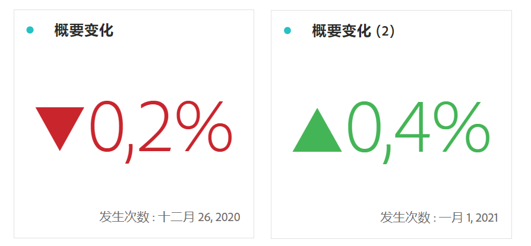

# 摘要数字和变化

>[!BEGINSHADEBOX]

_本文记录了_  _**Adobe Analytics**&#x200B;中的摘要编号和摘要更改可视化图表。_ _查看本文的CustomerJourneyAnalytics_ 版本的&#x200B;_**摘要编号和摘要更改**。_

>[!ENDSHADEBOX]

>[!BEGINSHADEBOX]

请参阅  [摘要数字和摘要变化可视化图表](https://video.tv.adobe.com/v/335564/?quality=12&learn=on){target="_blank"}以观看演示视频。

>[!ENDSHADEBOX]

## 摘要数字 {#summary-number}

<!-- markdownlint-disable MD034 -->

>[!CONTEXTUALHELP]
>id="workspace_summarynumber_button"
>title="摘要数字"
>abstract="创建显示总计和小计的可视化图表。"

<!-- markdownlint-enable MD034 -->

使用**[!UICONTROL 摘要数字]**&#x200B;可视化图表来突出显示项目中的大型重要数字。此可视化图表使用关联的数据源并会按以下方式运行：

* 如果未选中单元格，此可视化则会选择总列数。
* 如果选中了单个单元格，此可视化则会显示该单元格的概要。
* 如果选中了多个单元格，此可视化则会显示所选单元格的第一个单元格。
* 如果选中了列，此可视化则会选择列中的第一个单元格值。

作为可视化图表设置的一部分，可使用特定摘要数字选项。

| 选项 | 定义 |
|--- |--- |
| **[!UICONTROL 缩写值]** | 选择&#x200B;**[!UICONTROL 缩写值]**，智能地缩写数值。选择后，输入一个数字来定义缩写量。例如： <table><tr><td>**原始值**</td><td>**缩写值**</td><td>**结果**</td></tr><tr><td>$12,011,141.25</td><td>未选定</td><td  align="right">$12,011,141.25</td></tr><tr><td>$12,011,141.25</td><td>选定，设置为 `0`</td><td align="right">$12M</td></tr><tr><td>$12,011,141.25</td><td> 选定，设置为 `1`</td><td  align="right">$12.0M</td></tr><tr><td>$12,011,141.25</td><td>选定，设置为 `2`</td><td align="right">$12.01M</td></tr><tr><td>$12,011,141.25</td><td>选定，设置为 `3`</td><td align="right">$12.011M</td></tr></table> |
| **[!UICONTROL 值汇总方式]** | 选择显示所选数据的最大值、最小值、平均值、中间值或总和。 |

## 摘要变化 {#summary-change}

<!-- markdownlint-disable MD034 -->

>[!CONTEXTUALHELP]
>id="workspace_summarychange_button"
>title="摘要变化"
>abstract="创建一个显示两个数字之间增量（变化）的可视化图表"

<!-- markdownlint-enable MD034 -->

使用  **[!UICONTROL 摘要变化]**&#x200B;可视化图表来显示两个数字之间的增量（变化）。<!-- This is applicable for AA, not CJA: The green and red color of the Summary Change can be controlled through [custom event polarity](https://experienceleague.adobe.com/docs/analytics/admin/admin-tools/success-events/success-event.html) or a calculated metric's [Show Upward Trend As](https://experienceleague.adobe.com/docs/analytics/components/calculated-metrics/calcmetric-workflow/cm-build-metrics.html) option.-->

<!--
The green and red color of the Summary Change can be controlled through [custom event polarity](https://experienceleague.adobe.com/docs/analytics/admin/admin/c-manage-report-suites/c-edit-report-suites/conversion-var-admin/c-success-events/success-event.md) or a calculated metric's [Show Upward Trend As](https://experienceleague.adobe.com/docs/analytics/components/calculated-metrics/calcmetric-workflow/cm-build-metrics.html) option.
-->

此可视化图表的行为方式如下：

* 如果未选中单元格，此可视化图表会比较列中的前两个单元格值。
* 如果选中了一个单元格，此可视化图表会显示 0，因为它将单元格值与其自身进行比较。
* 如果选中了两个单元格，则第一个选定的单元格将作为分子，第二个单元格将作为分母。
* 如果选中了两个以上的单元格，则会仅考虑比较前两个单元格。
* 如果选中了单元格范围，则会将范围内选定的第一个单元格与最后一个单元格进行比较。
* 如果选中了列，会将第一个值与其自身进行比较，结果会显示变化为 0。

作为可视化图表设置的一部分，可使用特定&#x200B;**[!UICONTROL 摘要变化选项]**。

| 选项 | 定义 |
|--- |--- |
| **[!UICONTROL 显示百分比变化]** | 显示 2 个数字之间的百分比变化。 |
| **[!UICONTROL 显示原始差异]** | 显示 2 个数字之间的原始差异。您还可以对此选项使用缩写值，并最多显示 3 个小数位。 |
| **[!UICONTROL 缩写值]** | 选择&#x200B;**[!UICONTROL 缩写值]**，智能地缩写更改的值。选择后，输入一个数字来定义缩写量。例如： <table><tr><td>**原始值**</td><td>**缩写值**</td><td>**结果**</td></tr><tr><td>$12,011,141.25</td><td>未选定</td><td  align="right">$12,011,141.25</td></tr><tr><td>$12,011,141.25</td><td>选定，设置为 `0`</td><td align="right">$12M</td></tr><tr><td>$12,011,141.25</td><td> 选定，设置为 `1`</td><td  align="right">$12.0M</td></tr><tr><td>$12,011,141.25</td><td>选定，设置为 `2`</td><td align="right">$12.01M</td></tr><tr><td>$12,011,141.25</td><td>选定，设置为 `3`</td><td align="right">$12.011M</td></tr></table> |

>[!MORELIKETHIS]
>
>[将可视化图表添加到面板](/help/analyze/analysis-workspace/visualizations/freeform-analysis-visualizations.md#add-visualizations-to-a-panel)
>>[可视化图表设置](/help/analyze/analysis-workspace/visualizations/freeform-analysis-visualizations.md#settings)
>>[可视化图表上下文菜单](/help/analyze/analysis-workspace/visualizations/freeform-analysis-visualizations.md#context-menu)
>
