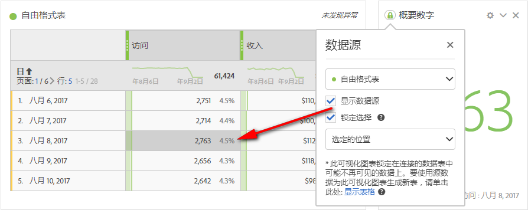
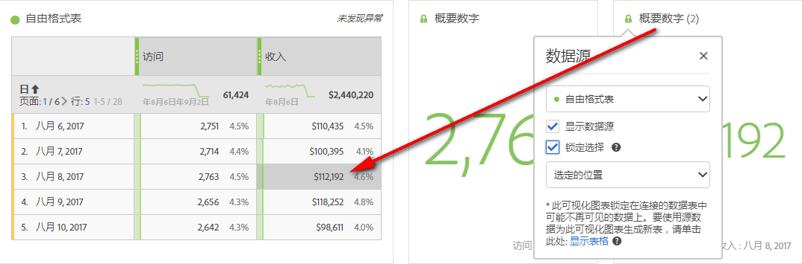
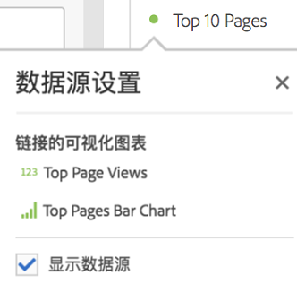

# 管理数据源

通过同步可视化信息，您可以控制与可视化对应的数据表或数据源。

**提示：**&#x200B;您可以通过标题旁边圆点的颜色来辨别所关联的可视化。颜色一致表示可视化基于同一个数据源。

管理数据源允许您显示数据源或锁定选择。这些设置决定了当有新数据输入时，可视化发生更改（或不发生更改）的方式。

1. [使用数据](../../../analyze/analysis-workspace/build-workspace-project/t-freeform-project.md#task_C2C698ACC7954062A28E4784911E6CF2) 表和 [可视化创建项目](../../../analyze/analysis-workspace/visualizations/freeform-analysis-visualizations.md#concept_09242627629147A88A68F1506954C276)。
1. 在数据表中，选择要和可视化信息关联的单元格（数据源）。
1. In the visualization, click the dot next to the title to bring up the **[!UICONTROL Data Source]** dialog. Select **[!UICONTROL Show Data Source]** or **[!UICONTROL Lock Selection]**.

   

   如果将可视化同步到表格单元格，则可以创建新的（隐藏）表格并使用该表格对同步的可视化进行颜色编码。

| 元素 | 描述 |
|--- |--- |
| 链接的可视化 | 如果有可视化连接到自由格式或对列表，左上侧的点即会打开以列出连接的可视化，并出现一个“显示”复选框选项来显示/隐藏表。将鼠标悬停在其上方将突出显示连接的可视化，单击它即会转到该可视化。 |
| 显示数据源 | 允许您显示（启用复选框）或隐藏（禁用复选框）与可视化对应的数据表。 |
| 锁定选择 | 启用此设置后，可将可视化锁定到相应数据表中当前选择的数据。启用后，您可以选择以下两项：  <ul><li>**选定位置**：如果您要将可视化持续锁定在相应数据表内所选择的位置上，可选择此选项。即使这些位置中的具体项目发生更改，这些位置仍将继续保持可视化状态。例如，如果您要始终显示此可视化中前五个促销活动名称，而无论具体是哪些促销活动名称显示在前五位，就可以选择此选项。</li> <li>**选定项目**：如果您要将可视化持续锁定在相应数据表内当前所选定的项目中，可选择此选项。即使这些项目更改了它们在表中的排名，仍将继续保持可视化状态。例如，如果您要始终显示此可视化中某五个特定促销活动名称，而无论这些促销活动名称的排名如何，就可以选择此选项。</li></ul> |

此架构与之前的一个功能不同，即，在Analysis Workspace中不再创建重复的隐藏表，该表存储锁定的选定内容。现在，数据源指向用于创建可视化的表格。

**用例示例：**

* 您可以创建一个概要可视化，并将其锁定到用于创建可视化的表格的单元格。当您启用“显示数据源”后，它会准确地显示表中信息的来源。源数据将会变成灰色：

   &gt;
* 您可以添加许多可视化，并在同一个表格的不同单元格中显示它们的来源，如下所示。此表与上述示例中的表相同，但显示来源的单元格（和量度）却不同：

   &gt;
* 单击左上侧的点（数据源设置），可查看是否有可视化连接到自由格式或对列表。将鼠标悬停在其上方将突出显示链接的可视化，单击它即会转到该可视化。

   &gt;
