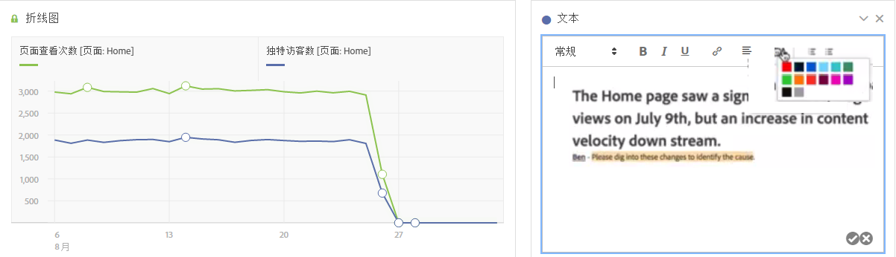
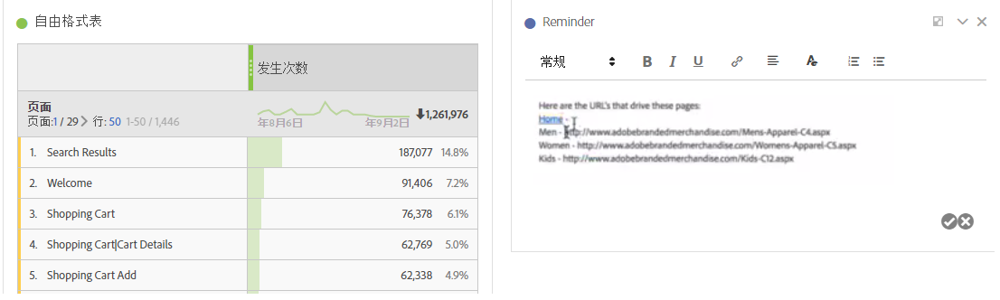

# 文本

允许您将用户定义的文本添加至您的工作区。

您可以更改字体设置（粗体、斜体等）并在文本框可视化与面板/可视化描述中添加超链接。

## Change font settings {#section_32727EE03FD04A8EB1D1B387DCAF6537}

在将文本可视化拖动到面板中并添加文本后，您可以通过添加标题级别、更改文本粗体/斜体/下划线、更改文本颜色等操作来设置文本的格式。

## Add hyperlinks {#section_D55B857188A74A06B49006DF3511DC7C}

突出显示文本，然后单击格式菜单中的超链接图标可添加超链接。
