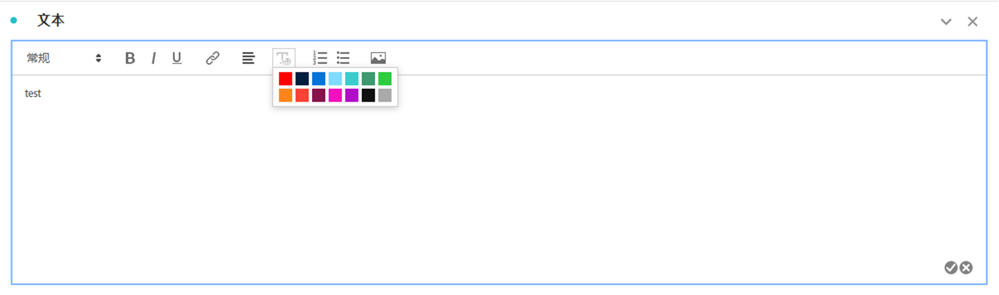
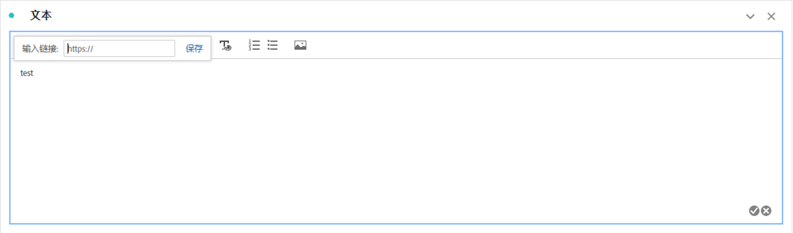
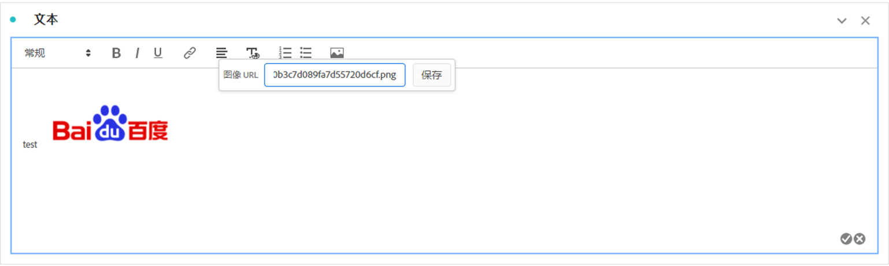

# 文本 {#text-visualization}

>[!CONTEXTUALHELP]
>id="workspace_text_button"
>title="文本"
>abstract="向您的项目添加用户定义的富文本可视化图表。"

<!-- markdownlint-enable MD034 -->

>[!BEGINSHADEBOX]

_本文记录了_  _**Adobe Analytics** 中的文本可视化图表。_ _请参阅[文本](https://experienceleague.adobe.com/zh-hans/docs/analytics-platform/using/cja-workspace/visualizations/text)以获取本文的_  _**Customer Journey Analytics** 版本。_

>[!ENDSHADEBOX]

您可以
要将用户定义的富文本添加到 Workspace 项目中，可以使用**[!UICONTROL 文本]**&#x200B;可视化图表或使用可视化图表和面板的描述。

## 使用

您可以通过以下方式使用文本可视化图表：

1. 添加**[!UICONTROL 文本]**&#x200B;可视化图表。请参阅[将可视化图表添加到面板](freeform-analysis-visualizations.md#add-visualizations-to-a-panel)。

1. 在面板或可视化图表中，从上下文菜单中选择&#x200B;**[!UICONTROL 编辑描述]**。

   完成编辑描述后选择 ，然后选择  以取消。

您可以更改文本格式、添加超链接以及添加图像。

## 调整格式 {#format}

编辑文本框或描述时，您可以调整字体大小（标题级别）、样式（粗体、斜体、下划线）以及对齐所选文本。还可以添加项目符号和编号列表。

## 添加超链接 {#hyperlinks}

要添加超链接，请突出显示文本并在菜单中选择。您可以使用超链接为项目接收方提供进一步的帮助。超链接可以链接到外部网站、文档页面、[工作区项目、面板或可视化图表](/help/analyze/analysis-workspace/curate-share/shareable-links.md)等。

## 添加图像 {#images}

若要向项目中添加图像，请在菜单中选择，然后在&#x200B;**[!UICONTROL 图像URL]**（例如`https://www.adobe.com/uploads/2018/06/Adobe.png`）中指定图像URL，然后选择&#x200B;**[!UICONTROL 保存]**。

该图像 URL 必须可公开访问、以 `https` 开头并且格式为 `.png`、`.jpeg`、`.jpg` 或 `.gif`。支持静态图像和动画图像。

请注意，不支持拖放插入图像。

