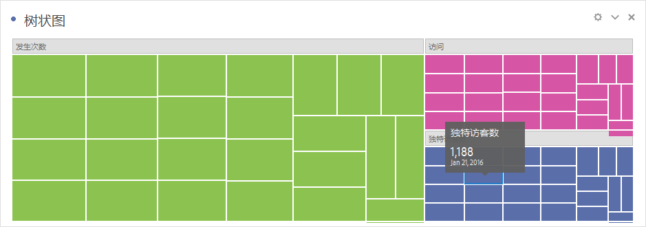

# [!UICONTROL 树状图] {#treemap}

<!-- markdownlint-disable MD034 -->

>[!CONTEXTUALHELP]
>id="workspace_treemap_button"
>title="树状图"
>abstract="创建树状图可视化图表，以使用嵌套矩形显示分层（树状结构）数据。"

<!-- markdownlint-enable MD034 -->

>[!BEGINSHADEBOX]

_本文在_  _&#x200B;**Adobe Analytics**&#x200B;中记录了树形图可视化图表。_ _对于本文的_  _&#x200B;**Customer Journey Analytics**&#x200B;版本，请参阅[树形图](https://experienceleague.adobe.com/zh-hans/docs/analytics-platform/using/cja-workspace/visualizations/treemap)。_

>[!ENDSHADEBOX]

使用  **[!UICONTROL 树状图]** 可视化图表将分层（树结构）数据显示为一组嵌套的矩形。

树上的每个分支都被给予一个矩形，然后为其贴上代表子分支的更小矩形。

通过树状图，您可以看到其他方法难以发现的模式。 通过维度的颜色和大小，您可以发现维度是如何关联的，以及某个维度是否特别相关。 树状图的第二个优势是，从结构上看，树状图可以有效利用空间。

>[!BEGINSHADEBOX]

请参阅  [树状图可视化图表](https://experienceleague.adobe.com/zh-hans/docs/analytics-learn/tutorials/analysis-workspace/visualizations/treemap-visualization){target="_blank"}以观看演示视频。

>[!ENDSHADEBOX]

>[!MORELIKETHIS]
>
>[将可视化图表添加到面板](/help/analyze/analysis-workspace/visualizations/freeform-analysis-visualizations.md#add-visualizations-to-a-panel)
>[可视化图表设置](/help/analyze/analysis-workspace/visualizations/freeform-analysis-visualizations.md#settings)
>[可视化图表上下文菜单](/help/analyze/analysis-workspace/visualizations/freeform-analysis-visualizations.md#context-menu)
>
