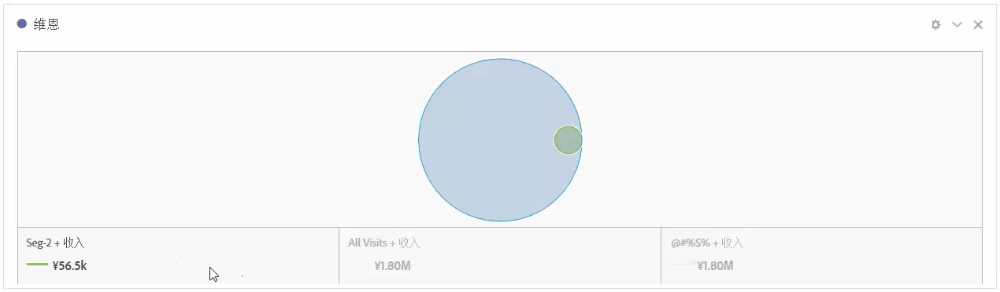
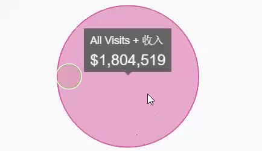
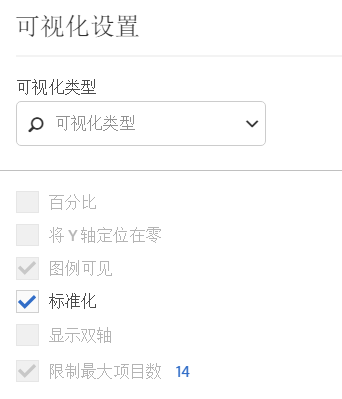

# 维恩图

通过维恩图可视化，最多可拖入 3 个区段（从“组件”中）和一个量度来构建维恩图。

然后，可以将光标悬停在这些区段上以更加深入地了解百分比等信息。

To turn the Venn diagram into a Freeform table, click the colored dot next to the **[!UICONTROL Venn]** header and select **[!UICONTROL Manage Data Sources]** &gt; **[!UICONTROL Available Data Sources]** &gt; **[!UICONTROL Freeform Table]**.

To normalize the Venn diagram (take the size out of it), go to its Visualization Settings icon and select **[!UICONTROL Normalization]**.

