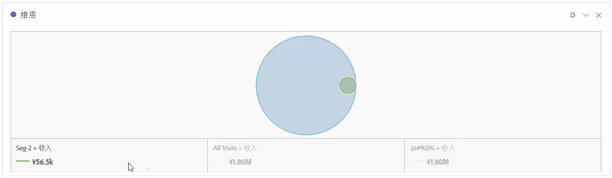
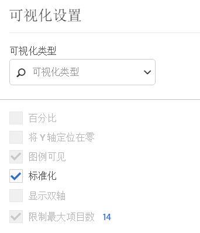

# 维恩图 {#venn}

<!-- markdownlint-disable MD034 -->

>[!CONTEXTUALHELP]
>id="workspace_venn_button"
>title="维恩图"
>abstract="创建维恩图可视化图表，以快速直观地比较两个元素及其重叠尺寸。"

<!-- markdownlint-enable MD034 -->

>[!BEGINSHADEBOX]

_本文记录了_  _&#x200B;**Adobe Analytics**&#x200B;中的维恩图可视化图表。_ _对于本文的_  _&#x200B;**Customer Journey Analytics**&#x200B;版本，请参阅[维恩图](https://experienceleague.adobe.com/zh-hans/docs/analytics-platform/using/cja-workspace/visualizations/venn)。_

>[!ENDSHADEBOX]

**[!UICONTROL 维恩图]**&#x200B;可视化图表允许您最多拖入 3 个过滤器和一个量度（从组件面板中）来生成维恩图。

>[!NOTE]
>
>Analysis Workspace使用面积比例维恩图。 具有以二维表示的三个或更多圆的维恩图不能始终以完美的比例绘制。
> 
>Workspace会尝试创建最接近的维恩图，但结果可能并不总是视觉准确。

您可以将光标悬停在筛选条件上，深入洞察百分比等信息。

要从[!UICONTROL 维恩图]可视化图表生成[!UICONTROL 自由格式表]，请选择&#x200B;**[!UICONTROL 维恩图]**&#x200B;标题旁边的彩色 ，然后选择&#x200B;**[!UICONTROL 显示数据源]**。 您将看到&#x200B;**[!UICONTROL 维恩图数据]**&#x200B;自由格式表，包含用于创建[!UICONTROL 维恩图]可视化图表的数据。

<!--
To normalize the Venn diagram (take the size out of it), go select  and select **[!UICONTROL Normalization]**.

-->

>[!BEGINSHADEBOX]

请参阅  [维恩图可视化图表](https://experienceleague.adobe.com/zh-hans/docs/analytics-learn/tutorials/analysis-workspace/visualizations/venn-diagram-visualization){target="_blank"}以观看演示视频。

>[!ENDSHADEBOX]

>[!MORELIKETHIS]
>
>[将可视化图表添加到面板](/help/analyze/analysis-workspace/visualizations/freeform-analysis-visualizations.md#add-visualizations-to-a-panel)
>[可视化图表设置](/help/analyze/analysis-workspace/visualizations/freeform-analysis-visualizations.md#settings)
>[可视化图表上下文菜单](/help/analyze/analysis-workspace/visualizations/freeform-analysis-visualizations.md#context-menu)
>

