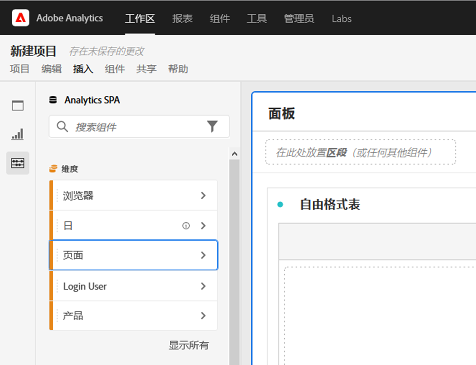
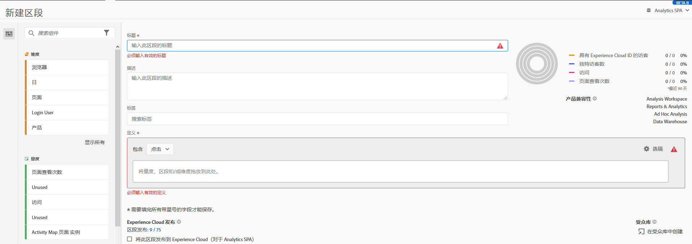

# Analysis Workspace 中的无障碍功能

了解 Customer Journey Analytics 的首要分析工具 [!UICONTROL Analysis Workspace] 中的无障碍支持。

无障碍是指让具有视觉、听觉、认知、行动和其他障碍的人士都可以使用产品。软件产品的无障碍功能示例包括：

* 屏幕阅读器支持，
* 图形的文本对应内容，
* 键盘快捷键，
* 将显示颜色更改为高对比度，
* 等等。

[!UICONTROL Analysis Workspace] 提供了一些无障碍工具，其中包括：

## 键盘导航

[!UICONTROL Analysis Workspace] 中的导航方式包括自上而下，以及从左至右。以下导航元素有助于促进无障碍功能：

* **[!UICONTROL Tab]** 键启用地标快捷方式，可在 Workspace 中的较大部分之间移动。在左侧面板中，**[!UICONTROL Tab]** 还允许您从一个可拖动选项移到下一个可拖动选项。
* 当 **[!UICONTROL Tab]** 键突出显示某个元素后，使用 ◀◀︎ 和 ▶▶︎ 可在各个元素之间移动。
* 使用 **[!UICONTROL F6]** 键可以导航到项目中的第一个面板，并在该面板内的可视化内容之间移动。然后，它会移到项目中的下一个面板并重复上述操作。
* 焦点指示器的应用有助于具有视力的键盘用户能够清楚地了解当前具有焦点的 UI 元素。该指示器是具有焦点的面板的蓝色边框。最近选择的功能以及功能内的选择具有灰色背景。在该示例中，[!UICONTROL 组件]和页面维度是最近选定的。

  

### 菜单栏的键盘导航

1. 按 Tab 键，直到到达菜单栏。
1. 使用箭头键在菜单和菜单项之间导航。
1. 按&#x200B;**[!UICONTROL 输入]**&#x200B;键打开菜单或选择菜单项。
1. 使用&#x200B;**[!UICONTROL 退出]**&#x200B;键关闭菜单。

### 用于拖放交互的键盘导航

[!UICONTROL Analysis Workspace] 是一种拖放式的用户界面。但是，用户可以改用键盘添加组件：

1. 使用 Tab 键前往左侧面板中的组件。
1. 按&#x200B;**[!UICONTROL 输入]**&#x200B;键选择。
1. 使用箭头键，导航到要放置组件的区域。
1. 按&#x200B;**[!UICONTROL 输入]**&#x200B;键放置组件。

### 键盘快捷键（热键）

[!UICONTROL Analysis Workspace] 提供丰富的[键盘快捷键](/help/analyze/analysis-workspace/build-workspace-project/fa-shortcut-keys.md)（热键），以实现更顺畅的工作流。

## 支持屏幕阅读器和屏幕放大镜

屏幕阅读器会读取计算机屏幕上显示的文本。它还可以读取非文本信息，例如应用程序中的按钮标签或图像描述。

## 调色板和对比度

[!UICONTROL Analysis Workspace] 致力于符合 WCAG 2.1 AA 合规性标准，包括对颜色对比度的要求。

此外，用户还可以在&#x200B;**[!UICONTROL 项目]** > **[!UICONTROL 项目设置]** > [项目调色板](/help/analyze/analysis-workspace/build-workspace-project/color-palettes.md)下为项目设置各自的首选调色板。

## 必填字段验证

在构建组件、可视化效果或面板时，进行保存时会验证必填字段。如果必填字段未通过验证，则会使用红色列出，并带有错误图标。书面说明解释了需要修复的内容。

## 支持操作系统无障碍功能

Analysis Workspace 支持内置的 Windows 和 macOS 无障碍功能，如高对比度模式、粘滞键和慢速键/过滤键。此外，它还向操作系统提供关于用户界面的信息，以支持使用辅助技术进行交互操作，其中包括屏幕阅读器，例如 macOS 上的 VoiceOver 以及 Windows 上的 NVDA 等。

<!--

# Accessibility in Analysis Workspace

Learn about accessibility support in [!UICONTROL Analysis Workspace], the premier analysis tool for Adobe Analytics. 

Accessibility refers to making products usable for people with visual, auditory, cognitive, motor, and other disabilities. Examples of accessibility features for software products include screen reader support, text equivalents for graphics, keyboard shortcuts, change of display colors to high contrast, and so on. 

[!UICONTROL Analysis Workspace] provides some tools that make it accessible to use, including:

## Navigate [!UICONTROL Workspace] using the keyboard

Navigation in [!UICONTROL Analysis Workspace] works top > down, and left > right. The following navigational elements facilitate accessibility:

* The `Tab` key enables landmark shortcuts, moving between larger sections within Workspace. In the left rail, `Tab` also enables you to move from one draggable option to the next.
* The `left/right arrows` move between individual elements after `Tab` has highlighted it. 
* The `F6` navigates to the first panel in the project and  moves between the visualizations within that panel. Then, it moves to the next panel in the project and repeats. 
* We apply focus indicators so that sighted keyboard users have a clear indication of which UI element currently has focus. The indicator is a blue border around the selected element.

    

### Keyboard navigation for the menu bar 

1. Tab until you have reached the menu bar.
1. Use left/right arrow keys to navigate to the menu you want.
1. Press `Enter` to select the menu and show its options.
1. Use up/down arrow keys to navigate to the menu option you want.
1. Press `Enter` to select the option.

### Keyboard navigation for drag & drop interactions 

[!UICONTROL Analysis Workspace] is a drag & drop user interface. However, users can add components using the keyboard instead:

1. Tab to a component in the left rail.
1. Press `Enter` to select.
1. Use arrow keys to navigate to the area where you want to drop the component.
1. Press `Enter` to place the component.

### Keyboard shortcuts (hotkeys) 

[!UICONTROL Analysis Workspace] offers a rich set of [keyboard shortcuts](/help/analyze/analysis-workspace/build-workspace-project/fa-shortcut-keys.md) for a more seamless workflow. Some common shortcuts for navigation, analysis creation, and insight democratization are listed below. 

#### Navigation

| Shortcut | Action |
| --- | --- |
| `[Alt + Shift + 1 / 2 / 3]` | Jump to different rails: [!UICONTROL Panels], [!UICONTROL Visualizations], or [!UICONTROL Components] | 
| `[Alt + Left / Right]` | Navigate between panels |
| `[Alt + M]` | Collapse/expand all panels |
| `[Alt + Ctrl + M]` | Collapse/expand active panel |
| `[Ctrl + /]` | Search left rail |

#### Analysis creation

| Shortcut | Action |
| --- | --- |
| `[Alt + 1]` | New freeform table |
| `[Ctrl + Shift + C]` | New calculated metric |
| `[Ctrl + Shift + D]` | New date range |
| `[Ctrl + Shift + E]` | New segment |
| `[Ctrl + Z]` | Undo |
| `[Component drag + Shift]` | Create a drop-down filter |

#### Democratization

| Shortcut | Action |
| --- | --- |
| `[Ctrl + S]` | Save |
| `[Ctrl + Shift + G]` | Curate |
| `[Ctrl + G]` | Share |
| `[Alt + Shift + S]` | Schedule |
| `[Alt + L]` | Get link to project |
| `[Ctrl + Shift + B]` | Download PDF |

## Support for screen readers and screen magnifiers

A screen reader reads text that appears on the computer screen. It also reads non-textual information, such as button labels or image descriptions in the application, provided in accessibility tags or attributes.  

## Color palettes & contrast  

[!UICONTROL Analysis Workspace] strives for WCAG 2.1 AA conformance, including requirements for color contrast. 

In addition, users can set their own preferred color palette for a project under **[!UICONTROL Project]** > **[!UICONTROL Project settings]** > [Project color palette](/help/analyze/analysis-workspace/build-workspace-project/color-palettes.md). 

## Required field validation in component builders 

When building a component, required fields are validated when you save. If a required field does not pass validation, it will be outlined in red with an error icon. A written description appears of the issue that needs to be fixed.  

Once a component is fully validated, pressing `Save` closes the builder. 

## Support for operating system accessibility features  

Analysis Workspace supports built-in MS Windows and macOS accessibility features like high-contrast mode, sticky keys, and slow keys/filter keys. It also provides information about the user interface to the operating system to enable interaction with assistive technologies, including screen readers such as VoiceOver for macOS and NVDA on Windows.

-->