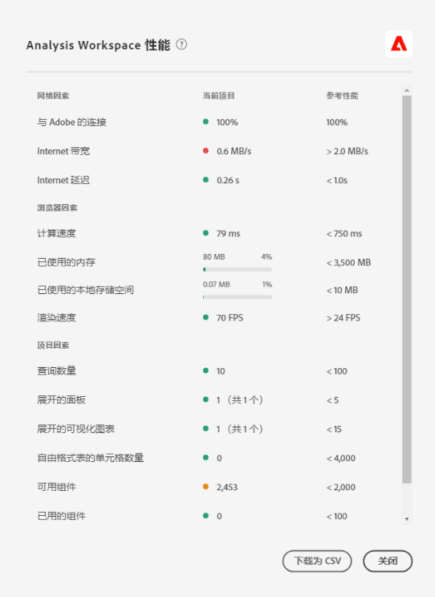

# 优化 [!UICONTROL Analysis Workspace 性能]

各种各样的因素可能都会影响到 Analysis Workspace 中项目的性能。为此，在开始构建项目之前了解这些因素至关重要，从而您可以按照更佳方法来规划和构建项目。本页包含了一个将会影响 Analysis Workspace 性能的因素列表，以及为了确保实现卓越性能而可以采取的优化措施。

## Analysis Workspace 中的[!UICONTROL 帮助] > [!UICONTROL 性能]

在 **Analysis Workspace > [!UICONTROL 帮助] > [!UICONTROL 性能]**&#x200B;下方，您可以看到影响项目性能的诸多因素，其中包括网络、浏览器和项目因素。为了获得最准确的结果，请在打开“性能”页面之前允许完整地加载项目。

* “当前项目”列显示了当前项目的结果和用户环境。
* “准则”列显示了 Adobe 针对每个因素推荐的阈值。

此外，您可以将性能内容&#x200B;**下载为 CSV**，以便与 Adobe 客户关怀团队或您的内部 IT 团队轻松共享。

>[!NOTE]
>
>由于各种因素会发生变化，所以每次打开模态时，“性能”页面上显示的信息也将产生变化。与此同时，随着更多可用数据的出现，Adobe 将会继续微调所提供的准则。

## 网络因素

[!UICONTROL 帮助] > [!UICONTROL 性能]下的网络因素包括：

| 因素 | 定义 | 影响因素 | 优化 |
| --- | --- | --- | --- |
| 与 Adobe 的连接 | 当打开性能页面时，Adobe 将发送 10 个测试调用。其结果表示与 Adobe 成功相连的调用所占的百分比。 | 本地网络问题或 Adobe 问题将会影响该因素。 | 检查 status.adobe.com，以验证是否存在任何已知的服务问题。接下来，验证您的本地网络连接。 |
| Internet 带宽 | 仅适用于 Google Chrome。您的浏览器对您所在位置的带宽的估计值。评估准则为 2.0MB/秒。 | 您的本地网络连接将影响这一因素。 | 验证您的本地网络连接。 |
| Internet 延迟 | 当打开性能页面时，Adobe 将发送 10 个测试调用。其结果表示每个请求连接到 Adobe 并从 Adobe 返回所需的平均时间。更简单地说，它可以衡量您所在的位置与 Adobe 之间的互联网速度。衡量准则为小于 1 秒。 | 本地网络问题、打开的浏览器选项卡过多，或 Adobe 问题都将影响这一因素。 | 检查 status.adobe.com，以验证是否存在任何已知的服务问题。接下来，验证您的本地网络连接，并关闭不使用的浏览器选项卡。 |

## 浏览器因素

[!UICONTROL 帮助] > [!UICONTROL 性能]下的浏览器因素包括：

| 因素 | 定义 | 影响因素 | 优化 |
| --- | --- | --- | --- |
| 计算速度 | 计算机执行某项处理测试的速度。准则为小于 750ms。 | 您的硬件以及并发项目将影响这一因素。 | 打开计算机的任务管理器 (PC) 或活动监视器 (Mac) 以确定能否关闭任何程序。接下来，关闭不使用的浏览器选项卡或其他项目。  如果这些操作不起作用，请与您的 IT 团队讨论硬件的详细信息。 |
| 已使用的内存 | 仅适用于 Google Chrome。Google Chrome 浏览器中的每个“工作区”选项卡可共享总计达 4GB 的内存。其结果表示当前项目正在占用的内存容量的百分比。准则为 3500 MB，若超过这一临界点，工作区将开始显示内存错误。 | 运行多个选项卡或下载 50,000 行数据时，将会增加内存用量。 | 如果收到内存错误，请关闭其他“工作区”选项卡，并且/或者每次运行一个 50,000 行的数据下载。 |
| 已使用的本地存储空间 | 将数据存储到本地计算机，以供在浏览器中使用。每个来源（如 experience.adobe.com）都有 10MB 的容量。 | Analysis Workspace 为多项功能提供了本地存储空间，其中包括存储自动保存（现有）的项目、用户设置和功能标记。 | 为了确保 Analysis Workspace 的功能不被中断，请清除 experience.adobe.com 域的本地存储空间。 |
| 渲染速度 | FPS 表示每秒帧数，即浏览器每秒在屏幕上绘制页面的次数。通常，人的肉眼可观察到 24 FPS 的渲染速度；如果 FPS 低于该值，您将会在工作区中发现渲染问题。 | FPS 受同时跨多个工作区项目的多任务影响，并受所查看项目的大小的影响。计算机上运行的其他项目（如流、后台扫描仪等）可能会产生影响。此外，您的硬件也会影响该因素。 | 打开计算机的任务管理器 (PC) 或活动监视器 (Mac) 以确定能否关闭任何程序。接下来，关闭不使用的浏览器选项卡或其他项目。  如果这些操作不起作用，请与您的 IT 团队讨论硬件的详细信息。 |

## 项目因素

[!UICONTROL 帮助] > [!UICONTROL 性能]下的项目因素包括：

| 因素 | 定义 | 优化 |
| --- | --- | --- |
| 查询次数 | 向 Adobe 发出的查询（请求）总数，这些查询是用来检索项目中显示的数据。查询包括表格的排名请求、异常检测、迷你图、左边栏中显示的组件等。不包括折叠面板和可视化图表。该准则为 100。 | 可采取以下方法来尽可能地简化项目：将数据拆分至多个用于特定目的或利益相关方组的项目中。运用标记将项目整理到不同的主题中，并运用[直接链接](https://experienceleague.adobe.com/docs/analytics/analyze/analysis-workspace/curate-share/shareable-links.html)来创建内部目录，以便利益相关方能够更轻松地找到所需内容。 |
| 已展开的面板（在所有面板中） | 项目的所有面板中已展开面板所占的数量。该准则为 5。 | 采取措施简化项目后，应折叠项目中那些在加载时不需要查看的面板。打开项目时，将仅处理已展开的面板。折叠的面板将不会得到处理，直至用户将它们展开为止。 |
| 已展开的可视化图表（在所有可视化图表中） | 项目的所有图表中已展开的表格和可视化图表所占的数量，包括隐藏的数据源在内。该准则为 15。 | 采取措施简化项目后，应折叠项目中那些在加载时不需要查看的可视化图表。应当优先考虑对报表使用者最为重要的可视化图表，并根据需要将支持的可视化图表划分成一个单独的，更加详细的面板或项目。 |
| 自由格式表的单元格数量 | 项目中自由格式表单元格的总量，计算方法是所有表的行数乘以列数。不包括隐藏的数据源。该准则为 4,000。 | 应当将表中的列数减少至仅包含最相关的数据点。应通过调整显示的行数、应用表过滤器，或应用区段来减少表中的行数。 |
| 可用组件 | 在项目的左边栏检索到的所有报表包中的组件总数。这将影响左边栏的加载速度，以及返回搜索结果的速度。该准则为 2,000。 | 应当与您的产品管理员探讨如何创建一个策划的虚拟报表包，其中包含一组更适合应用环境的组件。 |
| 已用的组件 | 项目中已使用的组件总数。该准则为 100。 | 已使用的组件数量不会对性能产生直接影响。但是，这些组件的复杂性将会对项目的性能产生影响。请参阅下面“其他因素”部分中的各种优化。 |
| 最长的日期范围 | 这个因素将显示项目使用的最长日期范围。该准则为 1 年。 | 请尽量不要获取超过需求的数据。将面板日历缩小到用来分析的相关日期，或在自由格式表中使用日期范围组件（紫色组件）。表中使用的日期范围将覆盖面板日期范围。例如，您可以将上月、上周和昨天添加到表列中，以请求这些特定范围的数据。有关在 Analysis Workspace 中使用日期范围的更多信息，请观看[此视频](https://experienceleague.adobe.com/docs/analytics-learn/tutorials/analysis-workspace/calendar-and-date-ranges/date-ranges-and-calendar-in-analysis-workspace.html?lang=zh-Hans)。  另外，应在项目中最大限度地减少使用年度同期比较的次数。在计算年度同期比较时，它会查看感兴趣的月份之间整整 13 个月的数据。这与将面板日期范围更改为过去 13 个月具有相同的效果。 |

## 其他因素

“帮助”>“性能”中未包含的其他因素：

| 因素 | 定义 | 影响因素 | 优化 |
| --- | --- | --- | --- |
| 区段复杂性 | 复杂的区段可能会对项目性能产生重大影响。 | 增加区段复杂性的因素（按影响程度降序排列）包括： <ul><li>运算符：“包含”、“包含任意”、“匹配”、“开始于”或“结束于” </li><li>连续分段，尤其是使用维度限制（之内/之后）时的连续分段 </li><li>维度内区段中使用的唯一维度项目数（例如，在 Page = &#39;A&#39; 的情况下，页面具有 10 个唯一项目的查询速度将比页面具有 100,000 个唯一项目的查询速度更快） </li><li>使用的不同维度的数量（例如，Page = &#39;Home&#39; 和 Page = &#39;Search results&#39; 的查询速度将比 eVar 1 =&#39;red&#39; 和 eVar 2 =&#39;blue&#39; 更快）</li><li>许多“或”运算符（而不是“和”）</li><li>嵌套容器的范围不同（例如，“访客”中“访问次数”内的“点击”）</li></ul> | 虽然无法避免某些复杂因素，但应寻找机会降低区段的复杂性。通常，您的区段标准越具体，其性能就越好。例如：<ul><li>对于容器，使用区段顶部的单个容器的速度将比使用一系列嵌套容器的速度更快。</li><li>对于运算符，“等于”比“包含”运算速度快，“等于任意”比“包含任意”运算速度快。</li><li>对于许多标准，使用“和”运算符的速度将比使用一系列“或”运算符的速度更快。</li></ul> 寻找机会，将多个 OR 语句简化为单个“等于任意”语句。使用  [分类](/help/components/classifications/c-classifications.md)可有助于将众多值合并到简洁的组中，您随后可以在这些组中创建区段。与含有许多 OR 语句或“包含”标准的区段相比，按分类组划分区段可提供更佳的性能。 |
| 可视化图表的复杂性（区段、量度、过滤器） | 自行添加到项目中的可视化图表类型（例如，流失和自由格式表）不会对项目性能有太大影响。可视化图表的复杂性会增加处理时间。 | 导致可视化图表复杂性增加的因素包括：<ul><li>请求的数据范围</li><li>应用的区段数量；例如，用作自由格式表行的区段</li><li>使用复杂区段</li><li>[静态项目](https://experienceleague.adobe.com/docs/analytics/analyze/analysis-workspace/visualizations/freeform-table/column-row-settings/manual-vs-dynamic-rows.html?lang=zh-Hans)行或列（位于自由格式表中）</li><li>应用于自由格式表行的过滤器</li><li>包含的量度数量，尤其是使用区段的计算量度</li></ul> | 如果您注意到项目没有按所需的速度加载，请尽量尝试将某些区段替换为 eVar 和过滤器。  如果您发现自己正在不断地将一些区段和计算量度用于对业务非常重要的数据点，请考虑改进您的实施方式，以便更直接地捕获这些数据点。使用 Adobe Experience Platform 中的标记和 Adobe 的处理规则，可以快速更改实施方式，而且也有利于实施。 |
| 报表包大小 | 报表包中收集到的数据量。 | - | 请咨询您的实施团队或 Adobe 专家，确定是否可以开展实施方面的改进，以提升 Adobe Analytics 的综合体验。 |
| 并行查询 | 您的组织同时向 Adobe 请求的查询数。每个组织都有权进行至少 5 个并发查询。 | 如果报表需要较长时间，通常是因为其所在队列中有其他报表。这意味着您的组织针对特定报表包尝试运行的并发请求过多。查询可能来自 API 请求、报告 UI（Analysis Workspace、Report Builder 等）、计划项目、计划报告、计划警报以及发出报告请求的并发用户。 | 将报表包的请求和计划较为均匀地分布在一天当中。此外，请尽可能将您的请求转移到非高峰时段。周一早上、周二早上和每个月的第一天是报告高峰时段。 |

## 提高 Analysis Workspace 中工作效率的技巧

以下是一段关于该主题的视频：

>[!VIDEO](https://video.tv.adobe.com/v/31157/?quality=12)
