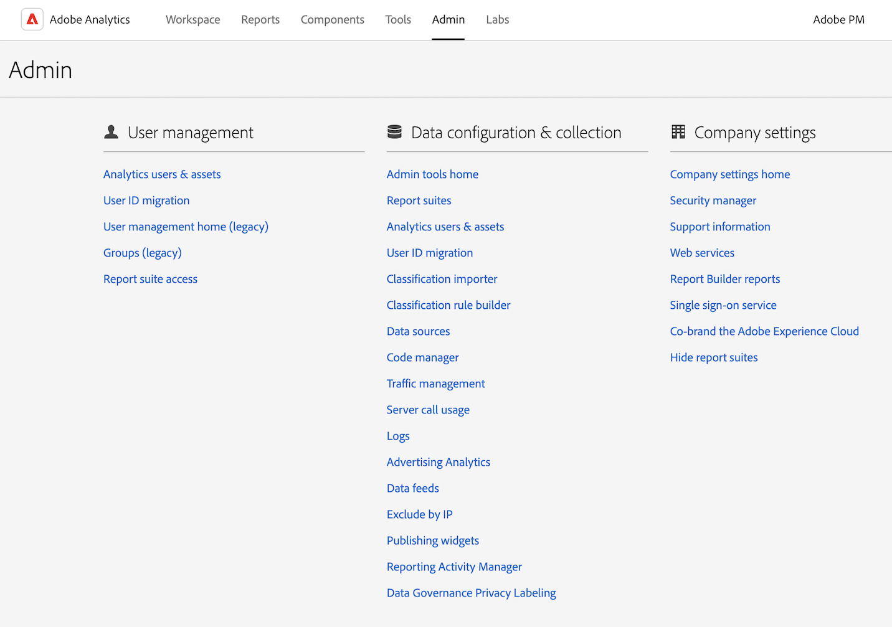

# 了解 Analytics 界面

Adobe Analytics 界面由以下关键区域组成，包括用于管理 Analysis Workspace 中的项目、管理组件、工具和管理员功能的选项卡。

以下部分描述了 Analysis Workspace 的每个区域：

## Workspace 选项卡

默认情况下，[!UICONTROL Workspace] 选项卡显示[!UICONTROL 项目]区域，该区域显示 Company 文件夹、您创建的任何个人文件夹、您的项目和移动记分卡。

1. 在 Adobe Analytics 中，选择 [!UICONTROL **Workspace**] 选项卡。

   

关于 [!UICONTROL Workspace] 选项卡上可用的特性和功能的更多信息，请参阅 [Adobe Analytics 登录页面](/help/analyze/landing.md)。

## “报告”选项卡

请使用 [!UICONTROL **Workspace**] 选项卡上左边栏中的&#x200B;[!UICONTROL **报告**]&#x200B;区域。有关更多信息，请参阅在 [Adobe Analytics 登录页面](/help/analyze/landing.md)中的&#x200B;*导航“报告”选项卡*。

## “组件”选项卡

[!UICONTROL 组件]选项卡包含可帮助您微调和增强数据分析的功能。

1. 在 Adobe Analytics 中，选择&#x200B;[!UICONTROL **组件**]&#x200B;选项卡，然后选择&#x200B;[!UICONTROL **所有组件**]。

   

2. 选择以下任一产品功能进行配置：

   | 产品功能 | 功能 | 更多信息 |
   |---------|----------|----------|
   | 区段 | Adobe Analytics 允许您使用各种 Analytics 功能、Adobe Experience Cloud、Adobe Target 和其他集成的 Adobe 产品生成、管理和共享强大而集中的受众区段并将它们应用到您的报表中。 | [Analytics 分段](https://experienceleague.adobe.com/docs/analytics/components/segmentation/seg-home.html) |
   | 计算量度 | 计算量度和高级计算（或派生）量度是指您可以从现有量度创建的自定义量度。通过使用这些工具，营销人员、产品经理和分析人员不必更改 Analytics 实施，即可提出有关数据的问题。 | [计算量度和高级计算量度](https://experienceleague.adobe.com/docs/analytics/components/calculated-metrics/cm-overview.html) |
   | 日期范围 | Analysis Workspace 包含用户在构建分析时可以使用的默认日期范围列表。此外，您可以创建自定义日期范围并将其提供给 Analysis Workspace 中的用户。 | [创建自定义日期范围](https://experienceleague.adobe.com/docs/analytics/analyze/analysis-workspace/components/calendar-date-ranges/custom-date-ranges.html?lang=zh-Hans) <!-- should create an article in the Components Guide for managing/creating date ranges. This article in the Tools Guide needs updating. --> |
   | 虚拟报表包 | 虚拟报表包可对您的 Adobe Analytics 数据进行分段，以便您能够控制每个区段的访问权限。 | [虚拟报表包概述](https://experienceleague.adobe.com/docs/analytics/components/virtual-report-suites/vrs-about.html?lang=zh-Hans) |
   | 警报 | 警报功能允许对警报进行更多粒度控制，而且还可以将异常检测与警报系统集成在一起。 | [警报概述](https://experienceleague.adobe.com/docs/analytics/components/alerts/intellligent-alerts.html) |
   | 批注 | 工作区中注释使您能够有效地将上下文数据的细微差别和见解传达给您的组织。它们可让您将日程表活动与特定维度和量度关联起来。 | [管理批注](https://experienceleague.adobe.com/docs/analytics/analyze/analysis-workspace/components/annotations/manage-annotations.html) |
   | 分类集 | 分类集提供单一界面来管理分类和规则。 
分类是在生成报表时对 Analytics 变量数据进行分类，然后以不同的方式显示数据的方法。您在变量值和与该值相关的元数据之间建立关系。分类可用于大多数自定义维度，例如跟踪代码、props 和 eVar。
 | [分类集概述](https://experienceleague.adobe.com/docs/analytics/components/classifications/sets/overview.html?lang=zh-Hans) |
   | 位置 | 为了从云目标导入 Adobe Analytics 分类数据，您首先需要添加并配置要收集分类数据的位置。您可以创建、编辑或删除位置。 | [位置管理器](https://experienceleague.adobe.com/docs/analytics/components/locations/locations-manager.html) |
   | 计划项目 | 管理计划项目时，可以编辑和删除重复项目计划；在搜索栏中或使用左侧边栏中的过滤器选项搜索计划；并按标记、批准的计划、所有者等进行过滤。 | [计划项目](/help/components/scheduled-projects-manager.md) |
   | 仪表板 | 创建仪表板是为了可视化量度并提供数据的交互式分析功能。通过单击仪表板中的项目，您可以快速轻松地对数据进行分段，以从分析中获取信息。 
仪表板是 Data Workbench 的一部分。阅读关于 Data Workbench 的[终止使用公告](https://experienceleague.adobe.com/docs/data-workbench/using/eol.html?lang=zh-Hans)。 | [功能板管理器](https://experienceleague.adobe.com/docs/analytics/analyze/reports-analytics/dashboard-manage.html) |
   | 计划报告 | 管理员级别的用户能够跨组织查看和管理计划报表。 | [计划报表队列](https://experienceleague.adobe.com/docs/analytics/components/scheduled-reports-admin.html) |
   | 报表设置 | 这些设置引用旧版 Adobe Analytics 产品，其中不包括 Analysis Workspace 及其相关组件。对 Analysis Workspace 设置进行调整，转至“组件”>“偏好设置”。 |  |
   | 偏好设置 | 为创建的所有新项目或面板管理 Analysis Workspace 及其相关组件的设置。现有项目和面板不受影响。 | [偏好设置](/help/analyze/analysis-workspace/user-preferences.md) |

   {style="table-layout:auto"}

## “工具”选项卡

<!-- The Tools tab ... -->

1. 在 Adobe Analytics 中，选择&#x200B;[!UICONTROL **工具**]&#x200B;选项卡，然后选择&#x200B;[!UICONTROL **所有工具**]。

   

2. 选择以下任一产品功能进行配置：

   | 产品功能 | 功能 | 更多信息 |
   |---------|----------|----------|
   | Data Warehouse | Data Warehouse 指的是用于存储和自定义报表的 Analytics 数据副本，您可以通过筛选数据来运行这些数据 
请求管理器允许您查看和复制请求，并重新安排请求的优先级。
 | [管理 Data Warehouse 请求](https://experienceleague.adobe.com/docs/analytics/export/data-warehouse/data-warehouse-requests-manage.html?lang=zh-Hans) |
   | Activity Map | Activity Map 专门用于通过可视化叠加图为链接活动排名，并且可以提供实时分析功能板，以监控受众在您网页上的参与度。让您可以设置不同的视图，以此来直观地标识客户活动的增速、量化营销方案，并根据受众的需求和行为采取相应的措施。 | [Activity Map 概述](https://experienceleague.adobe.com/docs/analytics/analyze/activity-map/activity-map.html?lang=zh-Hans) |
   | 经典版推荐 | 推荐是一项 Adobe Target 功能，它根据以前的用户活动、偏好设置或其他标准，自动显示可能让访客感兴趣的产品、服务或内容。 | [推荐](https://experienceleague.adobe.com/docs/target/using/recommendations/recommendations.html) |
   | Search &amp; Promote | 不再支持此功能。 |  |
   | Mobile Services | 不再支持此功能。 |  |
   | Analytics 功能板（移动应用程序） | Adobe Analytics 功能板应用程序可以随时随地从 Adobe Analytics 提供见解。通过此应用程序，用户可以查看您使用 Adobe Analytics 桌面 UI 创建的直观记分卡。 | iOS App Store 或 Google Play 商店中的 Adobe Analytics 功能板应用程序 |
   | Report Builder | Adobe Report Builder 是 Microsoft Excel 的一个加载项。通过它，可从 Adobe Analytics 数据构建自定义的请求，并可将其插入 Excel 工作表。请求可动态引用工作表中的单元格，并且您可更新和自定义 Report Builder 展示数据的方式。 | [Report Builder 是什么？](https://experienceleague.adobe.com/en/docs/analytics/analyze/report-builder/rb-overview) |

   {style="table-layout:auto"}

## “管理员”选项卡

“管理员”选项卡包含用于管理 Adobe Analytics 的功能和配置选项。

1. 在 Adobe Analytics 中，选择&#x200B;[!UICONTROL **管理员**]&#x200B;选项卡，然后选择&#x200B;[!UICONTROL **所有管理员**]。

   

2. 选择以下任一产品功能进行配置：

   | 产品功能 | 功能 | 更多信息 |
   |---------|----------|----------|
   | Analytics 用户和资源 | 大多数用户和产品管理功能现在只能在 [Adobe Admin Console](https://helpx.adobe.com/cn/enterprise/using/admin-console.html) 中使用，将资源从一个用户转移到另一个用户以及设置用户帐户有效期限的管理功能只能从 Adobe Analytics 管理员区域使用。 | [转移用户资源或设置帐户有效期限](https://experienceleague.adobe.com/docs/analytics/admin/admin-tools/user-product-management/users-assets.html) |
   | 用户 ID 迁移 | 通过 Analytics 用户 ID 迁移，管理员可以轻松地将 Analytics User Management 中的用户帐户迁移到 Adobe Admin Console。 | [将 Analytics 用户迁移到 Adobe Admin Console](https://experienceleague.adobe.com/docs/analytics/admin/admin-tools/user-product-management/migrate-users/c-migration-tool.html) |
   | 用户管理主页（旧版） | 用户和产品管理已移至 Adobe Admin Console。可使用 Adobe Admin Console 开始管理 Adobe Analytics 用户的用户权限。 | [Adobe Admin Console 中的 Analytics](https://experienceleague.adobe.com/docs/analytics/admin/admin-console/home.html?lang=zh-Hans) |
   | 群组（旧版） | 群组管理已移至 Adobe Admin Console。可使用 Adobe Admin Console 开始管理 Adobe Analytics 的群组。 | [Adobe Admin Console 中的 Analytics](https://experienceleague.adobe.com/docs/analytics/admin/admin-console/home.html?lang=zh-Hans) |
   | 报表包访问 | 用于授予对报表包工具的访问权限的方法已移至 Adobe Admin Console。可使用 Adobe Admin Console 向 Adobe Analytics 用户授予报表包访问权限。 | [报表包工具的产品轮廓权限](https://experienceleague.adobe.com/docs/analytics/admin/admin-console/permissions/report-suite-tools.html?lang=zh-Hans) |
   | 管理工具主页 | Analytics 管理工具区域是管理 Adobe Analytics 实例的主要区域；可以在此区域完成大多数管理任务。 | [管理工具概述](https://experienceleague.adobe.com/docs/analytics/admin/admin-tools/c-admin-tools.html) |
   | 报表包 | 可让您定义一些规则来管理报表包中数据的处理方式。 | [报表包管理器](https://experienceleague.adobe.com/docs/analytics/admin/admin-tools/manage-report-suites/report-suites-admin.html) |
   | Analytics 用户和资源 | 用户和资源管理已移至 Adobe Admin Console。可使用 Adobe Admin Console 开始管理 Adobe Analytics 用户的用户权限。 | [Adobe Admin Console 中的 Analytics](https://experienceleague.adobe.com/docs/analytics/admin/admin-console/home.html?lang=zh-Hans) |
   | 分类导入器 | 使用导入器将分类上传到 Adobe Analytics。您也可以在导入前导出要更新的数据。 | [分类导入器概述](https://experienceleague.adobe.com/docs/analytics/components/classifications/classifications-importer/c-working-with-saint.html) |
   | 分类规则生成器 | 您无需在每次跟踪代码变更时维护并上载分类，而是可以创建自动、基于规则的分类并将这些分类应用在多个报表包中。 | [分类规则生成器工作流](https://experienceleague.adobe.com/docs/analytics/components/classifications/classifications-rulebuilder/classification-rule-builder.html) |
   | 数据源 | 可使用数据源管理器创建、编辑或停用数据源。您还可以使用此界面跟踪上传到数据源 FTP 位置的文件的状态。 | [管理数据源](https://experienceleague.adobe.com/docs/analytics/import/data-sources/manage.html) |
   | 代码管理器 | 代码管理器可让您下载适用于 Web 和移动平台的数据收集代码 | [代码管理器](https://experienceleague.adobe.com/docs/analytics/admin/admin-tools/code-manager-admin.html) |
   | 流量管理 | 使用“流量管理”页面可以指定预期流量的变更。这些设置可让 Adobe 分配适当的资源，确保能够及时跟踪和处理您的流量。 | [流量管理概述](https://experienceleague.adobe.com/docs/analytics/admin/admin-tools/manage-report-suites/edit-report-suite/traffic-management/traffic-management.html) |
   | 服务器调用使用情况 | 服务器调用又称为“点击”或“图像请求”，它是一种将数据发送到 Adobe 服务器进行处理的实例。提供了“服务器调用使用情况”功能板，来跟踪服务器调用使用情况数据，并将其与合同中的使用限制进行比较。可以设置警报以防止超额情况。 | [服务器调用使用情况概述](https://experienceleague.adobe.com/docs/analytics/admin/admin-tools/server-call-usage/overage-overview.html) |
   | 日志 | 日志文件有助于您了解用户登录的时间、用户使用情况、访问情况、报表包，以及管理员执行的更改。 | [日志](https://experienceleague.adobe.com/docs/analytics/admin/admin-tools/logs.html) |
   | Advertising Analytics | 可配置 Adobe Analytics 以并排显示所有 Google 和 Bing 付费搜索数据。 | [配置 Advertising Analytics](https://experienceleague.adobe.com/docs/analytics/admin/admin-tools/manage-report-suites/edit-report-suite/advertising-analytics-config.html) |
   | 数据馈送 | 数据馈送是从 Adobe Analytics 中获取原始数据的有效方法。此原始数据可在 Adobe 以外的其他平台中使用，具体所用平台由您的组织自行决定。 | [Analytics 数据馈送概述](https://experienceleague.adobe.com/docs/analytics/export/analytics-data-feed/data-feed-overview.html?lang=zh-Hans) |
   | 按 IP 排除 | 您可以从报表中排除特定 IP 地址的数据，例如，内部网站活动、站点测试和员工使用情况。数据排除能够通过排除 IP 地址数据来提高报表的准确性。此外，还可以删除来自拒绝服务攻击或其他可能影响报表数据准确性的恶意事件的数据。您可以对排除进行配置，也可以使用您的防火墙进行排除。 | [按 IP 地址排除](https://experienceleague.adobe.com/docs/analytics/admin/admin-tools/exclude-ip.html?lang=zh-Hans) |
   | 报告活动管理器 | 通过报告活动管理器，可查看组织中每个报表包的报告容量。它可让您详细了解报告消耗，并帮助您轻松地诊断和修复在报告高峰期出现的容量问题。 | [报告活动管理器](https://experienceleague.adobe.com/docs/analytics/admin/admin-tools/reporting-activity.html) |
   | 数据治理隐私标签 | 为报表包数据设置标签即是向给定报表包中的每个变量分配身份标识、敏感性和数据管理标签。 | [为报表包数据设置标签](https://experienceleague.adobe.com/docs/analytics/admin/admin-tools/data-governance/data-labels/gdpr-setup-reportsuite.html) |
   | 公司设置主页 | 通过“公司设置”页面，您可以配置设置以将其应用于您的组织所管理的所有报表包。 | [公司设置概述](https://experienceleague.adobe.com/docs/analytics/admin/admin-tools/company-settings/c-company-settings.html) |
   | 安全管理器 | 通过安全管理器，您可以控制对报表数据的访问。相关选项包括强密码、密码过期时间、IP 登录限制及电子邮件域限制。 | [安全管理器](https://experienceleague.adobe.com/docs/analytics/admin/admin-tools/company-settings/security-manager.html) |
   | Web 服务 | Web 服务 API 可通过编程方式访问市场营销报告及其他“包”服务，从而让您以其他方式使用通过 Analytics 界面提供的功能，以及实现更多功能。 | [Web 服务](https://experienceleague.adobe.com/docs/analytics/admin/admin-tools/company-settings/web-services-admin.html) |
   | Report Builder 报表 | 管理分配给 Report Builder 用户的许可证。 | [Report Builder 报表](https://experienceleague.adobe.com/docs/analytics/admin/admin-tools/company-settings/report-builder-reports-admin.html) |
   | 单点登录服务 | Adobe Experience Cloud 中的单点登录是通过 Admin Console 实施的。 | [Adobe Admin Console 中的 Analytics](https://experienceleague.adobe.com/docs/analytics/admin/admin-console/home.html?lang=zh-Hans) |
   | 隐藏报表包 | 可让您在不再希望报表包对您和您的用户可用时，在 Adobe Analytics 用户界面中隐藏报表包。 | [隐藏报表包](https://experienceleague.adobe.com/docs/analytics/admin/admin-tools/company-settings/c-hide-report-suites.html) |

   {style="table-layout:auto"}

## Analysis Workspace

利用 Analysis Workspace，可以快速生成分析以收集见解，然后与其他人共享这些见解。可以使用拖放浏览器界面进行分析、添加可视化图表以便直观地呈现数据、梳理数据集以及与您选定的任何人员共享和安排项目。

下面的图像和附表解释了 Analysis Workspace 中的一些主要区域。

有关 Analysis Workspace 的更详细概述，请参阅 [Analysis Workspace 概述](/help/analyze/analysis-workspace/home.md)。

| 图像中的位置 | 名称和功能 |
|---------|----------|
| A | **最左侧边栏：**&#x200B;包含用于向 Analysis Workspace 添加面板、可视化图表和组件的选项卡。还包含用于打开数据词典的数据词典图标。 |
| B | **左边栏：**&#x200B;根据在最左侧边栏中选择的选项卡，此区域包含单独的面板、可视化图表或组件。 |
| C | **画布：**&#x200B;这是您从左边栏拖动内容以构建项目的主要区域。当您向画布添加面板、可视化图表和组件时，项目将动态更新。 |
| D | **报表包下拉菜单：**&#x200B;对于 Analysis Workspace 中的每个面板，报表包下拉菜单可让您选择要用作数据源的报表包。 |
