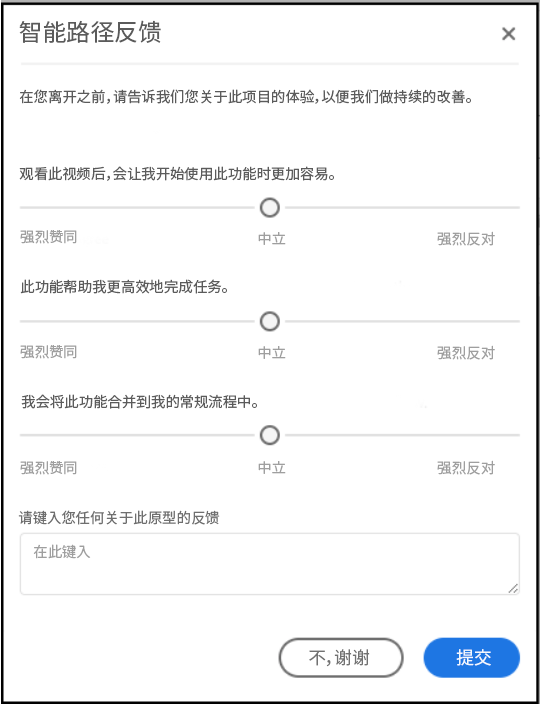

# [!UICONTROL Labs] 用户指南

[!UICONTROL Labs] 允许更快地为早期创意制作原型。它以客户为中心，整合了工具和流程，可加快开发速度并提高开发透明度。它允许用户与新兴技术交互，发掘有价值的分析，并影响未来的功能开发和优先级。您可以通过 Labs 抢先试用 Adobe Analytics 创新，并在您自己的业务用例和数据范围内评估即将推出的功能。

## 要求

已为所有管理员自动启用 [!UICONTROL Labs]。其他团队成员应联系其产品管理员并请求获取访问权限。

如果您尚未这样做，请阅读并签署适用的“保密协议”和“条款与条件”表格。

## 访问 [!UICONTROL Labs] 门户

要访问 [!UICONTROL Labs]，请执行以下操作：

1. 如果您还没有[!UICONTROL 工作区]和 [!UICONTROL Labs] 的访问权限，请联系管理员以获取相应权限。

1. 单击 **[!UICONTROL Labs]** 选项卡。

## 评估原型

要启动并评估原型，请执行以下操作：

1. 在 [!UICONTROL Labs] 屏幕上，单击要查看的原型的&#x200B;**[!UICONTROL 启动]**。启动原型后，您将在原型环境的左上方看到其名称。

   

1. 通过单击屏幕右上方的&#x200B;**[!UICONTROL 观看视频]**，观看重点介绍原型的视频。观看完视频后，单击&#x200B;**[!UICONTROL 关闭]**。

   

1. 使用原型。在原型环境中工作时：

* 无法保存或共享在原型环境中创建的项目。

* 在原型中，可以使用您在工作区中有权访问的任何维度、量度、区段和可视化图表来评估数据。

* 您在原型中进行的任何更改不会影响数据收集或处理。

* 通过创建或修改区段、计算量度和警报所做的更改将在原型环境之外持续保留。

## 提供反馈

1. 单击&#x200B;**[!UICONTROL 提供反馈]**，以便在使用原型时随时在消息框中提供反馈。

   

1. 单击&#x200B;**[!UICONTROL 提交]**&#x200B;以发送您的反馈。

1. 要尝试使用其他原型，或退出原型环境，请单击屏幕右上方的&#x200B;**[!UICONTROL 离开原型]**，并完成有关原型的简短调查。退出原型环境后，对原型项目所做的任何更改都将丢失。

   

1. 单击&#x200B;**[!UICONTROL 提交]**&#x200B;以返回主“预览”门户。

## 其他信息

* [!UICONTROL Labs] 中的一些原型会成为 Adobe Analytics 功能，而其他一些原型则不会。您的反馈有助于我们做出合理决策，因此请查看原型并告知 Adobe 它们对您的重要性。
* Labs 适用于所有 SKU 授权。
