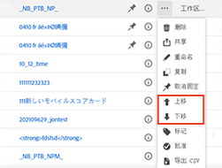
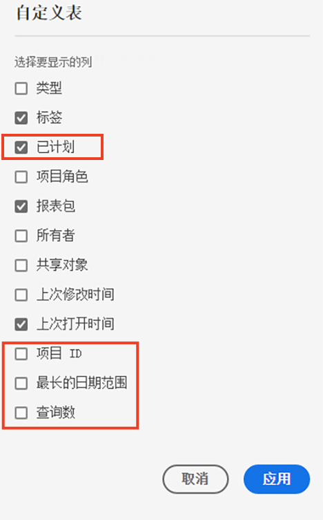
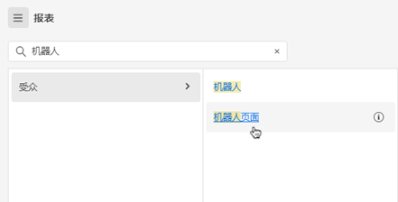
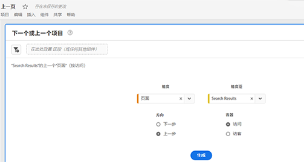
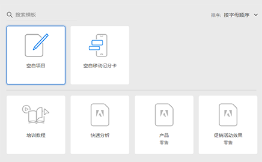
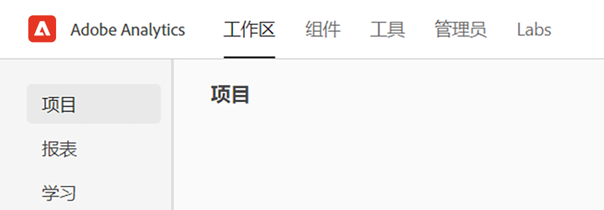
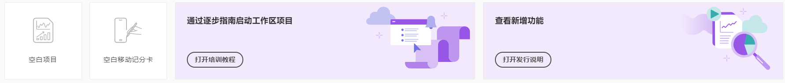
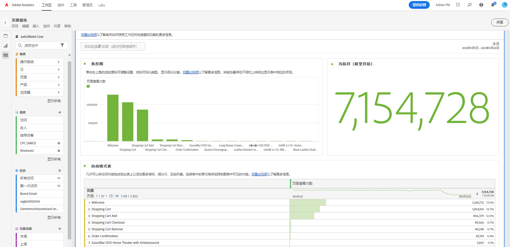
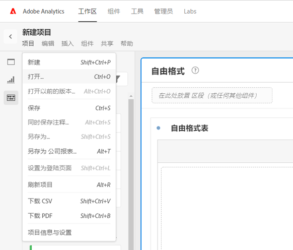

# Adobe Analytics 登陆页面

Adobe Analytics 的登陆页面将 [!DNL Analysis Workspace] 与 [!DNL Reports & Analytics] 融于一个界面中，提供[!DNL Workspace] 伞形结构下的访问点。它配有项目管理器主页、更新的报告菜单、现代化报告，以及学习部分，帮助您更高效地入门。以下是一段视频概述：

>[!VIDEO](https://video.tv.adobe.com/v/334278/?quality=12)

## 新的登陆页面功能 {#new-features}

| 功能 | 描述 | 屏幕快照 |
| --- | --- | --- |
| 全屏展开[!UICONTROL 项目]表格 | 单击汉堡菜单图标，展开表格。此操作将折叠左边栏标签。 |  |
| 自定义列宽 | 以前，列宽是固定的。现在可以通过拖动列分隔符进行调整。 |  |
| 重新排列固定项目 | 要上下移动固定项目，请单击固定项目旁边的省略号，然后选择&#x200B;**[!UICONTROL 向上移动]** 或 **[!UICONTROL 向下移动]**。 |  |
| 新表列 | 单击表格右上角的 [!UICONTROL 自定义表格] 图标。新表列包括： <ul><li>**[!UICONTROL 计划项目]**：当项目已计划时，设置为[!UICONTROL 开启]，或者，但项目未计划时，设置为[!UICONTROL 关闭]。点击 [!UICONTROL 开启] 链接，您可以看到有关计划项目的信息。如果您是项目所有者，也可[编辑项目计划](/help/analyze/analysis-workspace/curate-share/t-schedule-report.md)。</li><li>**[!UICONTROL 项目 ID]**：项目 ID 可用于调试项目。</li><li>**[!UICONTROL 最长的日期范围]**：较长的日期范围会增加项目的复杂性，并可能增加处理和加载时间。 </li><li>**[!UICONTROL 查询次数]**：项目加载时向 Analytics 发出的请求总数。较多的项目查询次数会增加项目的复杂性，并可能增加处理和加载时间。此数据仅在加载项目或发送计划项目后可用。 </li></ul> |  |
| 单击打开报告。 | （以前，您必须双击。） |  |
| **[!UICONTROL Reports &amp; Analytics]** 报告的新链接 | <ul><li>**[!UICONTROL 报告]** > **[!UICONTROL 受众]** > **[!UICONTROL 机器人]**</li><li>**[!UICONTROL 报告]** > **[!UICONTROL 受众]** > **[!UICONTROL 机器人页面]**<li>**[!UICONTROL 报告]** > **[!UICONTROL 参与]** > **[!UICONTROL 实时]**</li></ul> |  |
| 全新开箱即用报告 | <ul><li>**[!UICONTROL 报告]** > **[!UICONTROL 最受欢迎]** > **[!UICONTROL 下一页]**</li><li>**[!UICONTROL 报告]** > **[!UICONTROL 最受欢迎]** > **[!UICONTROL 上一页]**</li><li>**[!UICONTROL 报告]** > **[!UICONTROL 参与]** > **[!UICONTROL 页面分析]** > **[!UICONTROL 页面摘要]**</li></ul>请注意，这些报告采用[!UICONTROL 工作区]格式，需要配置和构建。输出包括一组高级别指标、趋势数据、[!UICONTROL 流程] 可视化等。您可以修改这些报告并更改维度、维度项数等。这些报告也可以作为工作区面板下的面板使用。 |  |
| **[!UICONTROL 新建项目]**&#x200B;模式恢复 | 当在 Workspace 中单击&#x200B;**[!UICONTROL 新建项目]**&#x200B;时，您可再次在[!UICONTROL 空白项目]和[!UICONTROL 空白移动记分卡]之间进行选择。 您也可以从公司创建的任何模板中进行选择。 |  |
| 也在 Customer Journey Analytics 中提供 | 此登录页面的修改版也将在 CJA 中提供。 |  |

{style="table-layout:auto"}

## 顶部菜单结构 {#top-menu}

* 顶部 Analytics 菜单：现在，大多数报告都位于左边栏中的[!UICONTROL 报告]菜单中。
* 左边栏有三个选项卡：[!UICONTROL 项目]、[!UICONTROL 报告]和[!UICONTROL 学习]。

### 术语

* **[!UICONTROL 项目]**&#x200B;是自定义的设计，结合了您构建的或其他人构建并与您共享的数据组件、表格和可视化图表。[!UICONTROL 项目]还指空白项目和空白移动记分卡。
* **[!UICONTROL 报告]**&#x200B;是指 Adobe 预建的任何内容，例如 Reports &amp; Analytics 中的报告和工作区中的模板。
* **[!UICONTROL 模板]**&#x200B;不再用作 Adobe 预建的工作区项目的术语。它们现在归入[!UICONTROL 报告]下。术语[!UICONTROL 模板]仍然用于您公司创建的模板。

## 在[!UICONTROL 项目]选项卡中导航 {#navigate-projects}

[!UICONTROL 项目]用作 [!UICONTROL Workspace] 主页。“项目”选项卡显示公司文件夹、您创建的任何个人文件夹、您的项目和移动记分卡。使用此页面可查看、创建和修改文件夹、项目和移动记分卡。有关更多信息，请参阅[关于 Analytics 中的文件夹](/help/analyze/analysis-workspace/build-workspace-project/workspace-folders/about-folders.md)。

>[!NOTE]
>
>以下几种设置会在该会话和多个会话期间保留。例如，您选择的选项卡、选择的过滤器、选择的列以及列排序方向。搜索结果不是持久性的。

| UI 元素 | 定义 |
| --- | --- |
| 编辑偏好设置 | 可让您[!UICONTROL 查看教程]和[编辑用户偏好设置](/help/analyze/analysis-workspace/user-preferences.md)。 |
| [!UICONTROL 新建] | 打开项目模式，您可以在其中创建 Workspace 项目或移动记分卡，也可以打开公司模板。 |
| [!UICONTROL 显示更少  显示更多] | 在不显示和显示横幅之间切换： |
| [!UICONTROL Workspace 项目] | 创建一个空白 [Workspace 项目](https://experienceleague.adobe.com/docs/analytics/analyze/analysis-workspace/home.html?lang=zh-Hans)以便您进行设计和构建。 |
| [!UICONTROL 移动记分卡] | 创建一个空白[移动记分卡](https://experienceleague.adobe.com/docs/analytics/analyze/mobapp/curator.html)以便您进行设计和构建。 |
| [!UICONTROL 打开培训教程] | 打开 Workspace 培训教程，它会通过分步教程指导您完成构建新的入门项目的过程。 |
| [!UICONTROL 打开发行说明] | 打开最新的 Adobe Experience Cloud 发行说明的 Adobe Analytics 部分。 |
| 过滤器图标 | 按标记、报告包、所有者、类型和其他过滤器（“我的”、“已与我共享”、“收藏”和“已批准”）进行过滤 |
| 搜索栏 | 搜索表中的所有列。 |
| 选区框 | 选择一个或多个项目可显示您可以执行的项目管理操作：**删除**、**共享**、**重命名**、**复制**、**取消固定**、**上移**、**下移**、**标记**、**批准**、**导出 CSV** 和&#x200B;**移至**。您可能无权执行所有列出的操作。 |
| [!UICONTROL 收藏] | 在可用作过滤器的收藏项目或文件夹旁边添加星号。 |
| [!UICONTROL 名称] | 标识项目的名称。 |
| 固定图标 | 固定项目，使它们始终显示在列表顶部，但您可以通过上移或下移项目来重新调整其顺序。使用省略号选项菜单并在列表中选择&#x200B;**上移**&#x200B;或&#x200B;**下移**。 |
| 信息 (i) 图标 | 显示有关项目的以下信息：类型、项目角色、所有者、描述及其共享对象。它还指示谁可以[编辑或复制](https://experienceleague.adobe.com/docs/analytics/analyze/analysis-workspace/curate-share/share-projects.html?lang=zh-Hans)此项目。 |
| 省略号 (...) | 显示您可以执行的项目管理操作：**删除**、**共享**、**重命名**、**复制**、**取消固定**、**上移**、**下移**、**标记**、**批准**、**导出 CSV** 和&#x200B;**移至**。您可能无权执行所有列出的操作。 |
| [!UICONTROL 类型] | 指示此类型是 Workspace 项目、移动记分卡还是文件夹。 |
| [!UICONTROL 标记] | 标记项目以将其整理到组中。 |
| [!UICONTROL 项目角色] | 标识项目角色：您是否为项目所有者，以及您是否具有编辑或复制项目的权限。 |
| [!UICONTROL 报告包] | 标识与项目关联的报告包。 面板中的表格和可视化图表从在面板的右上角选中的报告包中派生数据。报告包还确定在左边栏中有哪些组件可用。在项目中，您可以根据分析用例，使用一个或多个报告包。报告包列表按相关性排序。Adobe 在定义相关性时，依据当前用户在近期使用该包的频率以及该包在组织中的使用频率。 |
| [!UICONTROL 所有者] | 标识已创建项目的用户。 |
| [!UICONTROL 上次打开时间] | 标识您上次打开项目的日期。 |
| 自定义表格图标 | 选择要在表中查看的列。要在项目列表中添加或删除列，请单击右上角的列图标（），然后选择或取消选择列标题。 |
| 显示：文件夹和项目或所有项目 | 更改表格上的视图设置可根据文件夹结构显示文件夹和项目&#x200B;**或**&#x200B;在无结构的列表中显示所有项目。 |
| &lt;（“返回”按钮） | 返回到 Workspace 项目或报告中最新的登陆页面配置。您离开登陆页面时的页面配置将在您返回时保留。 |

### 弃用项目管理器页面 {#deprecate-pm-page}

随着新登陆页面的发布，我们弃用了项目管理器，如组件管理器下所列。新的登陆页面将处理旧项目管理器页面的所有功能以及其他功能。

项目管理器页面的一个常见用例是查看您的所有项目。

要使用筛选器边栏查看新登陆页面上的所有项目，请选择&#x200B;**其他过滤器**，然后选择&#x200B;**全部显示**。

如果您在“文件夹和项目”视图中，将弹出一个模式窗口，询问您是否要切换到“所有项目”视图，这样可以更轻松地在项目可能已整理到其中的任何文件夹的外部查看它们。选择&#x200B;**切换到“所有项目”视图**&#x200B;可更好地查看您有权访问的所有项目。

面向管理员的另一个用例是管理公司报告，以便删除、重命名、标记或审批报告。有关管理报告的信息，请参阅[管理公司报告](#manage-company-reports)。

## 在[!UICONTROL 报告]选项卡中导航 {#navigate-reports}

[!UICONTROL 报告]选项卡整合了三组报告：

* 预建 [!UICONTROL Workspace] 模板（之前位于 [!UICONTROL Workspace] > [!UICONTROL 项目] > [!UICONTROL 新建]下）。Adobe 在此上下文中不再使用“模板”一词。
* 之前的 Adobe Analytics [!UICONTROL 报告]顶部菜单下的大多数预建报告。这些报告现在显示在 [Analysis Workspace](https://experienceleague.adobe.com/docs/analytics/analyze/analysis-workspace/home.html?lang=zh-Hans) 中。

>[!IMPORTANT]
>
>在“报告”下，仅当您将新报告标记为收藏时，才会显示“收藏”文件夹。不会沿用任何预先存在的 Reports &amp; Analytics 收藏。

如前所述，此处仅提供以前在 Reports &amp; Analytics 中分组的最常用报告。少数很少使用或不再相关的报告没有迁移过来。有关更多详细信息，请参阅下面的常见问题解答。

### 菜单和子菜单 {#menus}

下面是菜单及其子菜单。如果找不到特定报告，请执行“搜索页面”以找到它。

| 菜单项 | 此菜单项下的报告 |
| --- | --- |
| **[!UICONTROL 最受欢迎]** | <ul><li>培训教程（预先存在的 Workspace 模板）</li><li>页面数（我的页面中浏览次数最多的有哪些？）</li><li>页面浏览量（我产生了多少次页面浏览？）</li><li>访问次数（我获得了多少次访问？）</li><li>访客数（我获得了多少个访客？）</li><li>关键量度（我最重要的量度表现如何？）</li><li>网站版块（我网站的哪些版块产生的页面浏览次数最多？）</li><li>下一个页面（我们的访客前往的下一个页面是哪个？）</li><li>上一个页面（我们的访客前往的上一个页面是哪个？）</li><li>营销活动（我的关键量度受哪些营销活动驱动？）</li><li>产品（哪些产品在驱动我的关键量度？）</li><li>最近联系渠道（哪个最近联系渠道的效果最佳？）</li><li>最近联系渠道详情（哪个特定最近联系渠道的效果优于其他渠道？）</li><li>收入（我的收入表现如何？）</li><li>订单（我的订单表现如何？）</li><li>单位数（我售出了多少个单位？）</li></ul> |
| **[!UICONTROL 参与度]** | <ul><li>关键量度（我最重要的量度表现如何？）</li><li>页面浏览量（我产生了多少次页面浏览？）</li><li>页面数（我的页面中浏览次数最多的有哪些？）</li><li>访问次数（我获得了多少次访问？）</li><li>访客数（我获得了多少个访客？）</li><li>每次访问花费的时间（我的用户每次访问花费了多少时间？）</li><li>事件之前的时间（我的用户在成功事件之前花费了多少时间？）</li><li>网站版块（我网站的哪些版块产生的页面浏览次数最多？）</li><li>Web 内容使用（哪种内容使用最多，并且吸引用户？）</li><li>媒体内容使用（哪种内容使用最多，并且吸引用户？）</li><li>下一个和上一个页面流程（我的访客采用的下一个/上一个路径是什么？）</li><li>流失（我的数字资产中哪里出现了流失？）</li><li>跨设备分析（在 Analysis Workspace 中使用跨设备分析）</li><li>Web 维系率（谁是我的忠实用户，他们会怎么做？）</li><li>媒体音频使用（音频使用趋势和热门量度是什么？）</li><li>媒体回访间隔、频度、忠诚度（谁是我的忠实读者？）</li><li>页面分析 > 重新加载（哪些页面产生的重新加载次数最多？）</li><li>页面分析 > 在页面上停留的时间（我的用户在我的页面上停留了多少时间？）</li><li>进入和退出 > 进入页面（我的进入次数最多的页面有哪些？）</li><li>进入和退出 > 原始进入页面（我的访客最初是从哪个页面进入的？）</li><li>进入和退出 > 单页面访问（哪些页面生成的单页面访问次数最多？）</li><li>进入和退出 > 退出页面（我的退出次数最多的页面有哪些？）</li></ul> |
| **[!UICONTROL 转化]** | <ul><li>产品 > 产品（哪些产品在驱动我的关键量度？）</li><li>产品 > 产品表现（哪些产品表现最佳？）</li><li>产品 > 类别（我表现最佳的产品类别是什么？）</li><li>购物车 > 购物车（有多少用户向购物车添加了产品？）</li><li>购物车 > 购物车查看次数（我的访客查看了他们的购物车多少次？）</li><li>购物车 > 购物车添加次数（用户向其购物车添加产品的频率如何？）</li><li>购物车 > 购物车移除次数（用户从其购物车移除产品的频率如何？）</li><li>购买次数 > 收入（我的收入表现如何？）</li><li>购买次数 > 订单（我的订单表现如何？）</li><li>购买次数 > 单位数（我售出了多少个单位？）</li><li>[Magento：营销和商务](https://experienceleague.adobe.com/docs/analytics/analyze/analysis-workspace/build-workspace-project/starter-projects.html#commerce?lang=zh-Hans)</li></ul> |
| **[!UICONTROL 受众]** | <ul><li>人员量度（有多少人在与我的品牌互动？）</li><li>访客个人资料 > 位置概览（哪些位置在用户中促成的使用量最大）</li><li>访客个人资料 > 地理分段 > 地理县、美国地理州、地理区域、地理城市、美国地理 DMA（我的用户访问哪些地理区域？）</li><li>访客个人资料 > 语言（我的用户更喜欢哪种语言？）</li><li>访客个人资料 > 时区（我的用户从哪些时区访问？）</li><li>访客个人资料 > 域（我的访客使用哪些 ISP 访问我的网站？）</li><li>访客个人资料 > 顶级域（哪些域会提升我的网站的流量？）</li><li>访客个人资料 > 技术 > 技术概览（人们使用哪些技术访问我的网站？）</li><li>访客个人资料 > 技术 > 浏览器、浏览器类型、浏览器宽度、浏览器高度（人们使用哪家公司的浏览器、浏览器版本及其宽度和高度来访问我的网站？）</li><li>访客个人资料 > 技术 > 操作系统、操作系统类型（我的访客使用哪个操作系统和哪个版本？）</li><li>访客个人资料 > 技术 > 移动运营商（我的访客使用哪些移动运营商访问我的网站？）</li><li>访客维系 > 回访频率（我的用户当前访问和之前访问之间间隔了多长时间？）</li><li>访客维系 > 回访访客（我的访客中有多少是回访用户？）</li><li>访客维系 > 访问次数（哪个访问次数区间对我的关键量度起到的推动作用最大？）</li><li>访客维系 > 销售周期 > 客户忠诚度（我的用户属于哪个忠诚度细分？）</li><li>访客维系 > 销售周期 > 首次购买前的天数（我的用户第一次访问和第一次购买之间间隔了多少天？）</li><li>访客维系 > 销售周期 > 上次购买前的天数（我的用户当前访问和上一次购买之间间隔了多少天？）</li><li>访客维系 > 移动 > 设备和设备类型（我的访客使用哪些设备和设备类型？）</li><li>访客维系 > 移动 > 制造商（我的访客使用哪个移动设备制造商？）</li><li>访客维系 > 移动 > 屏幕尺寸、屏幕高度、屏幕宽度（我的访客有哪些移动屏幕尺寸/高度/宽度？）</li><li>访客维系 > 移动 > [移动应用使用情况](https://experienceleague.adobe.com/docs/analytics/analyze/analysis-workspace/build-workspace-project/starter-projects.html#mobile?lang=zh-Hans)</li><li>访客维系 > 移动 > [移动应用旅程](https://experienceleague.adobe.com/docs/analytics/analyze/analysis-workspace/build-workspace-project/starter-projects.html#mobile?lang=zh-Hans)</li><li>访客维系 > 移动 > [移动应用量度](https://experienceleague.adobe.com/docs/analytics/analyze/analysis-workspace/build-workspace-project/starter-projects.html#mobile?lang=zh-Hans)</li><li>访客维系 > 移动 > [移动应用消息](https://experienceleague.adobe.com/docs/analytics/analyze/analysis-workspace/build-workspace-project/starter-projects.html#mobile?lang=zh-Hans)</li><li>访客维系 > 移动 > [移动应用表现](https://experienceleague.adobe.com/docs/analytics/analyze/analysis-workspace/build-workspace-project/starter-projects.html#mobile?lang=zh-Hans)</li><li>访客维系 > 移动 > [移动应用维系](https://experienceleague.adobe.com/docs/analytics/analyze/analysis-workspace/build-workspace-project/starter-projects.html#mobile?lang=zh-Hans)</li></ul> |
| **[!UICONTROL 客户获取]** | <ul><li>营销渠道 > 首次联系渠道、首次联系渠道详细信息（哪个首次联系渠道以及哪个特定的首次联系渠道表现最佳？）</li><li>营销渠道 > 首次最近渠道、首次最近渠道详细信息（哪个最近联系渠道以及哪个特定的最近联系渠道表现最佳？）</li><li>营销活动 > 营销活动（我的关键量度受哪些营销活动驱动？）</li><li>营销活动 > 营销活动效果（哪些营销活动带来的收入最多？）</li><li>营销活动 > 跟踪代码（哪些营销活动跟踪代码的表现最佳？）</li><li>[Web 客户获取](https://experienceleague.adobe.com/docs/analytics/analyze/analysis-workspace/build-workspace-project/starter-projects.html#web?lang=zh-Hans)</li><li>[移动客户获取](https://experienceleague.adobe.com/docs/analytics/analyze/analysis-workspace/build-workspace-project/starter-projects.html#mobile?lang=zh-Hans)</li><li>[Advertising Analytics：付费搜索](https://experienceleague.adobe.com/docs/analytics/analyze/analysis-workspace/build-workspace-project/starter-projects.html#advertising?lang=zh-Hans)</li><li>搜索关键词 - 全部、付费、免费（哪些搜索关键词和付费/免费搜索关键词对我的关键量度的推动作用最大？）</li><li>搜索引擎 - 全部、付费、免费（哪些搜索引擎和付费/免费搜索引擎对我的关键量度的推动作用最大？）</li><li>所有搜索页面排名（我的用户是从哪个搜索页面访问的？）</li><li>反向链接域（哪些域会提升我的网站的流量？）</li><li>原始反向链接域（在访问我的网站之前，用户所在的第一个域是哪个域？）</li><li>反向链接（我的用户在点进我的网站之前位于哪些 URL 上？）</li><li>反向链接类型（我的引用 URL 属于哪个类别？）</li></ul> |

### 模板（现在称作报告）位置 {#templates}

| 报告（模板）名称 | 报告位置 |
| --- | --- |
| 培训教程 | 最受欢迎 > 培训教程 |
| Web 内容使用 | 参与 > Web 内容使用 |
| 媒体内容使用 | 参与 > 媒体内容使用 |
| 跨设备分析 | 参与 > 跨设备分析 |
| Web 保留 | 参与 > Web 保留 |
| 媒体音频使用 | 参与 > 媒体音频使用 |
| 媒体回访间隔、频度、忠诚度 | 参与 > 媒体回访间隔、频度、忠诚度 |
| ITP 影响 | 参与 > ITP 影响 |
| 产品效果 | 转化 > 产品 > 产品效果 |
| Magento：营销和商务 | 转化 > Magento：营销和商务 |
| 人员量度 | 受众 > 人员量度 |
| 位置概述 | 受众 > 访客个人资料 > 位置概述 |
| 技术概述 | 受众 > 访客个人资料 > 技术 > 技术概述 |
| 移动应用程序使用情况 | 受众 > 移动 > 移动应用程序使用情况 |
| 移动应用程序旅程 | 受众 > 移动 > 移动应用程序旅程 |
| 移动应用程序量度 | 受众 > 移动 > 移动应用程序消息 |
| 移动应用程序性能 | 受众 > 移动 > 移动应用程序性能 |
| 移动应用程序保留 | 受众 > 移动 > 移动应用程序保留 |
| 营销活动效果 | 客户获取 > 营销活动 > 营销活动效果 |
| 移动客户获取 | 客户获取 > 移动客户获取 |
| Web 客户获取 | 客户获取 > Web 客户获取 |
| Advertising Analytics：付费搜索 | 客户获取 > Advertising Analytics：付费搜索 |

### 使用“报告”选项卡 {#use-reports}

对于 Reports &amp; Analytics 的当前用户，可通过此简介了解如何使用您习惯并且现在显示在 Workspace 中的报告。报告就像现有模板一样：如果您对它们进行更改，当您导航离开或转到其他报告时，系统会提示您保存/放弃更改。如果您确实想保存更改，它会将报告另存为新项目。

1. 转到[!UICONTROL 报告]选项卡。
1. 选择您要查看的报告，例如，在[!UICONTROL 最受欢迎]下方选择[!UICONTROL 页面]报告。
1. 单击右侧的&#x200B;**[!UICONTROL 打开报告]**。

   

1. “页面”报告显示在 Analysis Workspace 中，其中显示了[可视化](/help/analyze/analysis-workspace/visualizations/freeform-analysis-visualizations.md)（[条形图](/help/analyze/analysis-workspace/visualizations/bar.md)和[摘要数量](/help/analyze/analysis-workspace/visualizations/summary-number-change.md)）和[自由格式表](/help/analyze/analysis-workspace/visualizations/freeform-table/freeform-table.md)。使用的量度为“发生次数”。
1. 这里提供了多个选项。以下是部分选项：

   * 您可以按原样使用报告。
   * 您可以将一个或多个区段拖到顶部的“区段”放置区中。例如，拖动[!UICONTROL 移动客户]并观看结果变化。
   * 您可以前往右上方的日历更改日期范围。
   * 您可以添加维度细分、拖入其他量度，并且通常以您希望的任何方式自定义报告。

### 创建自定义公司报告 {#company-report}

创建并保存以供您的登录公司中的其他人使用的自定义报告称为公司报告。以前创建的公司报告和新创建的公司报告将在“创建项目”模式中列出，如下所示。

要创建新的公司报告，请执行以下操作：

1. 将工作区构建为所需的状态。
1. 打开[!UICONTROL 项目]菜单，然后单击&#x200B;**[!UICONTROL 另存为公司报告…]**。

   

1. 将所有必需字段添加到模态中并进行保存。

   该报告将添加到“创建项目”模式下的“公司报告”列表中，并且可供您的登录公司的内部人员使用。

更多学习选项：

* 请注意，您可以在打开的任何报告的左上角访问 20 分钟的 Analysis Workspace 视频概述。
* 如果您是新用户，我们建议观看[培训教程](https://www.youtube.com/watch?v=lCH1Kl1q9Wk)视频，以便您可以在指导下构建新项目。
* 这是指向[完整 Analysis Workspace 文档](/help/analyze/analysis-workspace/home.md)的链接。
* 这是 [Analysis Workspace 的完整 YouTube 播放列表](https://www.youtube.com/playlist?list=PL2tCx83mn7GuNnQdYGOtlyCu0V5mEZ8sS)。

### 管理公司报告 {#manage-company-reports}

管理员可以过滤项目列表以显示和管理公司报告。已固定的项目保持固定状态，后跟由  报告图标标识的公司报告的列表。在此视图中，您可以删除、重命名、标记或审批一个或多个报告。

显示和管理公司报告

1. 在过滤器边栏中，选择&#x200B;**其他过滤器**，然后选择&#x200B;**公司报告**。显示公司报告的列表。不会显示所有常规项目（除非已固定）。

   

   显示公司报告后，管理员可以删除、重命名、标记或审批报告。

1. 在报告列表中，选择单个报告或多个报告。

1. 单击报告旁边的 **...** 省略号图标可查看可用选项（删除、重命名、标记和审批）。

   

1. 选择一个选项（删除、重命名、标记和审批）。

1. 要在完成操作后返回常规视图，请在过滤器边栏中再次取消选中“公司报告”选项。

### 删除公司报告

管理员可以使用公司报告列表选项（如上所述）删除报告，也可以从“创建项目”模式中删除报告。

## 在“学习”选项卡中导航 {#navigate-learning}

“学习”页面包含实践视频导览和教程，以及文档链接。

* [!UICONTROL Workspace 基础知识]导览会将您直接转到 Workspace，向您介绍 Workspace 布局以及在何处查找/执行最常用操作。也可以随时通过面板标题中的工具提示弹出窗口直接在 Workspace 中重新启动此导览。
* 单击视频/导览会添加&#x200B;**[!UICONTROL 查看过]**&#x200B;标记。此标记有助于跟踪您在整个学习内容中的进度。如果您尚未完成内容，则当您单击此标记后，它即会消失。
* 视频模态上的&#x200B;**[!UICONTROL 了解详情]**&#x200B;按钮会将您转到 Adobe Experience League 文档页面，其中包含与您刚刚观看的视频相关的更多帮助内容。 **[!UICONTROL 查看更多视频]**&#x200B;会将您转到完整的 Analysis Workspace YouTube 播放列表。

## 设置您的登陆页面 {#set-landing}

用户可以设置其首选登陆页面。

1. 转到 Analytics > [!UICONTROL 组件] > [!UICONTROL 偏好设置] > [!UICONTROL 常规]。
1. 看看您更喜欢哪个登陆页面：

   

## “隐藏报告”选项卡 {#hide-reports}

管理员可以为其组织内的所有用户隐藏“报告”选项卡。

1. 转到 [!UICONTROL Analytics] > [!UICONTROL 组件] > [!UICONTROL 偏好设置] > [!UICONTROL 公司]。
1. 选中&#x200B;**[!UICONTROL 隐藏报告]**&#x200B;选项卡。

## 登陆页面常见问题解答 {#landing-faq}

| 问题 | 回答 |
| --- | --- |
| 以前在[!UICONTROL 工作区]中经常可以找到的模板在哪里？ | 这些模板在[!UICONTROL 报告]选项卡下分组。 |
| 我在 Beta 版程序 UI 中所做的工作会转移到生产[!UICONTROL 工作区]体验中吗？ | 会，在 Beta 版中所做的任何工作都会转移到以前/当前[!UICONTROL 工作区]体验中。 |
| 任何当前的 [!DNL Reports & Analytics] 收藏会转移吗？ | 不会，它们不会转移。但是，所有[!UICONTROL 工作区]项目收藏都会转移。 |
| 我可以固定的项目数量是否存在上限？ | 无限制，您可以固定的项目数量没有任何限制。 |
| 管理员可以为其用户指定此登陆页面吗？ | 不可以，管理员不能代表用户指定登陆页面。个人用户必须自行开启切换开关。 |
| 目前存在于 [!DNL Reports & Analytics] 中的所有报告是否仍可用？ | 不是，根据总体使用情况数据，以下报告已逐步淘汰： <ul><li>任何自定义 eVar/prop/事件/分类<li>我的推荐报告</li><li>每小时/每日/每周/每月/每季度/每年独特访客</li><li>每日/每周/每月/每季度/每年独特客户</li><li>操作名称深度</li><li>操作名称摘要</li><li>添加仪表板</li><li>年龄</li><li>音频支持</li><li>计费信息</li><li>进入页面点击数</li><li>颜色深度</li><li>Cookie 支持</li><li>Cookie</li><li>连接类型</li><li>创意元素</li><li>信用卡类型</li><li>交叉销售</li><li>自定义事件漏斗</li><li>自定义链接</li><li>客户 ID</li><li>每周的某一日</li><li>进入操作名称</li><li>退出操作名称</li><li>退出链接</li><li>流失</li><li>文件下载</li><li>在商店中查找</li><li>完整路径</li><li>性别</li><li>点击类型 VISTA 规则</li><li>图像支持</li><li>Java</li><li>JavaScript</li><li>JavaScript 版本</li><li>管理书签</li><li>管理仪表板</li><li>监视器颜色深度</li><li>显示器分辨率</li><li>新闻稿注册</li><li>下一个操作名称</li><li>下一个操作名称流程</li><li>Null 搜索次数</li><li>操作系统</li><li>订单查看</li><li>一天中的页面</li><li>页面未找到</li><li>PathFinder</li><li>路径长度</li><li>上一个操作名称</li><li>上一个操作名称流程</li><li>产品活动</li><li>产品成本</li><li>产品部门</li><li>产品库存类别</li><li>产品名称</li><li>产品评价</li><li>产品季节</li><li>产品共享</li><li>产品缩放</li><li>重新加载</li><li>搜索</li><li>服务器</li><li>单页面访问量</li><li>运费信息</li><li>网站层级</li><li>社交网站提及次数</li><li>一天中的时间</li><li>操作名称所用时间</li><li>视频支持</li><li>访客所在州</li></ul> |
