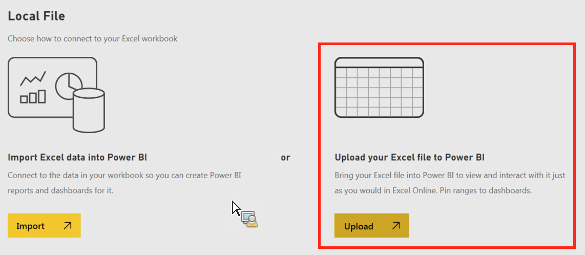

# 将数据手动导入 Power BI

{{legacy-arb}}

如果您要通过 Power BI 手动导入 Analytics 数据，请按照以下说明执行操作。

1. 在 Power BI 中，单击屏幕左下方的&#x200B;**[!UICONTROL 获取数据]**。
1. 在&#x200B;**[!UICONTROL 导入或连接到数据]** > **[!UICONTROL 文件]**&#x200B;下方，单击&#x200B;**[!UICONTROL 获取]**。

   

1. 单击“本地文件”。

   

1. 选择要上载的文件，并单击&#x200B;**[!UICONTROL 打开]**。
1. 单击&#x200B;**[!UICONTROL 将您的 Excel 文件上载到 Power BI]** 下方的&#x200B;**[!UICONTROL 上载]**。

   

1. 应当会显示消息“您的文件已上载”。
