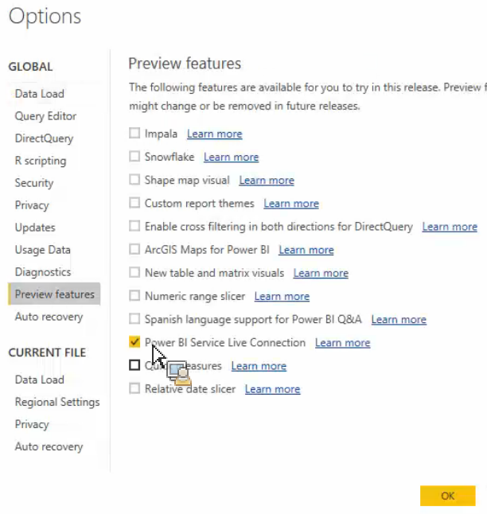

# 将已发布的资产提取到 Power BI Desktop

介绍如何将 Report Builder 发布的资产提取到 Power BI Desktop

## 先决条件 {#section_BDFDAE1E300B429FB6EBCB21AD1383A0}

* 您需要安装最新的 Power BI Desktop 版本（2017 年 4 月版）
* 此过程假定您已将 Report Builder 格式的表或请求发布到 Power BI 服务。

## 过程 {#section_CB03E6E1B066457EA0F6FC08FFF5EFDD}

在 Power BI Desktop 的 2017 年 4 月更新中，Microsoft 发布了可连接到 Power BI 服务中数据集的功能。此功能允许您根据已发布到云的现有数据集创建新报表。您可以利用此功能加强团队间的协作并减少重复劳动。

1. 在 Power BI Desktop 中，转到&#x200B;**[!UICONTROL 文件]** > **[!UICONTROL 选项和设置]** > **[!UICONTROL 选项]** > **[!UICONTROL 预览功能]**。
1. 启用 **[!UICONTROL Power BI 服务实时连接]**&#x200B;并单击&#x200B;**[!UICONTROL 确定]**。

1. 重新启动 Power BI Desktop。
1. 重新启动桌面后，请转到&#x200B;**[!UICONTROL 主页]** > **[!UICONTROL 获取数据]** > **[!UICONTROL 更多...]**。
1. 搜索并选择 **[!UICONTROL Power BI 服务]**。
1. 在 **[!UICONTROL Microsoft Power BI 服务]** > **[!UICONTROL 我的工作区]**&#x200B;下方，选择之前从 Report Builder 发布的数据集。

有关更多信息，请参阅 [Microsoft 博客帖子](https://powerbi.microsoft.com/zh-cn/blog/connecting-to-datasets-in-the-power-bi-service-from-desktop/)。
