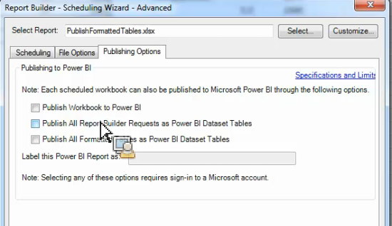
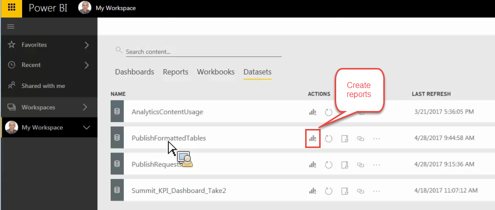
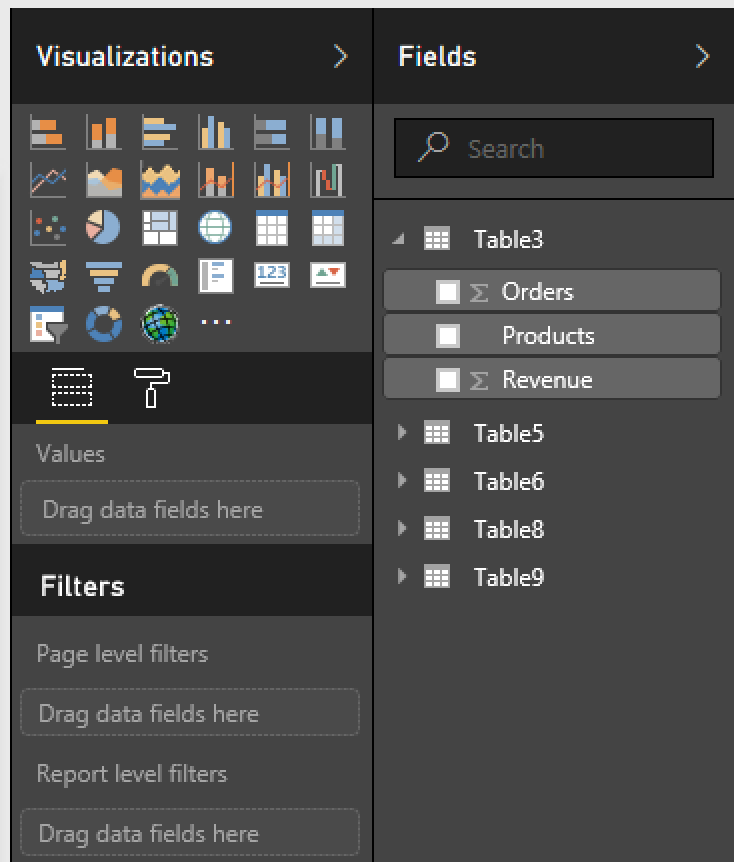
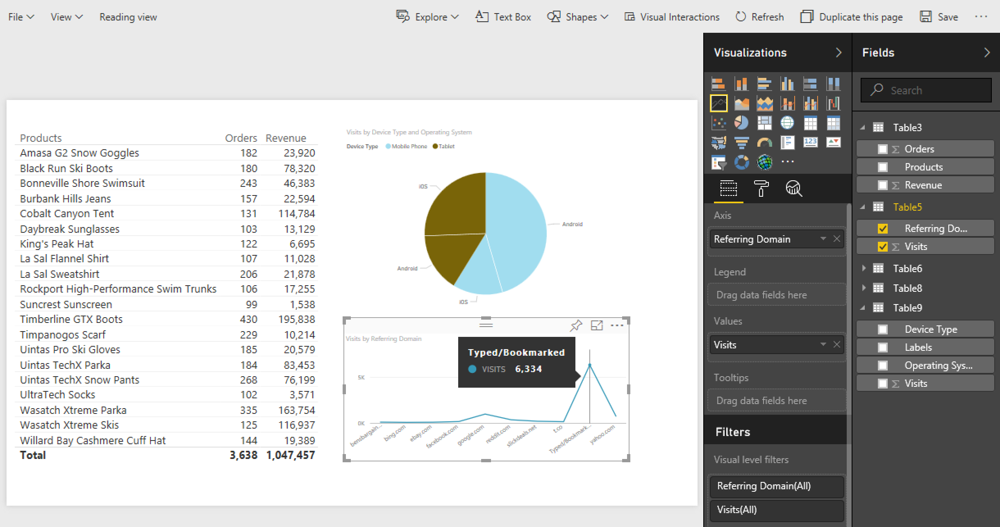
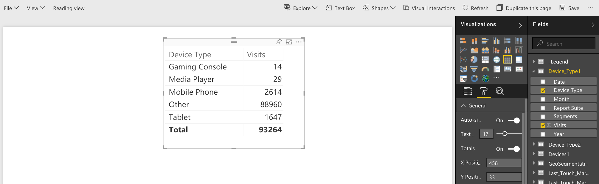

# 发布到 Power BI — 概述

{{legacy-arb}}

Microsoft Power BI是一套business analytics功能板，用于分析数据和分享见解。 Adobe Analytics与Power BI集成后，您可以在Microsoft Power BI中实现Report Builder Analytics数据的可视化，并轻松地在组织内共享该数据。

作为分析师，您之前使用电子邮件或 ftp 计划 Report Builder 工作簿分发。 现在，您可以让您的业务利益相关者在一个基于 Web 的环境（可跨各类平台和设备访问）中，从他们的 Power BI 帐户内访问准确和最新的数据。

通过将 Report Builder 的报表生成功能与 Power BI 的可视化功能相结合，组织中的每个人都可以更加轻松地访问信息。 通过 Power BI，您还可以将 Adobe Analytics 与其他数据源（如销售点或 CRM 源）集成以发现独特的客户洞察、关联和机会。

## 系统要求 {#section_0B71092D853446F38FA36447DAC0D32B}

* [已安装](/help/analyze/legacy-report-builder/setup/t-install-arb.md) Adobe Report Builder 5.5
* 有效的 Microsoft 帐户允许您登录到 Power BI

## 将工作簿发布到 Power BI {#section_21CA66229EC240D49594A9A7D3FBA687}

计划工作簿是带格式的 Excel 电子表格，其中填充了来自 Adobe Analytics 的数据，这些数据会按计划定期分发。

**发布 Report Builder 中的工作簿**

1. 在Report Builder中，生成并保存工作簿。
1. 在 Report Builder 工具栏上，单击&#x200B;**[!UICONTROL 计划]** > **[!UICONTROL 新建]**。

1. 在“基本计划向导”中，选中&#x200B;**[!UICONTROL 将工作簿发布到Microsoft Power BI]**&#x200B;旁边的框。

   

1. 指定您的电子邮件并立即发送，或指定计划频率（每小时、每天等）。
1. 单击&#x200B;**[!UICONTROL 确定]**&#x200B;以进行发布。
1. 此时，您将需要登录到Microsoft帐户。 提供您的凭据。
1. Report Builder工作簿已计划并发布到Power BI。

   对于每个计划实例，在Report Builder计划流程使用更新后的Analytics数据刷新工作簿后，该工作簿将发布到Microsoft Power BI。

**在 Power BI 中查看 Report Builder 工作簿数据**

1. 在 Power BI 中，双击[!UICONTROL 工作簿]菜单下方的工作簿。

   

1. 现在您可以查看工作簿仪表板数据。  

1. 您随后可以固定此工作簿的一个区域，以便将其包含在您的任意 Power BI 仪表板中。

## 作为 Power BI 数据集表，发布工作簿中所有带格式的表 {#section_7C54A54E75184DD6BAEF4ACCE241239A}

>[!NOTE]
>
>如果工作簿包含宏，将禁用“作为 Power BI 数据集表发布工作簿中所有带格式的表”。

您可以仅导入工作簿中所有带格式的表的内容，而不是导入整个工作簿。

**用例**：您有一个Excel工作簿，该工作簿从多个Report Builder请求中提取数据，并创建一个包含大量公式的摘要表。 您只需将此摘要表导入 Power BI 并为其创建一个可视化图表。

**发布 Report Builder 中带格式的表**

1. 在 Report Builder 中，生成一个数据表，其中包含一个标题行，后面接有一个数据行。
1. 选择此表，然后从[!UICONTROL 主页]菜单中选择&#x200B;**[!UICONTROL 套用表格式]**。 此表将得到默认命名（Table 1, Table 2 等），但是您可以在[!UICONTROL 设计]菜单中更改名称。

1. 在 Report Builder 工具栏上，单击&#x200B;**[!UICONTROL 计划]** > **[!UICONTROL 新建]**。

1. 在“基本计划向导”中，单击&#x200B;**[!UICONTROL 高级计划选项]**。
1. 在[!UICONTROL 计划向导 — 高级]内的&#x200B;**[!UICONTROL 发布选项]**&#x200B;选项卡中，选中&#x200B;**[!UICONTROL 作为 Power BI 数据集表发布所有带格式的表]**&#x200B;旁边的复选框。

   

1. （可选）您可以在Power BI中自定义已发布资源的名称。 如果您将版本控制用作工作簿名称的一部分（例如myworkbook_v1.1.xlsx），并且您不希望版本号显示在已发布的Power BI资源的名称中，则可以使用此功能。 这样做的好处是，如果版本号发生变化，已发布的资产不会发生变化。 （在此处查看[规范](/help/analyze/legacy-report-builder/c-publish-power-bi/specifications-limits.md)。）

**在 Power BI 中查看表数据**

1. 在 Power BI 中，转到&#x200B;**[!UICONTROL Workspace]** > **[!UICONTROL 数据集]**&#x200B;菜单。

   

1. 选择您发布的数据集，然后单击其旁边的[!UICONTROL 创建报表]图标。 请注意，这些表将显示为字段。

   

1. 选择一个表及其关联的列。

   

1. 从[!UICONTROL 可视化]菜单中，可以选择如何在Power BI中显示表。 例如，您可以选择以折线图显示数据：

   

1. 在这里，您可从该数据集表创建可视化。

## 作为 Power BI 数据集表发布所有 Report Builder 请求 {#section_0C26057C7DBB4068A643FDD688F6E463}

您可以将所有的请求转变为数据集表并在其上构建可视化。

>[!IMPORTANT]
>
>如果工作簿包含 100 个以上的请求，则只有前 100 个请求将被发布到 Power BI。 此外，对于发布到Power BI的每个请求，只发布前10,000行数据。 因此，虽然将通过计划成功提交这些请求，但发布到Power BI的范围是有限的。

1. 在Report Builder中，打开或创建包含Report Builder请求的工作簿。
1. 在 Report Builder 工具栏上，单击&#x200B;**[!UICONTROL 计划]** > **[!UICONTROL 新建]**。

1. 在“基本计划向导”中，单击&#x200B;**[!UICONTROL 高级计划选项]**。
1. 在[!UICONTROL 计划向导 - 高级]内的&#x200B;**[!UICONTROL 发布选项]**&#x200B;选项卡上，选中&#x200B;**[!UICONTROL 作为 Power BI 数据集表发布所有 Report Builder 请求]**&#x200B;旁边的框。

1. 单击&#x200B;**[!UICONTROL 确定]**。

**在 Power BI 中查看请求数据**

每个计划的Report Builder请求都将作为数据集中的表发布。 每个请求表都以请求中的主维度命名，它具有[!UICONTROL 报表包]和[!UICONTROL 区段]列。

1. 在 Power BI 中，转到&#x200B;**[!UICONTROL Workspace]** > **[!UICONTROL 数据集]**&#x200B;菜单。

1. 选择您发布的请求，然后单击其旁边的[!UICONTROL 创建报表]图标。

   请注意，请求在[!UICONTROL 字段]菜单中显示为表。

   

   >[!NOTE]
   >
   >无论您如何配置 Report Builder 请求在工作表中的布局（引导布局、自定义布局、某些列不可见），Report Builder 将始终以下列二维单标题行格式发布您的请求：日期、维度、量度、报表包、区段。

1. 另请注意，还有一个名为&#x200B;**[!UICONTROL 图例]**&#x200B;的表。 如果您从Report Builder上下文中提取请求，则可能很难记住每个请求的含义。 例如，图例表的目的是在“表ID”下显示每个请求的名称。 您还可以添加其他图例列以获取请求的完整视图。

   
