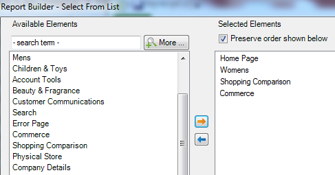

# 使用请求向导过滤路径报表

描述将过滤器应用于路径报表所涉及的各个步骤。

此示例使用“网站区域路径”。

1. 在 Adobe Report Builder 中，单击&#x200B;**[!UICONTROL 创建]**&#x200B;以打开“请求向导”。
1. 选择适当的报表包。
1. 在左侧的树视图中，选择&#x200B;**[!UICONTROL 路径]** > **[!UICONTROL 网站区域]** > **[!UICONTROL 网站区域路径]**。

   

1. 指定适当的日期。

1. 单击&#x200B;**[!UICONTROL 下一步]**。

1. 在向导的第 2 步中，在&#x200B;**[!UICONTROL 行标签]**&#x200B;下面单击&#x200B;**[!UICONTROL 前 1-10 项（应用了模式）]**&#x200B;链接。默认情况下，路径报表中已应用模式。

   

1. 选择&#x200B;**[!UICONTROL 过滤器]**&#x200B;选项。

   

1. 在&#x200B;**[!UICONTROL 定义“网站区域路径”路径模式]**&#x200B;对话框中，您可以指定
   * 第一个报表的起始排名。
   * 要在此报表中显示的条目数。
1. 单击&#x200B;**[!UICONTROL 编辑]**&#x200B;以定义路径模式。

1. 如果您需要自定义模式，请将左侧列表中的任意&#x200B;**[!UICONTROL 模式对象]**&#x200B;拖放至右侧的&#x200B;**[!UICONTROL 模式生成器画布]**&#x200B;中。

   

1. 您还可以从&#x200B;**[!UICONTROL 选择模式]**&#x200B;下拉列表中选择一个预定义模式并对其进行修改。下面显示了可用的模式：

   

   其中一些模式特定于Report Builder：登入路径的下一项目模式、退出路径的上一项目模式、下一项目模式。

## 要编辑预定义模式

选择阵列后，可以编辑预定义阵列。

1. 继续以上步骤，选择模式。 例如，选择&#x200B;**[!UICONTROL 退出网站模式]**：

   

1. 定义用户在退出前所遵循的网站区域路径。 单击&#x200B;**[!UICONTROL 指定项目: 已选择 0 个项目]**。如果您正在编辑现有请求，则可以通过从单元格范围中进行选择来定义此路径，也可以通过从部分列表中进行选择来定义此路径。

1. 要从前一请求的单元格范围进行选择，请选择&#x200B;**[!UICONTROL 来自单元格范围]**，并单击单元格选择器图标。然后，从报表中选取单元格。

   

1. 要从网站区域列表进行选择，请选择&#x200B;**[!UICONTROL 来自列表]**，然后单击&#x200B;**[!UICONTROL 添加]**。

1. 通过选择&#x200B;**[!UICONTROL 可用元素]**&#x200B;栏中的元素并单击橙色箭头，将其移至&#x200B;**[!UICONTROL 选定元素]**&#x200B;栏。然后，单击&#x200B;**[!UICONTROL 确定]**。

   

1. 要保存刚刚创建的模式，请单击&#x200B;**[!UICONTROL 保存]**。

1. 单击&#x200B;**[!UICONTROL 确定]**&#x200B;三次，然后单击&#x200B;**[!UICONTROL 完成]**&#x200B;以生成筛选路径。
