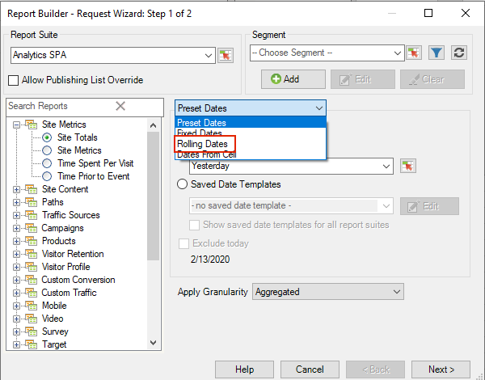
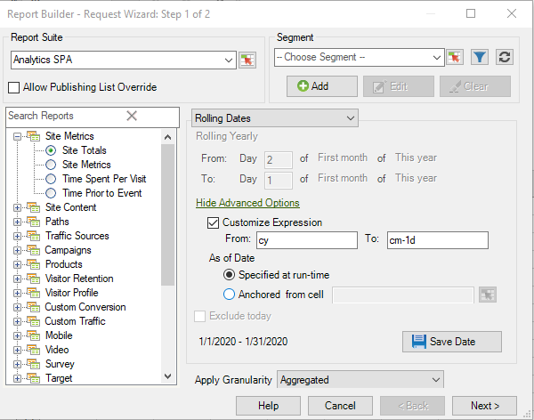

# 自定义的日期表达式

{{legacy-arb}}

您可以通过构建自定义表达式指定复杂的日期范围。

在构建表达式时，请参阅日历以正确指定周数和天数。 Excel具有多个内置函数，可让您计算日期之间的天数、工作天数、月数和年数。 您可以在公式中使用这些函数来计算其他间隔，如周和季度。

**启用自定义表达式**

以下示例说明如何为&#x200B;**[!UICONTROL 滚动日期]**&#x200B;启用自定义表达式。

1. 在[!UICONTROL 请求向导：第1步]中，选择&#x200B;**[!UICONTROL 滚动日期]**，而不使用&#x200B;**[!UICONTROL 预设日期]**。

   

1. 切换到每周、每月、每季度或每年滚动。 请注意以下选项发生了什么变化。
1. 有关更多自定义选项，请单击&#x200B;**[!UICONTROL 显示高级选项]**。

   

1. 例如，如果您将以上日期更改为每月滚动日期，从三个月前的第一天更改为本月的第一天，则提前选项部分中的日期将自我更新以反映这一点：

   

1. 启用&#x200B;**[!UICONTROL 自定义表达式]**。 通过选择&#x200B;**[!UICONTROL 滚动日期]**&#x200B;下的选项，您可以轻松查看自定义日期表达式的语法。

   

   您可以使用高级选项来混合和匹配自定义日期表达式。 例如，如果您要查看从一年的第一天到最后一个整月结束的数据，则可以输入以下内容： `From: cy` `To: cm-1d`。 在向导中，这些日期显示为1/1/2020-1/31/2020。
