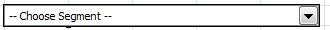

# 管理区段

{{legacy-arb}}

如何在 Report Builder 中添加、编辑、应用和过滤 Adobe Analytics 区段。

Report Builder在“请求向导”的第1步中提供了一个分段面板，允许您创建和管理区段。

## 添加或编辑区段 {#section_B2BC136F9A53498D90C7C2ECC5DB892B}

>[!NOTE]
>
>添加或编辑区段时，Report Builder 区段界面会在 Microsoft Internet Explorer 窗口中启动 Analytics 区段生成器。您的Report Builder会话将保持活动状态。 此操作不支持使用 Internet Explorer 以外的浏览器。

1. 在“请求向导”第 1 步的区段面板中，单击&#x200B;**[!UICONTROL 添加]**。
1. 将启动一个 Internet Explorer 窗口，其中可打开 Analytics 区段生成器界面。有关如何构建区段的信息，请参阅 [Analytics 分段](/help/components/segmentation/seg-home.md)。
1. 定义并保存区段后，返回至“请求向导”。
1. 单击“刷新”图标以刷新区段列表。

>[!IMPORTANT]
>
>该列表已缓存，新建区段只有在刷新后才会出现。

## 创建上下文区段 {#section_6DD2C663B2854469AA1075438F907678}

您可能希望将特定的报表维度组合转换为区段。您可以从 Report Builder 界面创建这些区段。例如，从页面请求输出中选择一些页面，然后基于这些值创建一个区段。

1. 选择要转换为区段的报表输出项。
1. 单击鼠标右键以选择&#x200B;**[!UICONTROL 在此容器中创建关联区段]**，并指定适当的容器（点击次数容器、访问次数容器、访客数容器）。

   

   有关容器的详细信息，请参阅[分段指南](/help/components/segmentation/seg-home.md)。

1. 此时将在 Internet Explorer 中启动区段生成器用户界面。区段生成器用户界面将使用您指定的容器和过滤器进行初始化。
1. 向区段添加名称和描述后，保存该区段。
1. 返回Report Builder并单击刷新图标以刷新区段列表。
1. 现在，您可以应用此区段。

## 搜索和应用区段 {#search}

此区段列表中会显示在Reports &amp; Analytics（现已终止使用）、Report Builder或Data Warehouse中创建的任何区段。 要刷新列表，请单击“刷新”图标。

您可以将一个或多个区段应用到任意给定请求。这包括连续区段。

1. 转至&#x200B;**[!UICONTROL 区段]**&#x200B;下拉列表，然后单击&#x200B;**[!UICONTROL 选择区段]**&#x200B;框中的向下小箭头以显示所有区段。

1. 选中要应用的区段。

   

>[!NOTE]
>
>无论您是否为管理员，在Report Builder中，您都只能查看那些您拥有的区段以及与您共享的区段。

## 过滤区段 {#filter}

单击“筛选器”图标&#x200B;**筛选器图标**&#x200B;以筛选

可用的过滤器包括：

| 过滤器名称 | 描述 |
|---|---|
| 标记 | 允许您过滤具有特定标签的区段。请注意，“标签”过滤器使用 AND 运算符。如果您选中两个标签，右侧窗格会显示&#x200B;**同时**&#x200B;具有这两个标签的区段。 |
| 所有者 | 允许您按所有者过滤区段。请注意，“所有者”过滤器使用 OR 运算符。如果您选中两个所有者，右侧窗格会显示&#x200B;**每个**&#x200B;所有者拥有的区段。 |
| 其他过滤器 > 仅&#x200B;*报表包名称* | 如果在Adobe Analytics的区段生成器中应用“仅&#x200B;*报表包名称*”过滤器，然后在[!DNL Report Builder]中显示“高级过滤器”，则“高级过滤器”将仅显示选定报表包的区段。 |
| 其他过滤器 > 我的 | 显示您拥有的所有区段。 |
| 其他过滤器 > 与我共享 | 显示他人与您共享的所有区段。 |
| 其他过滤器 > 收藏夹 | 显示您标记为收藏项目的所有区段。 |
| 其他过滤器 > 已批准 | 显示所有正式批准的区段。 |

## 将区段控件添加到工作簿 {#segment-control}

通过添加区段控件，您可以从工作簿中切换区段，而不必转至“请求向导”。

1. 单击区段下拉列表旁边的“控件”图标。

1. 选中要在区段控件中显示的所有区段，或者选中&#x200B;**[!UICONTROL 全选]**。

   

1. 请注意&#x200B;**[!UICONTROL 根据项目选择自动刷新链接的请求]**&#x200B;选项。

   * 如果选中，则会刷新使用此控件的所有请求。
   * 如果不选中，则会更新关联的请求参数，而不会刷新请求。

1. 指定区段控件的左上角单元格位置。

1. 单击&#x200B;**[!UICONTROL 确定]**，此时区段控件便会出现在指定的位置。

   

## 刷新区段列表 {#refresh}

每次添加新区段或编辑现有区段时，都应单击“刷新”图标以刷新缓存的区段列表。

## 在请求间管理区段 {#manage}

在 v5.4 之前，Report Builder 允许用户更改多个请求中的区段。但是，此流程始终会替换现有区段。希望向每个请求添加一个新区段的用户无法执行此操作，因为添加区段将会删除之前已分配给每个请求的区段集。

Report Builder 5.4 允许您添加、删除和替换区段，以及替换多个请求内的所有区段：

1. 在工作簿中选择多个请求。
1. 右键单击并选择&#x200B;**[!UICONTROL 编辑请求]** > **[!UICONTROL 按区段]**。

   

1. 在“编辑群组”对话框中，选择四个选项之一：

   | 选项 | 描述 |
   |---|---|
   | 添加区段 | 允许您选择一个或多个区段，以添加到当前区段列表中。 |
   | 替换区段 | 允许您选择要用一个或多个区段替换的区段。 |
   | 将所有区段替换为 | 允许您选择要替换当前区段的一个或多个区段。 |
   | 删除区段 | 允许您从请求中删除区段。 |
