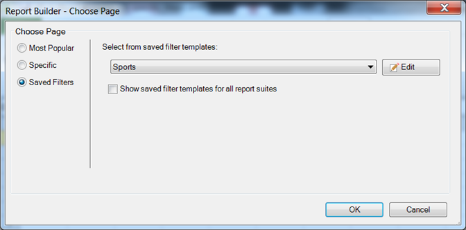

# 保存的过滤条件

{{legacy-arb}}

您可以在Report Builder中保存筛选器或其他参数，并在其他工作表或工作簿中使用它们。 这些参数将保存到Analytics，以确保可供其他计算机上的其他Report Builder用户使用。

创建筛选器时，将筛选器保存在[!UICONTROL 选择页面]窗体中。 有关此过程的示例，请参阅[特定筛选器](/help/analyze/legacy-report-builder/layout/c-filter-dimensions/t-specific-filters.md)。

