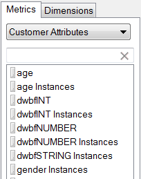

# 客户属性

{{legacy-arb}}

客户属性将存储在名为 VisAttr 的全新元素类型中，可将其配置为维度或指标。

有关如何上传客户属性的更多详细信息，请参阅 [Experience Cloud 帮助](https://experienceleague.adobe.com/docs/core-services/interface/customer-attributes/attributes.html?lang=zh-Hans)。

* 如果将VisAttr配置为量度，那么它可同时作为量度和“维度”显示。

   

* 它支持与 eVar 相同的划分方式（任何事物都可以被划分为任何事物）。
* VisAttr 支持所有 eVar 指标。
* 作为指标，VisAttr 支持“桶分组”（与网站逗留时间统计相类似：0 到 30、31 到 60…）
* VisAttr 可用于分段维度。
