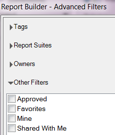

# 计算量度

Report Builder5.2支持Adobe Analytics统一的计算指标。 作为诸多创新中的一种，目前所有计算指标都拥有一个全局 ID — 不再局限于单一的报表包之中。

>[!NOTE]
>
>现有的工作簿可能会指向包含旧指标 ID 的请求。在使用 Report Builder 5.2 时，这些旧指标 ID 将会被转换为新的全局 ID。如果将该工作簿共享给 Report Builder v5.1 或早期版本的用户，则该用户将看不到计算指标。

如需更加详细地了解如何使用新版计算指标生成器和管理器来创建并管理计算指标，请参阅[《计算指标指南》](https://experienceleague.adobe.com/docs/analytics/components/calculated-metrics/cm-overview.html)。

在“请求向导”的第 2 步，可以过滤并应用计算指标。

## 筛选计算量度 {#section_376E986D3E684999A7CDB08E53854159}

**通过单击“筛选器”图标

“高级过滤器”对话框同时包含标准指标和计算指标。

可用的过滤器包括：

| 过滤器名称 | 描述 |
|---|---|
| 标记 | 允许过滤带有特定标签的计算指标。请注意，“标签”过滤器使用 AND 运算符。如果选中两个标签，右侧窗格会显示&#x200B;**同时**&#x200B;带有这两个标签的指标。 |
| 报表包 | 如果在 *的计算指标生成器中应用“仅*&#x200B;报表包名称[!DNL Adobe Analytics]”过滤器，然后在 [!DNL Report Builder] 中显示“高级过滤器”，则“高级过滤器”将仅显示选定报表包的计算指标。 |
| 所有者 | 允许按所有者过滤指标。请注意，“所有者”过滤器使用 OR 运算符。如果选中两个所有者，右侧窗格会显示&#x200B;**每个**&#x200B;所有者拥有的指标。 |
| “其他过滤器”>“已批准” | 显示所有正式批准的指标。 |
| “其他过滤器”>“收藏” | 显示标记为“收藏”的所有指标。 |
| 其他过滤器 > 我的 | 显示您拥有的所有指标。 |
| 其他过滤器 > 与我共享 | 显示他人与您共享的所有指标。 |

## 应用计算量度 {#section_DF5CF349460A45FDA4B6E6BB8B52F18E}

选定过滤器后，单击&#x200B;**[!UICONTROL 应用]**，可将过滤器应用到您的请求。此时，选定的指标会被添加到报表布局中。

