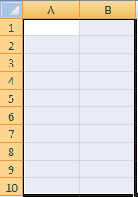

# 将量度和维度映射到单元格

在开始将项目映射到电子表格之前，请确保电子表格未处于受保护状态。如果工作表的保护方案阻止用户执行任何操作，则无法选择电子表格中的单元格。首先取消工作表保护，然后再添加单元格映射。

要映射的区域和单元格数量因您选择的量度、粒度、日期范围和设置的过滤器而不同。 例如，如果选择[!UICONTROL 网站量度] > [!UICONTROL 流量报表]，设置[!UICONTROL 周]粒度并设置[!UICONTROL 最近2周]的日期范围，则系统会在[!UICONTROL 请求向导：第2]步中提示您映射三个单元格（使用[!UICONTROL 自定义布局]时）。 该请求会检索第一周的数据和第二周的数据，其中每个数据点值等于页面查看的值。 第 3 个单元格充当行标题，您可以使用“[!UICONTROL 格式选项]”对其进行配置。

如果错误地映射电子表格上不兼容的位置，Report Builder会发出错误。

有关更多信息，请参阅以下部分：

* [选择单元格范围](/help/analyze/legacy-report-builder/layout/map-metrics-and-dimensions-to-cells.md#section_1E37FB46DA194FB7A1050B8833A48AC6)
* [选择单元格的技巧](/help/analyze/legacy-report-builder/layout/map-metrics-and-dimensions-to-cells.md#section_760421C3D7F84D67A639174710C93B22)
* [映射时的问题](/help/analyze/legacy-report-builder/layout/map-metrics-and-dimensions-to-cells.md#section_CC1BCF841291447EB3A994EB08F3A099)

## 选择单元格范围 {#section_1E37FB46DA194FB7A1050B8833A48AC6}

在“[!UICONTROL 请求向导: 第 2 步]”上，如果对趋势请求启用“[!UICONTROL 自定义布局]”，则可以将请求映射到一系列单元格。

单击要映射的项目旁边的&#x200B;**[!UICONTROL 范围选择器]** 。

* **范围中的所有单元格：**&#x200B;要求您为“[!UICONTROL 自定义布局]”类型的请求选择一组单元格。
* **范围的第 1 个单元格：**&#x200B;允许您选择范围左上角的单元格，并且显示用于指定输入和输出单元格的水平或垂直方向（列或行）的“[!UICONTROL 范围方向]”。使用此选项可让Report Builder为您选择单元格。
* **范围方向：**&#x200B;允许您指定单元格范围的方向（列或行）。
* **选择范围的上方单元格位置：**&#x200B;显示单元格引用。

## 选择单元格的技巧 {#section_760421C3D7F84D67A639174710C93B22}

您可通过以下方法来选择数据：单击&#x200B;**[!UICONTROL 范围选择]**&#x200B;图标 

，并在所需的电子表格单元格范围上单击并拖动鼠标。连续的选择区域由黑框标出。

对于单独选择的行，每行周围都具有白色的细边框。

要在一个请求中映射单独的行，请按住 [!UICONTROL Ctrl] 键，然后在所需的单元格上单击并拖动光标。如果请求需要 4 个区域，每个区域具有 10 个单元格，而不是 40 个单元格连在一起的一个连续区域，则需要这样做。

选择单元格后，再次单击“[!UICONTROL 范围选择]”窗体中的&#x200B;**[!UICONTROL 范围选择器]**，以返回“[!UICONTROL 请求向导: 第 2 步]”。

## 映射问题疑难解答{#section_CC1BCF841291447EB3A994EB08F3A099}

如果错误地选择映射到已具有活动映射的单元格，则区域选取器图标旁边的文本框中不会显示任何单元格引用。 单击[!UICONTROL 确定]时，Report Builder显示错误&#x200B;*选定范围与另一个请求的范围相交。 请更改您的选择。*

* 如果仍需要使用该单元格，请右键单击所需的单元格，然后选择“**[!UICONTROL 删除请求]**”。

如果要避免显示此消息，可采用 2 种方法：

* 通过向具有请求和映射的单元格添加格式来规划报表的格式
* 测试包含映射的电子表格区域

要测试具有嵌入请求的区域，您可以：

* 启动[!UICONTROL 请求管理器]并单击表中列出的各个请求。单击请求会突出显示请求映射到的电子表格单元格。
* 选择电子表格中您要用于新映射的单元格并单击“[!UICONTROL 来自工作表]”。[!UICONTROL 请求管理器]会选择列表中具有与所选单元格相交的输出项目的请求。如果没有选择任何请求，则表示单元格可用。
* 选择电子表格中的单元格，右键单击以显示上下文菜单，然后验证“[!UICONTROL 编辑请求]”是否可用。如果可用，则表示存在与这些单元格相关联的请求。
