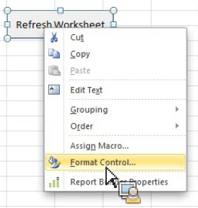

# 将Report Builder函数与Microsoft Excel结合使用

{{legacy-arb}}

您可以使用Report Builder函数来访问功能，而无需访问Report Builder用户界面。

例如，要使用基于从其他来源提取到Excel中的数据的输入过滤器自动刷新Report Builder请求，请使用字符串RefreshRequestsInCellsRange(...)函数。 所有调用均为异步调用，它们会立即返回，而不会等待完全执行。

**要求**

* 需要Report Builder 5.0（或更高版本）。

下表列出了公开的功能。

| 函数名称 | 类型 | 描述 |
|:---| --- | ---|
| AsyncRefreshAll() | 字符串 | 刷新工作簿中存在的所有 Report Builder 请求。 |
| AsyncRefreshRange(string rangeAddressInA1Format) | 字符串 | 刷新指定单元格范围地址中存在的所有Report Builder请求（字符串表达式，表示A1格式的单元格范围，例如“Sheet1！A2:A10”）。 |
| AsyncRefreshRangeAltTextParam() | 字符串 | 刷新指定单元格范围（通过 Ms 表单控件的可选文字传递）中存在的所有 Report Builder 请求。 |
| AsyncRefreshActiveWorksheet() | 字符串 | 刷新活动工作表中存在的所有 Report Builder 请求。 |
| AsyncRefreshWorksheet(string worksheetName) | 字符串 | 刷新指定工作表（选项卡上显示的工作表名称）中存在的所有 Report Builder 请求。 |
| AsyncRefreshWorksheetAltTextParam()； | 字符串 | 刷新特定工作表名称（通过 Ms 表单控件的可选文字传递）中存在的所有 Report Builder 请求。 |
| tring GetLastRunStatus() | 字符串 | 返回一个描述上次运行状态的字符串。 |

若要访问Report Builder函数，请转到&#x200B;**[!UICONTROL 公式]** > **[!UICONTROL 插入函数]**。 使用搜索字段搜索函数，或者选择一个类别以列出该类别中的函数。


## 示例 {#section_034311081C8D4D7AA9275C1435A087CD}

以下示例显示&#x200B;*如果单元格P5中的值为文本或为空，请刷新单元格P9*&#x200B;中的范围。

```
=IF(OR(ISTEXT(P5),ISBLANK(P5)),AsyncRefreshRange("P9"),"")
```

## 将Report Builder函数与格式控件结合使用 {#section_26123090B5BD49748C8D8ED7A1C5ED84}

您可以将宏分配给您创建的控件，该控件可以是刷新工作簿请求的函数。 例如，函数 AsyncRefreshActiveWorksheet 将刷新工作表中的所有请求。但是，有时您可能只想刷新某些请求。

1. 设置宏参数。
1. 右键单击控件，然后选择&#x200B;**[!UICONTROL 指定宏]**。
1. 输入Report Builder函数名称（不包含参数或圆括号。）


## 使用格式控件将参数传递给Report Builder函数 {#section_ECCA1F4990D244619DFD79138064CEF0}

带有参数的两个函数可用于“格式控制”。 您必须使用&#x200B;**替换文本：**&#x200B;字段：

* AsyncRefreshRange(string rangeAddressInA1Format)
* AsyncRefreshWorksheet(string worksheetName)

使用格式控件将参数传递给Report Builder函数

1. 右键单击控件并选择&#x200B;**[!UICONTROL 设置控件格式]**。

   

1. 单击&#x200B;**[!UICONTROL 可选文字]**&#x200B;选项卡。

   

1. 在&#x200B;**[!UICONTROL 可选文字]**&#x200B;下面，输入要刷新的单元格范围。
1. 在&#x200B;**[!UICONTROL 公式]** > **[!UICONTROL 插入函数]**> **[!UICONTROL Report Builder.Adobe.Bridge.ReportBuilder]**&#x200B;下打开参数列表。

1. 选取以 AltTextParam 结尾的两个函数之一，然后单击&#x200B;**[!UICONTROL 确定]**。
