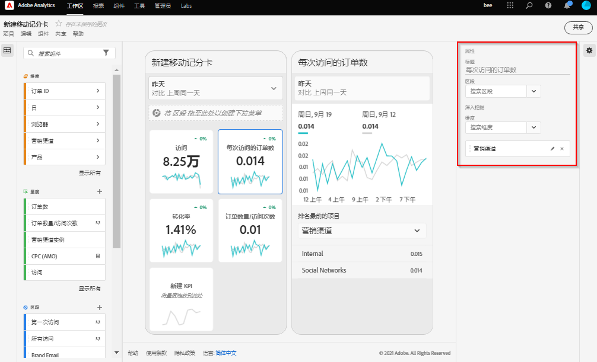

# 创建记分卡

Adobe Analytics评分卡以平铺布局为执行用户显示关键数据可视化图表，如下所示：

作为此记分卡的策划人，您可以使用记分卡生成器来配置在执行用户的记分卡上显示的图块。 您还可以配置在点按图块后如何调整详细视图或划分。 记分卡生成器界面如下所示：

要创建记分卡，您需要执行以下操作：

1. 访问[!UICONTROL 空白移动记分卡]模板。
2. 使用数据配置记分卡并保存。

## 访问[!UICONTROL 空白移动记分卡]模板

您可以通过以下方式之一访问[!UICONTROL 空白移动记分卡]模板：

**创建新项目**

1. 打开 Adobe Analytics，然后单击&#x200B;**[!UICONTROL 工作区]**&#x200B;选项卡。
1. 单击&#x200B;**[!UICONTROL 创建项目]**&#x200B;并选择&#x200B;**[!UICONTROL 空白移动记分卡]**&#x200B;项目模板。
1. 单击&#x200B;**[!UICONTROL “创建”]**。

或

1. 从 **[!UICONTROL 工具]** 菜单中，选择 **[!UICONTROL Analytics 功能板（移动应用程序）]**。
1. 在后续显示的屏幕上，单击&#x200B;**[!UICONTROL 新建记分卡]**&#x200B;按钮。

## 使用数据配置记分卡并保存

要实施记分卡模板，请执行以下操作：

1. 在&#x200B;**[!UICONTROL 属性]**（位于右侧边栏中）下，指定要从中使用数据的&#x200B;**[!UICONTROL 项目报表包]**。

   

1. 要向记分卡中添加新图块，请将左侧面板中的某个量度拖放到&#x200B;**[!UICONTROL 在此处拖放量度]**&#x200B;区域。您也可以使用类似的工作流程，在两个图块之间插入量度。

   

   *从每个图块中，您可以访问一个详细视图，该视图显示有关量度的其他信息，例如，相关维度列表的排名最前的项目。*

1. 要向量度中添加相关维度，请将左侧面板中的维度拖放到图块中。例如，您可以通过将维度拖放到图块中的方式，将相应维度（例如，本例中的 **[!DNL DMA Region]**）添加到&#x200B;**[!UICONTROL 独特访客数]**&#x200B;量度；您添加的维度将显示在特定于图块的&#x200B;**[!UICONTROL 属性]**&#x200B;的划分部分下方。可向每个图块中添加多个维度。

   

   单击记分卡生成器中的图块后，右侧边栏会显示与该图块关联的属性和特征。在此边栏中，您可以为图块提供一个新的&#x200B;**[!UICONTROL 标题]**，或者通过指定组件而不是从左侧边栏中拖放组件来配置图块。

   

   此外，如果单击图块，动态弹出窗口将会显示“划分”视图在应用程序中向执行用户显示的方式。如果未将任何维度应用于图块，则划分维度将为&#x200B;**小时**&#x200B;或&#x200B;**天**，具体取决于默认日期范围。

   

   添加到图块的每个维度将显示在应用程序详细视图的下拉列表中。之后，执行用户可以从下拉列表所列的选项中进行选择。

1. 要将区段应用于单个图块，请将左侧面板中的某个区段直接拖放到图块的顶部。如果要将区段应用于记分卡中的所有图块，请将区段拖放到记分卡的顶部。或者，您也可以通过在日期范围下方的筛选器菜单中选择区段来应用区段。您可以像在 Adobe Analytics Workspace 中一样[为记分卡配置和应用过滤器](https://experienceleague.adobe.com/docs/analytics-learn/tutorials/analysis-workspace/using-panels/using-drop-down-filters.html?lang=zh-Hans)。

   

1. 同样，要移除应用于整个记分卡的组件，请单击记分卡上图块外的任意位置，然后单击将鼠标悬停在该组件上时显示的 **x** 来移除该组件，如下面的&#x200B;**首次访问**&#x200B;区段所示：

   

1. 通过选择日期范围下拉菜单来添加和移除可在记分卡中选择的日期范围组合。

   

   每个新记分卡都从 6 个日期范围组合开始，重点展示今天和昨天的数据。您可以单击 x 以移除不必要的日期范围，也可以单击铅笔图标以修改每个日期范围组合。

   

   要创建或更改主要日期，请使用下拉菜单从可用日期范围中选择，或者将日期组件从右边栏拖放到放置区域中。

   

   要创建比较日期，您可以在下拉菜单中选择方便的预设以进行常用的时间比较。您还可以从右边栏拖放日期组件。

   

   如果尚未创建您所需的日期范围，您可以单击日历图标以创建一个新的日期范围。

   

1. 这会将您带到日期范围生成器，您可以在其中创建和保存新的日期范围组件。要命名记分卡，请单击屏幕左上角的命名空间，然后键入新名称。

   

## 共享记分卡

要与执行用户共享记分卡，请执行以下操作：

1. 单击&#x200B;**[!UICONTROL 共享]**&#x200B;菜单，然后选择&#x200B;**[!UICONTROL 共享记分卡]**。

1. 在&#x200B;**[!UICONTROL 共享移动记分卡]**&#x200B;表单中，通过以下方式填写字段：

   * 提供记分卡的名称
   * 提供记分卡的说明
   * 添加相关标记
   * 指定记分卡的收件人

1. 单击&#x200B;**[!UICONTROL 共享]**。

共享记分卡后，收件人可以在其Analytics功能板中访问该记分卡。 如果您在记分卡生成器中对记分卡进行后续更改，则共享记分卡中会自动更新这些更改。 然后，执行用户在其应用程序中刷新记分卡后，便可看到这些更改。

如果通过添加新组件来更新记分卡，则您可能需要再次共享记分卡（并选中&#x200B;**[!UICONTROL 共享嵌入的组件]**&#x200B;选项），以确保执行用户有权访问这些更改。