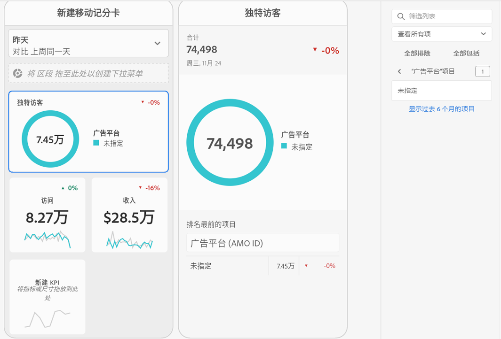

# 创建记分卡

以下信息指示 Adobe Analytics 数据的策划人如何为执行用户配置和展示功能板。要开始使用，您可以查看Adobe Analytics功能板记分卡生成器视频：

>[!VIDEO](https://video.tv.adobe.com/v/34544)

Adobe Analytics评分卡以平铺布局为执行用户显示关键数据可视化图表，如下所示：

作为此记分卡的策划人，您可以使用记分卡生成器来配置在执行用户的记分卡上显示的图块。 您还可以配置在点按图块后如何调整详细视图或划分。 记分卡生成器界面如下所示：

要创建记分卡，您需要执行以下操作：

1. 访问[!UICONTROL 空白移动记分卡]模板。
2. 使用数据配置记分卡并保存。

## 访问[!UICONTROL 空白移动记分卡]模板

您可以通过创建新项目或从工具菜单访问[!UICONTROL 空移动记分卡]模板。

### 创建新项目

1. 打开 Adobe Analytics，然后单击&#x200B;**[!UICONTROL 工作区]**&#x200B;选项卡。
1. 单击&#x200B;**[!UICONTROL 创建项目]**&#x200B;并选择&#x200B;**[!UICONTROL 空白移动记分卡]**&#x200B;项目模板。
1. 单击&#x200B;**[!UICONTROL “创建”]**。

### “工具”菜单

1. 从&#x200B;**[!UICONTROL 工具]**&#x200B;菜单中，选择&#x200B;**[!UICONTROL Analytics功能板（移动设备应用程序）]**。
1. 在后续屏幕中，单击&#x200B;**[!UICONTROL 新建记分卡]**。

## 使用数据配置记分卡并保存

要实施记分卡模板，请执行以下操作：

1. 在&#x200B;**[!UICONTROL 属性]**（位于右侧边栏中）下，指定要从中使用数据的&#x200B;**[!UICONTROL 项目报表包]**。

   

1. 要向记分卡中添加新图块，请将左侧面板中的某个量度拖放到&#x200B;**[!UICONTROL 在此处拖放量度]**&#x200B;区域。您也可以使用类似的工作流程，在两个图块之间插入量度。

   

1. 从每个图块中，您可以访问一个详细视图，该视图显示有关量度的其他信息，例如，相关维度列表的排名最前的项目。

## 添加维度或量度

要向量度中添加相关维度，请将左侧面板中的维度拖放到图块中。

例如，您可以通过将维度拖放到图块中的方式，将相应维度（例如，本例中的&#x200B;**[!DNL Marketing Channel]**）添加到&#x200B;**[!UICONTROL 独特访客]**&#x200B;量度中。 Dimension划分显示在特定于磁贴的&#x200B;**[!UICONTROL 属性]**&#x200B;的[!UICONTROL 钻取]（划分）部分下。 可向每个图块中添加多个维度。

## 应用区段

要将区段应用于单个图块，请将左侧面板中的某个区段直接拖放到图块的顶部。

如果要将区段应用于记分卡中的所有图块，请将区段拖放到记分卡的顶部。或者，您也可以通过在日期范围下方的筛选器菜单中选择区段来应用区段。您可以像在 Adobe Analytics Workspace 中一样[为记分卡配置和应用过滤器](https://experienceleague.adobe.com/docs/analytics-learn/tutorials/analysis-workspace/using-panels/using-drop-down-filters.html?lang=zh-Hans)。

## 添加日期范围

通过选择日期范围下拉菜单来添加和移除可在记分卡中选择的日期范围组合。

每个新记分卡都从 6 个日期范围组合开始，重点展示今天和昨天的数据。您可以单击 x 以移除不必要的日期范围，也可以单击铅笔图标以修改每个日期范围组合。

要创建或更改主要日期，请使用下拉菜单从可用日期范围中选择，或者将日期组件从右边栏拖放到放置区域中。

要创建比较日期，您可以在下拉菜单中选择方便的预设以进行常用的时间比较。您还可以从右边栏拖放日期组件。

如果尚未创建您所需的日期范围，您可以单击日历图标以创建一个新的日期范围。

这会将您带到日期范围生成器，您可以在其中创建和保存新的日期范围组件。

## 应用可视化

Analytics功能板提供了四种可视化图表，可让您对维度项目和量度有更深入的了解。 通过更改图块[!UICONTROL 属性]的[!UICONTROL 图表类型]，更改为其他可视化。 只需选择正确的图块，然后更改图表类型即可。

或者，单击左边栏中的[!UICONTROL 可视化图表]图标，然后将右侧可视化图表拖放到图块上：

### [!UICONTROL 概要数字]

使用“概要数字”可视化图表来突出显示项目中的大型重要数字。

### [!UICONTROL 圆环图]

此可视化图表与饼图类似，它将数据显示为整体的一部分或区段。在比较总百分比时使用圆环图。 例如，假设您想了解哪个广告平台对独特访客总数做出了贡献：

### [!UICONTROL 折线图]

此折线图可视化图表使用线条来表示量度，以显示一段时间内值的变化情况。折线图可显示一段时间内的维度，但可与任何可视化图表一起使用。 在此示例中，您正在显示产品类别维度。

### [!UICONTROL 水平条形图]

此可视化显示了一些水平条，这些水平条表示一个或多个量度中的各种值。例如，要轻松查看您的顶级产品，请使用[!UICONTROL 水平条]作为首选可视化图表。

### 删除[!UICONTROL 未指定]维度项目

如果要从数据中删除[!UICONTROL 未指定]维度项目，请执行以下操作：

1. 选择正确的拼贴。
1. 在右边栏的&#x200B;**[!UICONTROL Drillins]**&#x200B;下，选择要删除其&#x200B;**[!UICONTROL Unspecified]**&#x200B;项目的维度项目旁边的向右箭头。

   

1. 单击&#x200B;**[!UICONTROL Unspecified]**&#x200B;旁边的图标，以从报表中删除未指定的数据。 （您还可以删除任何其他维度项目。）

## 查看和配置磁贴属性

在记分卡生成器中单击图块时，右侧边栏会显示与该图块关联的属性和特征。 在此边栏中，您可以为图块提供一个新的&#x200B;**[!UICONTROL 标题]**，或者通过指定组件而不是从左侧边栏中拖放组件来配置图块。

单击图块时，动态弹出窗口会显示向应用程序中的执行用户显示“钻取（划分）”视图的方式。 如果未将任何维度应用于图块，则划分维度将为&#x200B;**小时**&#x200B;或&#x200B;**天**，具体取决于默认日期范围。

划分可通过按其他量度和维度（例如，在此零售示例中）按字面划分量度和维度来优化分析：

* 按广告平台(AMO ID)划分的独特访客量度
* 按产品类别（零售）划分的访问量
* 按产品名称划分的总收入

添加到图块的每个维度将显示在应用程序详细视图的下拉列表中。之后，执行用户可以从下拉列表所列的选项中进行选择。

## 删除组件

同样，要移除应用于整个记分卡的组件，请单击记分卡上图块外的任意位置，然后单击将鼠标悬停在该组件上时显示的 **x** 来移除该组件，如下面的&#x200B;**首次访问**&#x200B;区段所示：

## 命名记分卡

要命名记分卡，请单击屏幕左上角的命名空间，然后键入新名称。

## 共享记分卡

要与执行用户共享记分卡，请执行以下操作：

1. 单击&#x200B;**[!UICONTROL 共享]**&#x200B;菜单，然后选择&#x200B;**[!UICONTROL 共享记分卡]**。

1. 在&#x200B;**[!UICONTROL 共享移动记分卡]**&#x200B;表单中，通过以下方式填写字段：

   * 提供记分卡的名称
   * 提供记分卡的描述
   * 添加相关标记
   * 指定记分卡的收件人

1. 单击&#x200B;**[!UICONTROL 共享]**。

共享记分卡后，收件人可以在其Analytics功能板中访问该记分卡。 如果您在记分卡生成器中对记分卡进行后续更改，则共享记分卡中会自动更新这些更改。 然后，执行用户在其应用程序中刷新记分卡后，便可看到这些更改。

如果通过添加新组件来更新记分卡，则您可能需要再次共享记分卡（并选中&#x200B;**[!UICONTROL 共享嵌入的组件]**&#x200B;选项），以确保执行用户有权访问这些更改。