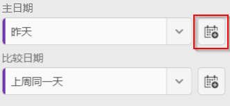
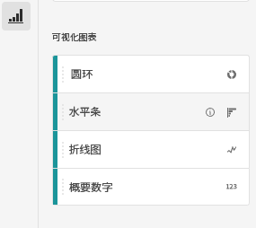
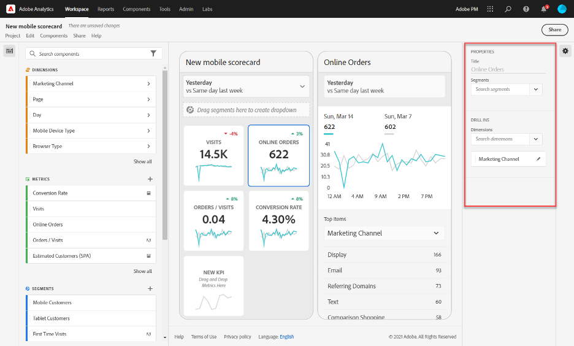

# 创建移动记分卡 {#create-a-mobile-scorecard}

>[!CONTEXTUALHELP]
>id="mobilescorecard_annotations"
>title="注释"
>abstract="可以在组件管理器或 Workspace 项目内部创建注释。"

<!-- markdownlint-enable MD034 -->

以下信息指示 Adobe Analytics 数据的策划人如何为执行用户配置和展示移动记分卡。要开始操作，您可以观看 Adobe Analytics 功能板记分卡生成器视频：

>[!BEGINSHADEBOX]

请参阅  [移动记分卡生成器](https://video.tv.adobe.com/v/38139?quality=12&learn=on&captions=chi_hans){target="_blank"}以获取演示视频。

>[!ENDSHADEBOX]

Adobe Analytics 记分卡以平铺版面为执行用户显示关键数据可视化图表，如下所示：

作为此记分卡的策划人，您可以使用记分卡生成器来配置要在执行用户的记分卡上显示的磁贴。您还可以配置在点按磁贴后，如何调整详细视图或细分。记分卡生成器界面如下所示：

要创建记分卡，您需要执行以下操作：

1. 访问[!UICONTROL 空白移动记分卡]模板。
1. 使用数据配置记分卡并将其保存。

## 访问[!UICONTROL 空白移动记分卡]模板 {#template}

您可以通过创建新项目或从“工具”菜单中访问[!UICONTROL 空白移动记分卡]模板。

### 创建新项目 {#create}

1. 打开 Adobe Analytics，然后单击 **[!UICONTROL Workspace]** 选项卡。
1. 单击&#x200B;**[!UICONTROL 创建新项目]**&#x200B;并选择&#x200B;**[!UICONTROL 空白移动记分卡]**&#x200B;项目模板。
1. 单击&#x200B;**[!UICONTROL 创建]**。

### “工具”菜单

1. 从&#x200B;**[!UICONTROL 工具]**&#x200B;菜单中，选择 **[!UICONTROL Analytics 功能板（移动应用程序）]**。
1. 在后续显示的屏幕上，单击&#x200B;**[!UICONTROL 新建记分卡]**。

## 使用数据配置记分卡并将其保存 {#configure}

要实施记分卡模板，请执行以下操作：

1. 在&#x200B;**[!UICONTROL 属性]**（位于右侧边栏中）下，指定要从中使用数据的&#x200B;**[!UICONTROL 项目报告包]**。

   

1. 要向记分卡中添加新磁贴，从左侧面板中拖动量度并将其放至&#x200B;**[!UICONTROL 在此处拖放量度]**&#x200B;区域。您也可以使用类似的工作流程，在两个磁贴之间插入量度。

   

1. 从每个磁贴中，您可以访问一个详细视图，该视图显示有关量度的其他信息，例如，相关维度列表的排名最前的项目。

## 添加维度或量度 {#dimsmetrics}

要向量度中添加相关维度，请将左侧面板中的维度拖放到磁贴中。

例如，您可以通过将适当的维度（如本示例中的 **[!DNL Marketing Channel]**）拖放到磁贴上来将它添加到&#x200B;**[!UICONTROL 独特访客]**&#x200B;量度。维度细分显示在详细信息幻灯片专属的&#x200B;**[!UICONTROL 属性]**&#x200B;的[!UICONTROL 深入分析]部分之下。可向每个磁贴中添加多个维度。

## 应用区段 {#segments}

要将区段应用于单个磁贴，请将左侧面板中的某个区段直接拖放到磁贴的顶部。

如果要将区段应用于记分卡中的所有磁贴，请将区段拖放到记分卡的顶部。或者，您也可以通过在日期范围下方的过滤器菜单中选择区段来应用区段。您可以像在 Adobe Analytics Workspace 中一样[为记分卡配置和应用过滤器](https://experienceleague.adobe.com/docs/analytics-learn/tutorials/analysis-workspace/using-panels/using-drop-down-filters.html?lang=zh-hans)。

## 添加日期范围 {#dates}

通过选择日期范围下拉菜单来添加和移除可在记分卡中选择的日期范围组合。

每个新记分卡都从 6 个日期范围组合开始，重点展示今天和昨天的数据。您可以单击 x 以移除不必要的日期范围，也可以单击铅笔图标以修改每个日期范围组合。

要创建或更改主要日期，请使用下拉菜单从可用日期范围中选择，或者将日期组件从右边栏拖放到放置区域中。

要创建比较日期，您可以在下拉菜单中选择方便的预设以进行常用的时间比较。您还可以从右边栏拖放日期组件。

如果尚未创建您所需的日期范围，您可以单击日程表图标以创建一个新的日期范围。

这会将您带到日期范围生成器，您可以在其中创建和保存新的日期范围组件。

### 显示/隐藏比较日期范围 {#show-comparison-dates}

要显示或隐藏比较日期范围，请切换&#x200B;**“包括比较日期”**&#x200B;设置。

默认情况下&#x200B;*启用*&#x200B;此设置。 如果您不想查看比较日期，请取消选择该选项。

## 应用可视化图表 {#viz}

>[!BEGINSHADEBOX]

请参阅  [可视化图表](https://video.tv.adobe.com/v/3445776?quality=12&learn=on&captions=chi_hans){target="_blank"}以获取演示视频。

>[!ENDSHADEBOX]

Analytics 功能板提供了四种可视化图表，可让您深入了解维度项和量度。通过更改磁贴的[!UICONTROL 属性]的[!UICONTROL 图表类型]来更改为其他可视化图表。只需选择正确的磁贴，然后更改图表类型。

或者，单击左边栏中的[!UICONTROL 可视化图表]图标，并将正确的可视化图表拖放到磁贴上：

### [!UICONTROL 摘要数字]

使用摘要数字可视化图表来突出显示项目中的大型重要数字。

### [!UICONTROL 圆环图]

此可视化图表与饼图类似，它将数据显示为整体的一部分或区段。在比较总数的百分比时使用圆环图。例如，假设您想查看哪个广告平台对独特访客总数做出了贡献：

### [!UICONTROL 线形图]

此线形图可视化图表使用线条来表示量度，以显示一段时间内值的变化情况。线形图显示随时间变化的维度，但适用于任何可视化图表。在此示例中，您将对产品类别维度进行可视化。

### [!UICONTROL 水平条形图]

此可视化图表显示了一些水平条形图，这些水平条形图表示一个或多个量度中的各种值。例如，要轻松查看您的最热门产品，请使用[!UICONTROL 水平条形图]作为您的首选可视化图表。

### 删除[!UICONTROL 未指定]维度项

如果要从数据中删除[!UICONTROL 未指定]维度项，请执行以下操作：

1. 选择正确的磁贴。
1. 在右边栏中的&#x200B;**[!UICONTROL 深入分析]**&#x200B;下，选择要删除其&#x200B;**[!UICONTROL 未指定]**&#x200B;项的维度项旁边的右箭头。

   

1. 单击&#x200B;**[!UICONTROL 未指定]**&#x200B;旁边的图标以从报告中删除未指定数据。（您也可以删除任何其他维度项。）

## 查看和配置磁贴属性 {#tiles}

在记分卡生成器中单击某个磁贴时，右侧边栏将显示与该磁贴及其详细信息幻灯片关联的属性和特征。在此边栏中，可为该磁贴提供新的&#x200B;**标题**&#x200B;或通过应用区段而配置该磁贴。

## 查看详细信息幻灯片 {#view-detail-slides}

在单击某个磁贴时，将有一个动态弹出窗口显示如何在应用程序中为执行用户显示详细信息幻灯片。可添加维度以根据特定需求细分数据。如果尚未应用某个维度，则细分维度将为&#x200B;**小时**&#x200B;或&#x200B;**天**，具体取决于默认日期范围。

细分通过按维度项（如以下各项）细分各个量度而细化您的分析结果：

* 按广告平台（AMO ID）细分独特访客量度
* 按产品类别（零售）细分访问
* 按产品名称细分总收入

添加到详细信息幻灯片的每个维度都将显示在应用程序中详细信息幻灯片中的一个下拉列表中。然后，执行用户可从该下拉列表中列出的各个选项中进行选择。

## 自定义详细信息幻灯片 {#customize-detail-slide}

通过自定义详细信息幻灯片，与受众共享的信息可更有针对性。

>[!BEGINSHADEBOX]

请参阅  [自定义详细信息视图](https://video.tv.adobe.com/v/3413785?quality=12&learn=on&captions=chi_hans){target="_blank"}以获取演示视频。

>[!ENDSHADEBOX]

可修改每个详细信息幻灯片的布局，并添加文本以更好地解释最终用户可能在数据中看到的内容。还可以使用下拉菜单更改图表类型。

### 更改幻灯片布局

更改幻灯片布局可强调最重要的信息。例如，可更改布局以仅显示图表或仅显示表格。要更改幻灯片布局，请选择预先设计的格式之一。

还可通过将可视化图表组件从左侧边栏拖放到画布上而更改幻灯片布局。每个详细信息幻灯片一次只能容纳两个可视化图表。

### 将描述性文本添加到幻灯片

可添加文本以提供关于图表中包含的内容的有意义信息或关于数据的细微差别。

要将文本添加到详细信息幻灯片，请选择显示 `T` 符号的布局，或将文本可视化图表组件从左侧边栏拖放过来。在添加新的文本可视化图表或选择带有文本的幻灯片布局时，将自动打开文本编辑器。文本编辑器提供用于设置文本格式的所有标准选项。可应用段落、标题和副标题等文本样式，并可应用粗体和斜体字体。可两端对齐文本、添加带项目符号和编号的列表以及添加链接。编辑完毕后，选择文本编辑器右上角的最小化按钮以关闭它。要编辑已添加的文本，请选择铅笔图标以再次打开文本编辑器。

## 删除组件 {#remove}

同样，要移除应用于整个记分卡的组件，请单击记分卡上磁贴外的任意位置，然后单击将光标悬停在该组件上时显示的 **x** 来移除该组件，如下面的&#x200B;**首次访问**&#x200B;区段所示：

## 创建数据故事 {#create-data-story}

数据故事是围绕中心主题或量度生成的辅助数据点、业务背景和相关量度的集合。

例如，如果您关注 Web 流量，则对您最重要的量度可能是访问次数，但您也可能对新访客和独特访客感兴趣，并且您可能要查看按网页或流量来源设备类型细分的数据。通过移动记分卡项目中的数据故事，可重点介绍对您最重要的量度，同时用多张详细信息幻灯片讲述这些量度背后的整个故事。

>[!BEGINSHADEBOX]

请参阅  [创建数据故事](https://video.tv.adobe.com/v/3420558?quality=12&learn=on&captions=chi_hans){target="_blank"}以获取演示视频。

>[!ENDSHADEBOX]

**创建数据故事**

通过将多张详细信息幻灯片添加到磁贴而生成您的数据故事。

1. 从移动记分卡项目开始。
1. 选择要从其创建故事的磁贴。

   

   {width=".50%"}

1. 添加幻灯片以生成您的数据故事。默认生成您的第一张幻灯片。

   要添加新幻灯片，请将光标悬停在幻灯片上或单击幻灯片，然后选择可用的选项：

   * 点按 [!UICONTROL +] 号以创建新幻灯片。

   * 点按复制图标以复制现有幻灯片。

1. 如果创建空白的幻灯片，请从左边栏拖放组件，或选择一种版面以自动为该幻灯片填入磁贴中的数据。

   

要删除幻灯片，请点按垃圾桶图标。

### 自定义数据故事 {#customize-data-story}

通过数据故事，可自定义一切，以使您可共享要共享的信息并排除多余的一切。可自定义磁贴和个别幻灯片以添加过滤器、显示细分、更改版面和更改可视化图表。

**自定义磁贴**

1. 点按磁贴。所选磁贴加入蓝色轮廓，并且右侧面板显示该磁贴属性。
1. 更改标题、图表类型和其他磁贴选项。
1. 将组件拖动到磁贴上。

   

   在将可视化图表等组件拖放到磁贴上时，该组件将应用于所有数据故事幻灯片。

1. 要仅对标题应用更改，请按住 Shift 键以应用更改。

   

>[!NOTE]
>幻灯片从磁贴继承组件，但磁贴不从幻灯片继承组件。

**自定义个别幻灯片**

可更改数据故事中个别幻灯片的可视化图表。例如，可将特定幻灯片的水平条形图变为圆环图。还可以更改版面。参阅[自定义详细信息幻灯片](#customize-detail-slide)。

### 预览数据故事 {#preview-data-story}

创建数据故事后，使用&#x200B;**预览**&#x200B;按钮可像应用程序用户那样查看数据故事并与之交互。有关预览数据故事的信息，请参阅[预览记分卡](#preview)

### 在磁贴和幻灯片之间导航 {#navigate-tiles-slides}

导航栏显示代表每张幻灯片上的内容的图标。如果您有大量幻灯片，可以使用导航栏轻松导航到特定幻灯片。

要在磁贴和幻灯片之间移动，请点按导航栏。

{width="25%"}

还可以使用箭头键或选择组件并按住它移向屏幕左侧或右侧进行滚动以来回导航。

## 预览记分卡 {#preview}

可预览在 Analytics 功能板应用程序中发布记分卡后其外观和功能。

1. 在屏幕的右上角单击&#x200B;**[!UICONTROL 预览]**。

   

1. 要查看记分卡在不同设备上的外观，请从[!UICONTROL 设备预览]下拉菜单中选择一个设备。

   

1. 要与预览交互，您可以：

   * 单击左键以模拟在手机屏幕上点击。

   * 使用计算机的滚动功能模拟用手指滚动手机屏幕。

   * 单击并按住以模拟在手机屏幕上按住手指。此操作对于与详细视图中的可视化图表交互很有用。

## 命名记分卡 {#name}

要命名记分卡，请单击屏幕左上角的命名空间，然后输入新名称。

## 共享记分卡 {#share}

要与执行用户共享记分卡，请执行以下操作：

1. 单击&#x200B;**[!UICONTROL 共享]**&#x200B;菜单，然后选择&#x200B;**[!UICONTROL 共享记分卡]**。

1. 在&#x200B;**[!UICONTROL 共享移动记分卡]**&#x200B;表单中，通过以下方式填写字段：

   * 提供记分卡的名称
   * 提供记分卡的说明
   * 添加相关标记
   * 指定记分卡的收件人

1. 单击&#x200B;**[!UICONTROL 共享]**。

共享记分卡后，收件人可在其 Analytics 功能板中访问该记分卡。如果您在记分卡生成器中对记分卡进行后续更改，则已共享的记分卡会自动更新以反映这些更改。然后，执行用户在其应用程序中刷新记分卡后，便可看到这些更改。

如果通过添加新组件来更新记分卡，则您可能需要再次共享记分卡（并选中&#x200B;**[!UICONTROL 共享嵌入的组件]**&#x200B;选项），以确保执行用户有权访问这些更改。

### 使用可共享链接共享记分卡 {#shareable-link}

使用可共享链接可以轻松地在电子邮件、文档或短信应用程序中共享记分卡。可共享链接让收件人可以在他们的桌面或仪表板移动应用程序上打开记分卡。可共享深度链接使共享项目和提升利益相关者的参与变得更加容易。

使用可共享链接共享记分卡

1. 单击&#x200B;**[!UICONTROL 共享]**&#x200B;菜单，然后选择&#x200B;**[!UICONTROL 共享记分卡]**。

   

1. 复制链接并将其粘贴到电子邮件、文档或 IM 应用程序中。

   当收件人使用桌面应用程序或浏览器打开链接时，移动记分卡项目将在 Workspace 中打开。

   当收件人在移动设备上打开链接时，记分卡将直接在 Analytics 仪表板应用程序中打开。

   如果收件人尚未下载移动应用程序，他们将被引向 App Store 或 Google Play Store 中的应用程序列表，然后可以在那里下载。

