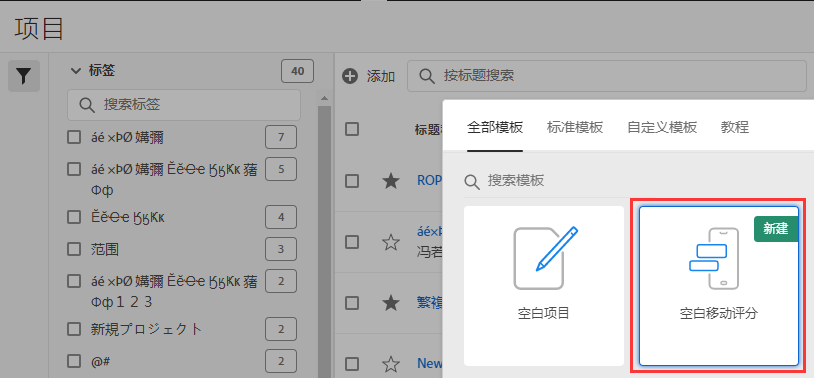
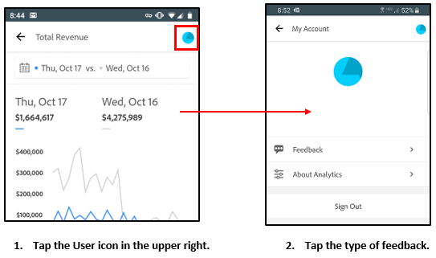
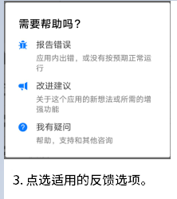

# 测试版：Analytics 移动设备应用程序策划人指南

## 简介

Adobe Analytics 移动设备应用程序可随时随地提供来自 Adobe Analytics 的分析。该应用程序允许用户通过移动设备访问直观的记分卡，这些记分卡可从 Adobe Analytics 的桌面 UI 创建和共享。记分卡是关键量度和其他组件的集合，这些组件以平铺布局显示，您可以点击它们以获取更详细的划分和趋势报表。您可以根据对您最重要的数据来定制记分卡。iOS 和 Android 操作系统均支持移动设备应用程序。

## 关于本指南

本指南旨在帮助 Adobe Analytics 数据策划人在 Analytics 移动设备应用程序上为其执行用户配置记分卡。策划人可以是组织管理员，也可以是其他角色中负责设置应用程序记分卡的人员，该应用程序使执行用户能够在自己的移动设备上快速、轻松地查看广泛呈现的重要摘要数据。尽管执行用户是 Analytics 移动设备应用程序的最终用户，但是本指南将帮助数据策划人为这些用户有效地设置应用程序。

## 术语表

下表描述了用于了解 Analytics 移动设备应用程序的受众、功能和操作的术语。

| 术语 | 定义 |
|--- |--- |
| 用户 | 在移动设备上查看 Analytics 中的关键量度和分析的执行人员 |
| 策划人 | 精通数据的人员，可从 Analytics 中查找和发布分析数据，并配置供用户查看的记分卡 |
| 策划 | 创建或编辑移动记分卡的操作，记分卡中包含用户的相关量度、维度和其他组件 |
| 记分卡 | 包含一个或多个图块的移动设备应用程序视图 |
| 图块 | 记分卡视图中量度的呈现方式 |
| 划分 | 一种辅助视图，点按记分卡中的图块可访问这种辅助视图。此视图将展开图块上显示的量度，并（可选）报告其他划分维度。 |
| 日期范围 | 移动设备应用程序报告的主要日期范围 |
| 比较日期范围 | 与主要日期范围进行比较的日期范围 |

 
## 为执行用户创建记分卡

移动记分卡以平铺布局为执行用户显示关键数据可视化图表，如下所示：

作为此记分卡的策划人，您可以使用记分卡生成器来配置要在用户的记分卡上显示的图块。您还可以配置在点按图块后，如何调整详细视图或“划分”。记分卡生成器界面如下所示：

要创建记分卡，您需要执行以下操作：

1. 访问“空移动记分卡”模板。
2. 使用数据配置记分卡并保存。

### 访问“空移动记分卡”模板

您可以通过以下方式之一访问“空移动记分卡”模板：

**创建新项目**

1. 打开 Adobe Analytics，然后单击&#x200B;**工作区**&#x200B;选项卡。
2. 单击&#x200B;**创建新项目**&#x200B;按钮，然后选择&#x200B;**空移动记分卡**&#x200B;项目模板。
3. 单击&#x200B;**创建**&#x200B;按钮。

*注意：如果看不到“空移动记分卡”模板（如下所示），则表明尚未激活您的公司以使用测试版。请联系您的客户服务经理。*

**添加项目**

在&#x200B;**项目**&#x200B;屏幕的&#x200B;**组件**&#x200B;选项卡下，单击&#x200B;**添加**&#x200B;按钮并选择&#x200B;**移动记分卡**。

**使用 Analytics 工具**

在 Analytics 中，单击&#x200B;**工具**&#x200B;菜单，然后选择&#x200B;**移动设备应用程序**。在后续显示的屏幕上，单击&#x200B;**创建记分卡**&#x200B;按钮。

### 使用数据配置记分卡并保存

要实施记分卡模板，请执行以下操作：

1. 在&#x200B;**属性**（位于右侧边栏中）下，指定要从中使用数据的&#x200B;**项目报表包**。

   

2. 要向记分卡中添加新图块，请将左侧面板中的某个量度拖放到&#x200B;**在此处拖放量度**&#x200B;区域。您也可以使用类似的工作流程，在两个图块之间插入量度。

   

   *从每个图块中，您可以访问一个详细视图，该视图显示有关量度的其他信息，例如，相关维度列表的排名最前的项目。*

3. 要向量度中添加相关维度，请将左侧面板中的维度拖放到图块中。例如，您可以通过将维度拖放到图块中的方式，将相应维度（例如，本例中的 **DMA 区域**）添加到&#x200B;**独特访客数**&#x200B;量度；您添加的维度将显示在特定于图块的&#x200B;**属性**&#x200B;的划分部分下方。可向每个图块中添加多个维度。

   

   *注意：您也可以通过将某个维度拖放到记分卡画布上，将其添加到所有图块。*

   单击记分卡生成器中的图块后，右侧边栏会显示与该图块关联的属性和特征。在此边栏中，您可以为图块提供一个新的&#x200B;**标题**，或者通过指定组件而不是从左侧边栏中拖放组件来配置图块。

   此外，如果单击图块，动态弹出窗口将会显示“划分”视图在应用程序中向执行用户显示的方式。如果未将任何维度应用于图块，则划分维度将为&#x200B;**小时**&#x200B;或&#x200B;**天**，具体取决于默认日期范围。

   

   *请注意添加到图块的每个维度将如何显示在应用程序详细视图的下拉列表中。之后，执行用户可以从下拉列表所列的选项中进行选择。*

4. 要将区段应用于单个图块，请将左侧面板中的某个区段直接拖放到图块的顶部。如果要将区段应用于记分卡中的所有图块，请将区段拖放到记分卡的顶部。

5. 同样，要删除应用于整个记分卡的组件，请单击记分卡上图块外的任意位置，然后单击将鼠标悬停在该组件上时显示的 **x** 来删除组件，如下面的&#x200B;**移动设备客户**&#x200B;区段所示：

   

6. 在记分卡的&#x200B;**属性**&#x200B;下，您还可以选择指定以下内容：

   * **默认日期范围**。此处指定的范围将与针对执行用户在其应用程序中首次访问记分卡所应用的范围相同。

   * **比较日期范围**

   * 要应用到整个记分卡的任何&#x200B;**区段**

7. 要命名记分卡，请单击屏幕左上角的命名空间，然后键入新名称。

   

## 共享记分卡

要与执行用户共享记分卡，请执行以下操作：

1. 单击&#x200B;**共享**&#x200B;菜单，然后选择&#x200B;**共享记分卡**。

2. 在&#x200B;**共享**&#x200B;表单中，通过以下方式填写字段：

   * 提供记分卡的名称
   * 提供记分卡的说明
   * 添加相关标记
   * 指定记分卡的收件人
   * 选择&#x200B;**与收件人共享嵌入的组件**&#x200B;选项，以确保执行用户有权访问记分卡中的所有组件。

3. 单击&#x200B;**共享**。

共享记分卡后，收件人可在其 Analytics 移动设备应用程序中访问该记分卡。如果您在记分卡生成器中对记分卡进行后续更改，则已共享的记分卡会自动更新以反映这些更改。然后，执行用户在其应用程序中刷新记分卡后，便可看到这些更改。

*注意：如果通过添加新组件来更新记分卡，则您可能需要再次共享记分卡（并选中&#x200B;**自动与收件人共享嵌入的组件**选项），以确保执行用户有权访问这些更改。*

## 使用应用程序设置执行用户

在某些情况下，执行用户可能需要一些其他帮助才能访问和使用应用程序。本节将介绍有助于您提供该帮助的信息。

### 帮助执行用户获取访问权限

要帮助执行用户在应用程序中访问记分卡，请确保：

* 执行用户设备上的移动操作系统满足以下最低要求：iOS 版本 10 或更高版本，或者 Android 版本 4.4 (KitKat) 或更高版本
* 执行用户已有效登录 Adobe Analytics
* 您已为执行用户正确创建了移动记分卡，并与他们共享了这些记分卡。
* 执行用户有权访问 Analysis Workspace 以及记分卡所基于的报表包
* 执行用户有权访问记分卡中包含的组件。注意：在共享记分卡时，您可以选择&#x200B;**自动与收件人共享嵌入的组件**&#x200B;选项。

### 帮助执行用户使用应用程序

在测试阶段，且应用程序尚未公开发布之前，您可以控制有权访问该应用程序的人员。

1. 帮助执行用户下载并安装应用程序。为此，请根据执行用户使用的是 iOS 还是 Android 设备，提供以下步骤来扩展他们的访问权限。

   **对于 iOS 上的执行用户：**

   1. 单击以下公共链接（此链接也可在 Analytics 中的&#x200B;**工具** > **移动设备应用程序**&#x200B;下找到）：

      [iOS 链接](https://testflight.apple.com/join/WtXMQxlI)：`https://testflight.apple.com/join/WtXMQxlI`

      单击该链接后，会显示以下 Testflight 屏幕：

      

   2. 点按屏幕上的&#x200B;**在 App Store 中查看**&#x200B;链接，以下载 Testflight 应用程序。

   3. 安装 Testflight 应用程序后，从 Testflight 中找到并安装 Adobe Analytics 移动设备应用程序，如下所示：

      
   **对于 Android 上的执行用户：**

   1. 在用户设备上点按以下 Play Store 链接（此链接也可在 Analytics 中的&#x200B;**工具** > **移动设备应用程序**下找到）：
      [Android](https://play.google.com/apps/testing/com.adobe.analyticsmobileapp)：`https://play.google.com/apps/testing/com.adobe.analyticsmobileapp`

      点按该链接后，再点按以下屏幕上的“成为测试人员”链接：

      

   2. 点按以下屏幕上的&#x200B;**在 Google Play 上下载**链接：
      

   3. 下载并安装应用程序。下载并安装后，执行用户可以使用他们现有的 Adobe Analytics 凭据登录应用程序；我们同时支持 Adobe ID 和 Enterprise/Federated ID。
   

2. 帮助他们访问您的记分卡。执行用户登录应用程序后，会显示&#x200B;**选择公司**&#x200B;屏幕。该屏幕列出了执行用户所属的登录公司。要帮助他们访问记分卡，请执行以下操作：

   * 点按应用于您共享的记分卡的登录公司或 Experience Cloud 组织的名称。然后，记分卡列表会显示与该登录公司下的执行用户共享的所有记分卡。
   * 帮助他们按&#x200B;**最近修改**&#x200B;对此列表进行排序（如果适用）。
   * 点按记分卡的名称以查看记分卡。
   

   注意：如果执行用户登录后看到一条消息，指出尚未共享任何内容，则：

   * 执行用户可能选择了错误的 Analytics 实例
   * 可能尚未与执行用户共享记分卡

      
   验证执行用户是否可以登录正确的 Analytics 实例，以及是否已共享记分卡。

3. 向执行用户说明图块在您共享的记分卡中的显示方式。

   

   有关图块的其他信息：

   * 折线图的粒度取决于日期范围的长度：
      * 一天会显示每小时的趋势
      * 超过一天且不足一年会显示每日的趋势
      * 一年及以上会显示每周的趋势
   * 百分比值更改公式为：量度总计（当前日期范围）- 量度总计（比较日期范围）/ 量度总计（比较日期范围）。
   * 您可以通过下拉屏幕来刷新记分卡。

4. 点按图块以显示图块的详细划分方式。

   

5. 要更改记分卡的日期范围，请执行以下操作：

   

   *注意：您也可以按相同方式更改上面显示的“划分”视图中的日期范围。*

   根据点按的时间间隔（**日**、**周**、**月**&#x200B;或&#x200B;**年**），您将看到两个日期范围选项，即当前时间范围或紧随其前的时间范围。点按这两个选项之一，以选择第一个范围。在&#x200B;**比较对象**&#x200B;列表下，点按其中显示的一个选项，以将此时间段的数据与您选择的第一个日期范围进行比较。点按屏幕右上角的&#x200B;**完成**。**日期范围**&#x200B;字段和记分卡图块会更新以显示您选择的新范围中的新比较数据。

6. 要提供对应用程序的反馈，请执行以下操作：

   1. 点按应用程序屏幕右上角的用户图标。
   2. 在&#x200B;**我的帐户**&#x200B;屏幕上，点按&#x200B;**反馈**&#x200B;选项。
   3. 点按以查看用于提供反馈的选项。
   
   

**要报告错误**，请执行以下操作：

点按相应选项，然后选择错误的子类别。在报告错误的表单中，在顶部字段中提供您的电子邮件地址，并在其下方的字段中提供错误说明。您帐户信息的屏幕快照会自动附加到消息中，但如果需要，您可以通过点按附件图像中的 **X** 来删除该屏幕快照。您还可以选择进行屏幕录制、添加更多屏幕快照或附加文件。要发送报告，请点按表单右上角的纸飞机图标。

**要提供改进建议**，请执行以下操作：

点按相应选项，然后选择建议的子类别。在建议表单中，在顶部字段中提供您的电子邮件地址，并在其下方的字段中提供建议说明。您帐户信息的屏幕快照会自动附加到消息中，但如果需要，您可以通过点按附件图像中的 **X** 来删除该屏幕快照。您还可以选择进行屏幕录制、添加更多屏幕快照或附加文件。要发送建议，请点按表单右上角的纸飞机图标。

**要咨询问题**，请执行以下操作：

点按相应选项，然后在顶部字段中提供您的电子邮件地址，并在其下方的字段中提供问题说明。屏幕快照会自动附加到消息中，但如果需要，您可以通过点按附件图像中的 **X** 来删除该屏幕快照。您还可以选择进行屏幕录制、添加更多屏幕快照或附加文件。要发送问题，请点按表单右上角的纸飞机图标。
