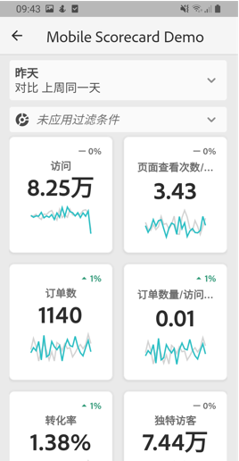
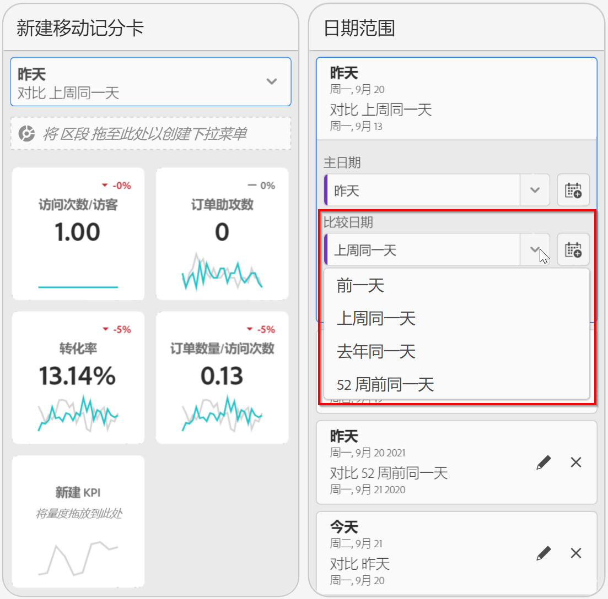
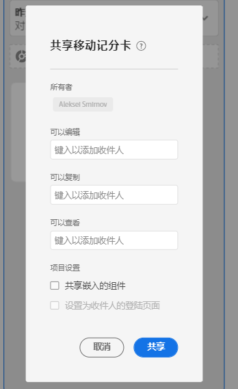
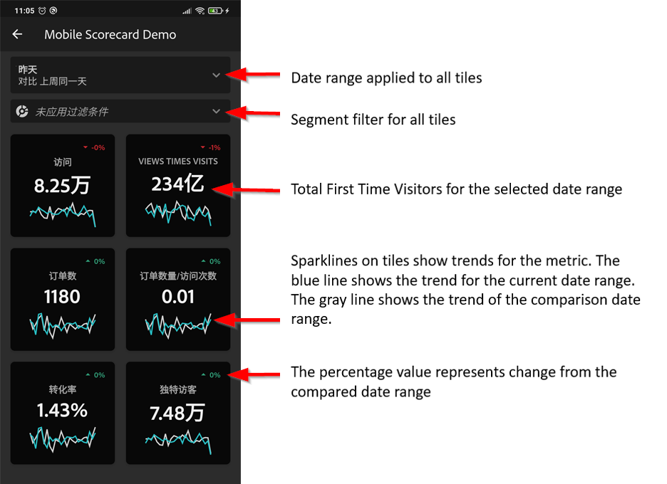

# Adobe Analytics 功能板策划人指南

以下信息将指导 Adobe Analytics 数据策划人如何为执行用户配置和展示功能板。要观看相关演示视频，请访问以下“Adobe Analytics 功能板记分卡生成器”视频：

>[!VIDEO](https://video.tv.adobe.com/v/34544)

## 简介

Adobe Analytics 功能板可以随时随地从 Adobe Analytics 提供分析。该应用程序允许用户通过移动设备访问直观的记分卡，这些记分卡可从 Adobe Analytics 的桌面 UI 创建和共享。记分卡是关键量度和其他组件的集合，这些组件以平铺布局显示，您可以点击它们以获取更详细的划分和趋势报表。您可以根据对您最重要的数据来定制记分卡。iOS 和 Android 操作系统均支持 Analytics 功能板。

## 有关本指南的更多信息

本指南旨在帮助 Adobe Analytics 数据策划人在功能板上为其执行用户配置记分卡。策划人可以是组织管理员，也可以是其他角色中负责设置应用程序记分卡的人员，该应用程序使执行用户能够在自己的移动设备上快速、轻松地查看广泛呈现的重要摘要数据。尽管执行用户是 Analytics 功能板的最终用户，但是本指南将帮助数据策划人为这些用户有效地设置应用程序。

## 术语表

下表描述了用于了解 Analytics 功能板的受众、功能和操作的术语。

| 术语 | 定义 |
|--- |--- |
| 用户 | 在移动设备上查看 Analytics 中的关键量度和分析的执行人员 |
| 策划人 | 精通数据的人员，可从 Analytics 中查找和发布分析数据，并配置供用户查看的记分卡 |
| 策划 | 创建或编辑移动记分卡的操作，记分卡中包含用户的相关量度、维度和其他组件 |
| 记分卡 | 包含一个或多个图块的功能板视图 |
| 图块 | 记分卡视图中量度的呈现方式 |
| 划分 | 一种辅助视图，点按记分卡中的图块可访问这种辅助视图。此视图将展开图块上显示的量度，并（可选）报告其他划分维度。 |
| 日期范围 | 功能板报告的主要日期范围 |
| 比较日期范围 | 与主要日期范围进行比较的日期范围 |

## 为执行用户创建记分卡

记分卡以平铺布局为执行用户显示关键数据可视化图表，如下所示：

作为此记分卡的策划人，您可以使用记分卡生成器来配置要在用户的记分卡上显示的图块。您还可以配置在点按图块后，如何调整详细视图或“划分”。记分卡生成器界面如下所示：

要创建记分卡，您需要执行以下操作：

1. 访问[!UICONTROL 空白移动记分卡]模板。
2. 使用数据配置记分卡并保存。

### 访问[!UICONTROL 空白移动记分卡]模板

您可以通过以下方式之一访问[!UICONTROL 空白移动记分卡]模板：

**创建新项目**

1. 打开 Adobe Analytics，然后单击&#x200B;**[!UICONTROL 工作区]**&#x200B;选项卡。
2. 单击&#x200B;**[!UICONTROL 创建新项目]**&#x200B;按钮，然后选择&#x200B;**[!UICONTROL 空白移动记分卡]**&#x200B;项目模板。
3. 单击&#x200B;**[!UICONTROL 创建]**&#x200B;按钮。

**添加项目**

在&#x200B;**[!UICONTROL 项目]**&#x200B;屏幕的&#x200B;**[!UICONTROL 组件]**&#x200B;选项卡下，单击&#x200B;**[!UICONTROL 添加]**&#x200B;按钮并选择&#x200B;**[!UICONTROL 移动记分卡]**。

**或**

从&#x200B;**[!UICONTROL 工具]**&#x200B;菜单中，选择&#x200B;**[!UICONTROL 分析仪表板（移动应用程序）]**。 在后续显示的屏幕上，单击&#x200B;**[!UICONTROL 新建记分卡]**&#x200B;按钮。

### 使用数据配置记分卡并保存

要实施记分卡模板，请执行以下操作：

1. 在&#x200B;**[!UICONTROL 属性]**（位于右侧边栏中）下，指定要从中使用数据的&#x200B;**[!UICONTROL 项目报表包]**。

   

2. 要向记分卡中添加新图块，请将左侧面板中的某个量度拖放到&#x200B;**[!UICONTROL 在此处拖放量度]**&#x200B;区域。您也可以使用类似的工作流程，在两个图块之间插入量度。

   

   *从每个图块中，您可以访问一个详细视图，该视图显示有关量度的其他信息，例如，相关维度列表的排名最前的项目。*

3. 要向量度中添加相关维度，请将左侧面板中的维度拖放到图块中。例如，您可以通过将维度拖放到图块中的方式，将相应维度（例如，本例中的 **[!DNL DMA Region]**）添加到&#x200B;**[!UICONTROL 独特访客数]**&#x200B;量度；您添加的维度将显示在特定于图块的&#x200B;**[!UICONTROL 属性]**&#x200B;的划分部分下方。可向每个图块中添加多个维度。

   

   单击记分卡生成器中的图块后，右侧边栏会显示与该图块关联的属性和特征。在此边栏中，您可以为图块提供一个新的&#x200B;**[!UICONTROL 标题]**，或者通过指定组件而不是从左侧边栏中拖放组件来配置图块。

   

   此外，如果单击图块，动态弹出窗口将会显示“划分”视图在应用程序中向执行用户显示的方式。如果未将任何维度应用于图块，则划分维度将为&#x200B;**小时**&#x200B;或&#x200B;**天**，具体取决于默认日期范围。

   

   添加到图块的每个维度将显示在应用程序详细视图的下拉列表中。之后，执行用户可以从下拉列表所列的选项中进行选择。

4. 要将区段应用于单个图块，请将左侧面板中的某个区段直接拖放到图块的顶部。如果要将区段应用于记分卡中的所有图块，请将区段拖放到记分卡的顶部。或者，您也可以通过在日期范围下方的筛选器菜单中选择区段来应用区段。您可以像在 Adobe Analytics Workspace 中一样[为记分卡配置和应用过滤器](https://experienceleague.adobe.com/docs/analytics-learn/tutorials/analysis-workspace/using-panels/using-drop-down-filters.html)。

   

5. 同样，要删除应用于整个记分卡的组件，请单击拼贴外部记分卡上的任意位置，然后单击将鼠标悬停在组件上时显示的&#x200B;**x**&#x200B;将其删除，如&#x200B;**首次访问**&#x200B;区段所示：

   

6. 通过选择日期范围下拉列表，添加和删除可在记分卡中选择的日期范围组合。

   

   每个新记分卡开始具有6个日期范围组合，侧重于从今天到昨天的数据。 单击x可删除不必要的日期范围，也可以单击铅笔编辑每个日期范围组合。

   

   要创建或更改主日期，请使用下拉框从可用日期范围中进行选择，或将日期组件从右边栏拖放到拖放区中。

   

   要创建比较日期，您可以从下拉菜单中为常见时间比较选择方便的预设。 您还可以从右边栏中拖放日期组件。

   

   如果尚未创建您想要的日期范围，则可以单击日历图标创建新日期范围。

   

7. 此操作将带您进入日期范围生成器，您可以在其中创建并保存新的日期范围组件。 要命名记分卡，请单击屏幕左上角的命名空间，然后键入新名称。

   

## 共享记分卡

要与执行用户共享记分卡，请执行以下操作：

1. 单击&#x200B;**[!UICONTROL 共享]**&#x200B;菜单，然后选择&#x200B;**[!UICONTROL 共享记分卡]**。

2. 在&#x200B;**[!UICONTROL 共享移动记分卡]**&#x200B;表单中，通过以下方式填写字段：

   * 提供记分卡的名称
   * 提供记分卡的说明
   * 添加相关标记
   * 指定记分卡的收件人

3. 单击&#x200B;**[!UICONTROL 共享]**。

共享记分卡后，收件人可在其 Analytics 功能板中访问该记分卡。如果您在记分卡生成器中对记分卡进行后续更改，则已共享的记分卡会自动更新以反映这些更改。然后，执行用户在其应用程序中刷新记分卡后，便可看到这些更改。

如果通过添加新组件来更新记分卡，则您可能需要再次共享记分卡（并选中&#x200B;**[!UICONTROL 共享嵌入的组件]**&#x200B;选项），以确保执行用户有权访问这些更改。

## 使用应用程序设置执行用户

在某些情况下，执行用户可能需要一些其他帮助才能访问和使用应用程序。本节将介绍有助于您提供该帮助的信息。

### 帮助执行用户获取访问权限

要帮助执行用户在应用程序中访问记分卡，请确保：

* 执行用户设备上的移动操作系统满足以下最低要求：iOS 版本 10 或更高版本，或者 Android 版本 4.4 (KitKat) 或更高版本
* 执行用户已有效登录 Adobe Analytics
* 您已为执行用户正确创建了移动记分卡，并与他们共享了这些记分卡
* 执行用户有权访问 Analysis Workspace 以及记分卡所基于的报表包
* 执行用户有权访问记分卡中包含的组件。请注意，在共享记分卡时，您可以选择&#x200B;**[!UICONTROL 共享嵌入的组件]**&#x200B;选项。

### 帮助执行用户使用应用程序

为帮助执行用户，需要执行以下操作：

1. 帮助执行用户下载并安装应用程序。为此，请根据执行用户使用的是 iOS 还是 Android 设备，提供以下步骤来扩展他们的访问权限。

   **对于 iOS 上的执行用户：**

   * 单击以下链接（也可在 Analytics 的&#x200B;**[!UICONTROL 工具]** > **[!UICONTROL Analytics 功能板（移动应用程序）]**&#x200B;下找到该链接），然后按照相应提示下载、安装和打开应用程序：

      [iOS 链接](https://apple.co/2zXq0aN)
   **对于 Android 上的执行用户：**

   * 单击以下链接（也可在 Analytics 的&#x200B;**[!UICONTROL 工具]** > **[!UICONTROL Analytics 功能板（移动应用程序）]**&#x200B;下找到该链接），然后按照相应提示下载、安装和打开应用程序：

      [Android 链接](https://bit.ly/2LM38Oo)
   下载并安装后，执行用户可以使用他们现有的 Adobe Analytics 凭据登录应用程序；我们同时支持 Adobe ID 和 Enterprise/Federated ID。

   

2. 帮助他们访问您的记分卡。执行用户登录应用程序后，会显示&#x200B;**[!UICONTROL 选择公司]**&#x200B;屏幕。该屏幕列出了执行用户所属的登录公司。要帮助他们访问记分卡，请执行以下操作：

   * 点按应用于您共享的记分卡的登录公司或 Experience Cloud 组织的名称。然后，记分卡列表会显示与该登录公司下的执行用户共享的所有记分卡。
   * 帮助他们按&#x200B;**[!UICONTROL 最近修改]**&#x200B;对此列表进行排序（如果适用）。
   * 点按记分卡的名称以查看记分卡。

   

   如果执行用户登录后看到一条消息，指出尚未共享任何内容，则：

   * 执行用户可能选择了错误的 Analytics 实例

   * 可能尚未与执行用户共享记分卡

      

   * 验证执行用户是否可以登录正确的 Analytics 实例，以及是否已共享记分卡。

3. 向执行用户说明拼贴在您共享的记分卡中的显示方式(下面的第一个记分卡在深色模式下设置；如果您认为您的执行用户喜欢此查看选项，请参阅下面的&#x200B;**[!UICONTROL 首选项]**:

   

   

   有关图块的其他信息：

   * 折线图的粒度取决于日期范围的长度：
      * 一天会显示每小时的趋势
      * 超过一天且不足一年会显示每日的趋势
      * 一年及以上会显示每周的趋势
   * 百分比值更改公式为：量度总计（当前日期范围）- 量度总计（比较日期范围）/ 量度总计（比较日期范围）。
   * 您可以通过下拉屏幕来刷新记分卡。

4. 点按图块以显示图块的详细划分方式。

   

   * 点按折线图上的任一点，可查看与线上的这个点相关联的数据。

   * 将包含一个表以显示已添加到图块的各维度的数据。点按向下箭头以选择维度。如果未将维度添加到图块，则表将显示图表数据。

5. 要更改记分卡的日期范围，请点按日期标题，然后选择要视图的主要和比较日期范围组合。

   

6. 要提供对应用程序的反馈，请执行以下操作：

   1. 点按应用程序屏幕右上方的设置图标。
   2. 在&#x200B;**[!UICONTROL 设置]**&#x200B;屏幕上，点按&#x200B;**[!UICONTROL 反馈]**&#x200B;选项。
   3. 点按以查看用于提供反馈的选项。

      

7. 要更改首选项，请点按上面显示的&#x200B;**[!UICONTROL 首选项]**&#x200B;选项。在“首选项”中，您可以打开生物识别登录，也可以将应用程序设置为深色模式，如下所示：

   

**要报告错误**，请执行以下操作：

点按相应选项，然后选择错误的子类别。在报告错误的表单中，在顶部字段中提供您的电子邮件地址，并在其下方的字段中提供错误说明。您帐户信息的屏幕快照会自动附加到消息中，但如果需要，您可以通过点按附件图像中的 **X** 来删除该屏幕快照。您还可以选择进行屏幕录制、添加更多屏幕快照或附加文件。要发送报告，请点按表单右上角的纸飞机图标。

**要提供改进建议**，请执行以下操作：

点按相应选项，然后选择建议的子类别。在建议表单中，在顶部字段中提供您的电子邮件地址，并在其下方的字段中提供建议说明。您帐户信息的屏幕快照会自动附加到消息中，但如果需要，您可以通过点按附件图像中的 **X** 来删除该屏幕快照。您还可以选择进行屏幕录制、添加更多屏幕快照或附加文件。要发送建议，请点按表单右上角的纸飞机图标。

**要咨询问题**，请执行以下操作：

点按相应选项，然后在顶部字段中提供您的电子邮件地址，并在其下方的字段中提供问题说明。屏幕快照会自动附加到消息中，但如果需要，您可以通过点按附件图像中的 **X** 来删除该屏幕快照。您还可以选择进行屏幕录制、添加更多屏幕快照或附加文件。要发送问题，请点按表单右上角的纸飞机图标。

>[!IMPORTANT]
>
>从 2020 年 10 月开始，Adobe 逐步推出一系列增强功能，以优化“Adobe Analytics 功能板”应用程序的性能。这些增强功能的重心在于缓存用于填充特定日期（不包括当天）记分卡的历史 Analytics 数据。该数据将在安全的 Microsoft Azure 公共云存储帐户中缓存长达 24 小时。如果您想要选择退出这些性能增强功能，请联系您的客户成功经理。
