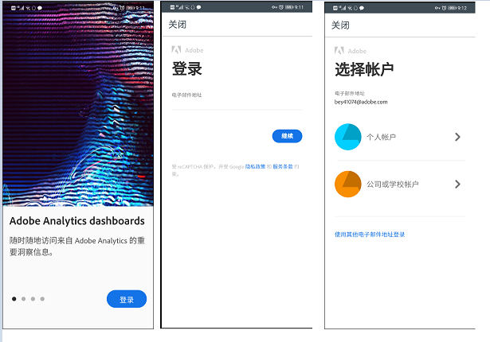
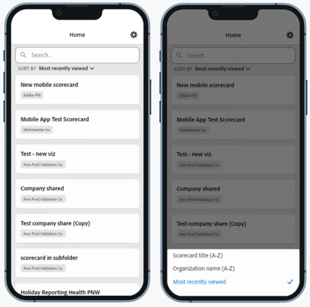
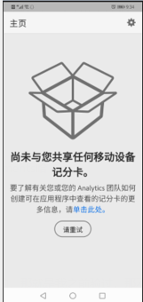
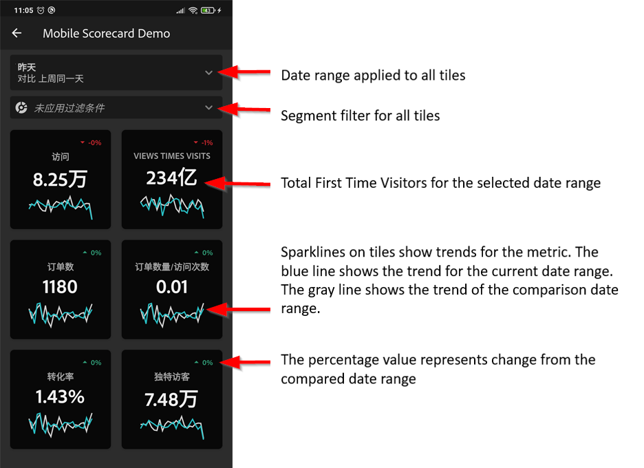
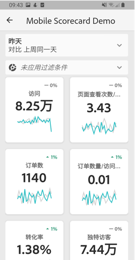
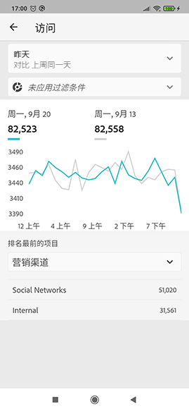
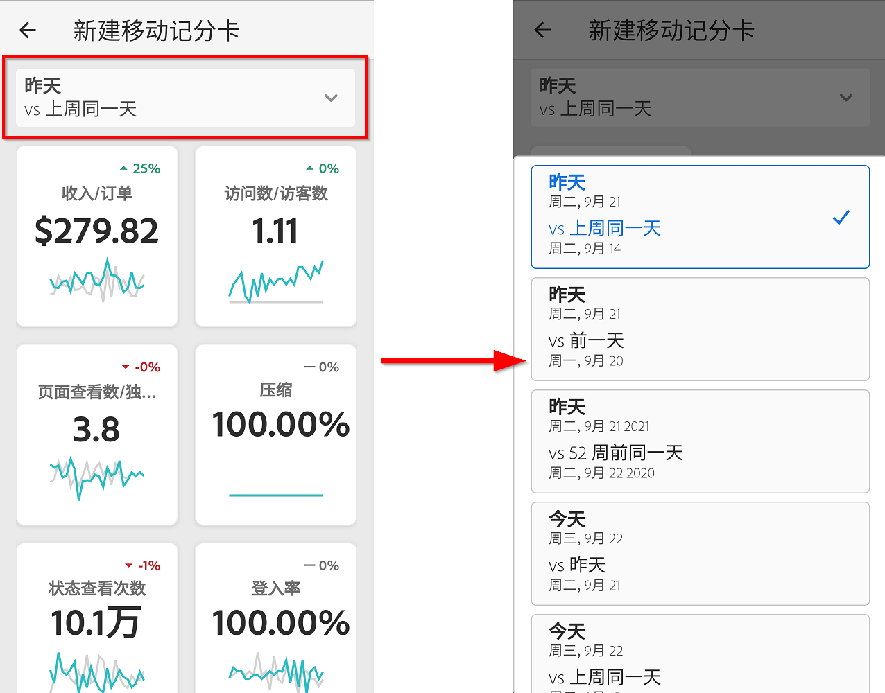
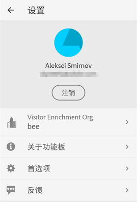
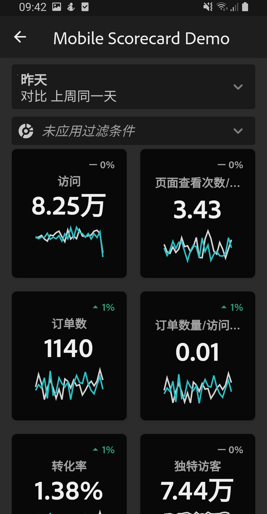

# 执行用户快速入门指南

通过阅读以下信息，执行用户可以了解有关使用和查看 Adobe Analytics 功能板的最佳实践。要观看演示此信息的视频，请参阅 [Adobe Analytics 功能板应用程序内体验](https://youtu.be/QXqQ_PkArbA)。

本指南旨在帮助执行用户阅读并理解 Analytics 功能板上的记分卡。该应用程序允许执行用户在其自己的移动设备上快速、轻松地查看广泛呈现的重要概要数据。

## 在设备上设置功能板

要有效地使用功能板，您需要让记分卡策划人帮助您进行设置。本节将介绍有助于您在策划人的帮助下设置应用程序的信息。

### 获取访问权限

要在功能板中访问记分卡，请确保：

* 您已有效登录 Adobe Analytics
* 您的策划人已正确创建了移动记分卡，并与您共享了这些记分卡

### 下载并安装记分卡

要下载并安装应用程序，请根据设备上的操作系统执行以下相应步骤。

**对于 iOS 上的执行用户：**

单击以下链接（也可在 Analytics 的&#x200B;**[!UICONTROL 工具]** > **[!UICONTROL Analytics 功能板（移动应用程序）]**&#x200B;下找到该链接），然后按照相应提示下载、安装和打开应用程序：

[iOS 链接](https://apple.co/2zXq0aN)

**对于 Android 上的执行用户：**

单击以下链接（也可在 Analytics 的&#x200B;**[!UICONTROL 工具]** > **[!UICONTROL Analytics 功能板（移动应用程序）]**&#x200B;下找到该链接），然后按照相应提示下载、安装和打开应用程序：

[Android 链接](https://bit.ly/2LM38Oo)

下载和安装后，执行用户可使用其现有的 Adobe Analytics 凭据登录应用程序。

## 使用功能板

要使用功能板，请执行以下操作：

1. 登录到该应用程序。启动功能板时，将显示登录屏幕。使用现有的 Adobe Analytics 凭据按照提示进行操作。我们同时支持 Adobe ID 和 Enterprise/Federated ID。

   

1. 选择一个公司。登录功能板后，会显示&#x200B;**[!UICONTROL 选择公司]**&#x200B;屏幕。此屏幕会列出您所属的登录公司。点按与您共享的记分卡所关联的公司名称。

   记分卡列表会显示与您共享的所有记分卡。

1. 点按要查看的记分卡。

   如果您在一次登录中有权访问多个组织，则组织中的所有记分卡都可在记分卡列表中使用。

   您可以根据记分卡标题、组织名称或最近查看的记分卡对记分卡列表进行排序。 您甚至可以搜索特定记分卡。

   

   如果您登录后看到一条消息，指出尚未共享任何内容，请与策划人确认以下事项：

   * 您可以登录到正确的 Analytics 实例
   * 已与您共享记分卡

   

1. 检查图块在记分卡中的显示方式（第一个记分卡以深色模式显示；有关更多信息，请参阅下面的&#x200B;**[!UICONTROL 首选项]**）。

   

   有关图块的其他信息：

   * 折线图的粒度取决于日期范围的长度：

      * 一天会显示每小时的趋势
      * 超过一天且不足一年会显示每日的趋势
      * 一年及以上会显示每周的趋势

   * 百分比值更改公式为：指标总计（当前日期范围）- 指标总计（比较日期范围）/ 指标总计（比较日期范围）。

   * 您可以通过下拉屏幕来刷新记分卡。

   以下是以正常模式显示的示例记分卡：

   

1. 点按图块以查看图块的详细划分方式。

   

1. 要更改记分卡的日期范围，请执行以下操作：

   

   * 您也可以按相同方式更改上面显示的“划分”视图中的日期范围。

   * 根据点按的时间间隔（**日**、**周**、**月**&#x200B;或&#x200B;**年**），您将看到两个日期范围选项，即当前时间范围或紧随其前的时间范围。点按这两个选项之一，以选择第一个范围。在&#x200B;**[!UICONTROL 比较对象]**&#x200B;列表下，点按其中显示的一个选项，以将此时间段的数据与您选择的第一个日期范围进行比较。点按屏幕右上角的&#x200B;**[!UICONTROL 完成]**。**[!UICONTROL 日期范围]**&#x200B;字段和记分卡图块会更新以显示您选择的新范围中的新比较数据。

1. 要将区段过滤器应用于记分卡，请点按过滤器下拉列表，然后选择由策划人配置的区段。 应用程序中的[过滤器](https://experienceleague.adobe.com/docs/analytics-learn/tutorials/analysis-workspace/using-panels/using-drop-down-filters.html?lang=zh-Hans)的工作方式与在 Analytics Workspace 中相同。

   

1. 获取记分卡更新。如果记分卡不包含您可能感兴趣的所有量度或划分，请联系您的 Analytics 团队来更新记分卡。更新后，您可以下拉屏幕上的记分卡进行刷新，并加载最近添加的数据。

1. 要提供对应用程序的反馈，请执行以下操作：

   1. 点按应用程序屏幕右上方的设置图标。
   2. 在&#x200B;**[!UICONTROL 设置]**&#x200B;屏幕上，点按&#x200B;**[!UICONTROL 反馈]**&#x200B;选项。
   3. 点按以查看用于提供反馈的选项。

      

1. 要更改首选项，请点按上面显示的&#x200B;**[!UICONTROL 首选项]**&#x200B;选项。在“首选项”中，您可以打开生物识别登录，也可以将应用程序设置为深色模式，如下所示：

   

**要报告错误**，请执行以下操作：

点按相应选项，然后选择错误的子类别。在报告错误的表单中，在顶部字段中提供您的电子邮件地址，并在其下方的字段中提供错误说明。您帐户信息的屏幕快照会自动附加到消息中，但如果需要，您可以通过点按附件图像中的 **X** 来删除该屏幕快照。您还可以选择进行屏幕录制、添加更多屏幕快照或附加文件。要发送报告，请点按表单右上角的纸飞机图标。

**要提供改进建议**，请执行以下操作：

点按相应选项，然后选择建议的子类别。在建议表单中，在顶部字段中提供您的电子邮件地址，并在其下方的字段中提供建议说明。您帐户信息的屏幕快照会自动附加到消息中，但如果需要，您可以通过点按附件图像中的 **X** 来删除该屏幕快照。您还可以选择进行屏幕录制、添加更多屏幕快照或附加文件。要发送建议，请点按表单右上角的纸飞机图标。

**要咨询问题**，请执行以下操作：

点按相应选项，然后在顶部字段中提供您的电子邮件地址，并在其下方的字段中提供问题说明。屏幕快照会自动附加到消息中，但如果需要，您可以通过点按附件图像中的 **X** 来删除该屏幕快照。您还可以选择进行屏幕录制、添加更多屏幕快照或附加文件。要发送问题，请点按表单右上角的纸飞机图标。

## 术语表

| 术语 | 定义 |
|--- |--- |
| 用户 | 在移动设备上查看 Analytics 中的关键量度和分析的执行人员 |
| 策划人 | 精通数据的人员，可从 Analytics 中查找和发布分析数据，并配置供用户查看的记分卡 |
| 策划 | 创建或编辑移动记分卡的操作，记分卡中包含用户的相关量度、维度和其他组件 |
| 记分卡 | 包含一个或多个图块的功能板视图 |
| 图块 | “记分卡视图”中量度的呈现方式 |
| 划分 | 一种辅助视图，点按记分卡中的图块可访问这种辅助视图。此视图将展开图块上显示的量度，并（可选）报告其他划分维度。 |
| 日期范围 | 功能板报告的主要日期范围 |
| 比较日期范围 | 与主要日期范围进行比较的日期范围 |

