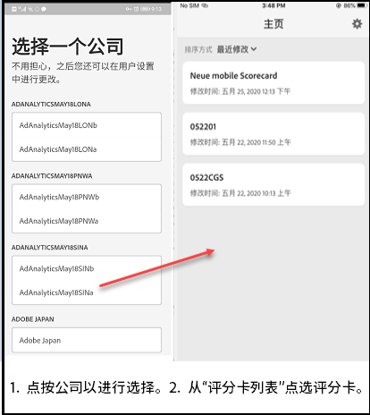

# Analytics移动应用程序：执行用户快速入门指南

## 简介

Adobe Analytics移动应用程序可随时随地从Adobe Analytics提供洞察。  应用程序允许用户通过移动设备访问直观的记分卡。 记分卡是关键指标和其他组件的集合，它们以拼贴的布局显示，您可以点击它以获取更详细的细分和趋势报表。 iOS和Android操作系统均支持移动应用程序。

## 关于本指南

本指南旨在帮助执行用户阅读和解释Analytics移动应用程序上的记分卡。 该应用程序使执行用户能够在自己的移动设备上快速、轻松地查看重要摘要数据的广泛呈现。

## 术语表

| 术语 | 定义 |
|--- |--- |
| 消费者 | 在移动设备上查看Analytics中的关键指标和洞察的执行人员角色 |
| 策展人 | 从Analytics中查找和分发洞察并配置要由消费者查看的记分卡的“数据识别”角色 |
| 管理分析 | 创建或编辑包含消费者相关指标、维度和其他组件的移动记分卡的操作 |
| 记分卡 | 包含一个或多个拼贴的移动应用程序视图 |
| 拼贴 | 记分卡视图中的度量渲染 |
| 划分 | 点击记分卡中的拼贴可访问的辅助视图。 此视图将展开拼贴上显示的度量，并（可选）报告其他划分维度。 |
| 日期范围 | 移动应用程序报告的主要日期范围 |
| 比较日期范围 | 与主要日期范围进行比较的日期范围 |

## 在设备上设置应用程序

要有效地使用应用程序，您需要让Scorecard管理人帮助您设置它。 本节提供的信息可帮助您在策展人的帮助下进行设置。

### 获取访问权限

要访问应用程序上的记分卡，请确保：

* 您有一个有效的Adobe Analytics登录名
* 您的策展人已正确创建移动记分卡并与您共享它们

### 下载并安装应用程序

要下载和安装应用程序，请按照设备上的操作系统执行以下步骤。

**对于iOS设备：**

1. 单击以下公共链接(在“工具” **&gt;“移动应用程序”下的Analytics中也可** 以找到该链接 ****):

   [iOS链接](https://testflight.apple.com/join/WtXMQxlI): `https://testflight.apple.com/join/WtXMQxlI`

   单击链接后，将显示以下Testflight屏幕：

   

2. 点按屏 **幕上的“在App Store中查看** ”链接以下载Testflight应用程序。

3. 安装Testflight应用程序后，从Testflight中查找并安装Adobe Analytics移动应用程序，如下所示：

   

**对于Android设备：**

1. 点按用户设备上的以下“播放商店”链接(该链接也可在“工具” **&gt;“移动应用程** 序”下的Analytics中使用 ****):

   [Android](https://play.google.com/apps/testing/com.adobe.analyticsmobileapp): `https://play.google.com/apps/testing/com.adobe.analyticsmobileapp`

   点击链接后，点按以下屏幕上的“成为测试人员”链接：

   

2. 点按下 **面屏幕上的Google Play链接** ，下载它：

   

## 使用应用程序

要使用应用程序，请执行以下操作：

1. 登录应用程序。 启动应用程序时，将显示登录屏幕。 使用您现有的Adobe Analytics凭据按照提示进行操作。 我们同时支持Adobe和Enterprise/Federated ID。

   

2. 选择一个公司. 登录应用程序后，将显示“ **选择公司** ”屏幕。 此屏幕列出您所属的登录公司。 点按与您共享的记分卡关联的公司名称。

3. 然后，记分卡列表会显示与您共享的所有记分卡。 点按要查看的记分卡。

   

   *注意：如果您登录并看到一条消息说没有共享内容，请与策展人确认以下内容：*

   * *您可以登录到正确的Analytics实例*
   * *记分卡已与您共享*

      

4. 检查拼贴在记分卡中的显示方式。

   

   有关拼贴的其他信息：

   * 分隔线的粒度取决于日期范围的长度：
   * 一天显示每小时的趋势
   * 一天多一年不到的时候，每日的趋势
   * 一年或更多时间显示每周趋势
   * 百分比值更改公式是度量合计（当前日期范围）-度量合计（比较日期范围）/度量合计（比较日期范围）。
   * 您可以下拉屏幕以刷新记分卡。

5. 点按拼贴可显示拼贴的详细细分工作方式。

   

6. 要更改记分卡的日期范围：

   

   *注意：您还可以按相同方式更改上述“细分”视图中的日期范围。*

   根据点按(**Day**、 **Week**、 **Month**、 **Year** Span)的时间间隔，您将看到两个选项范围（当前时间范围或紧接其之前的日期范围）。 点按这两个选项之一以选择第一个范围。 在“ **比较对象** ”列表下，点按其中一个显示的选项，将此时间段的数据与您选择的第一个日期范围进行比较。 点 **击屏幕右上角** 的“完成”。 “日 **期范围** ”字段和“记分卡”拼贴会使用您所选新范围中的新比较数据进行更新。

7. 获取记分卡更新。 如果记分卡不包含您可能感兴趣的所有度量或细分，请联系您的Analytics团队以更新记分卡。 更新后，您可以在屏幕上下拉卡以刷新它并加载最近添加的数据。

8. 保留反馈。 要保留反馈，请执行以下操作：

   1. 点按应用程序屏幕右上角的用户图标。
   2. 在“我的 **帐户** ”屏幕上，点按 **反馈** 。
   3. 点按可查看退出反馈的选项。
   
   

**要报告错误**:

点按该选项并选择错误的子类别。 在报告错误的表单中，在顶部字段中提供您的电子邮件地址，并在其下方字段中提供错误的说明。 您的帐户信息的屏幕快照会自动附加到消息中，但如果需要，您可以通过点击附件图像中的 **X** 来删除该屏幕快照。 您还可以选择进行屏幕录制、添加更多屏幕截图或附加文件。 要发送报表，请点按表单右上角的纸质平面图标。

**建议改进**:

点按选项，然后为建议选择子类别。 在建议表单中，在顶部字段中提供您的电子邮件地址，并在其下方字段中提供错误的说明。 您的帐户信息的屏幕快照会自动附加到消息中，但如果需要，您可以通过点击附件图像中的 **X** 来删除该屏幕快照。 您还可以选择进行屏幕录制、添加更多屏幕截图或附加文件。 要发送建议，请点按表单右上角的纸面图标。

**要提问**:

点按选项，在顶部字段中提供您的电子邮件地址，并在其下方字段中提供您的问题。 屏幕截图会自动附加到消息中，但如果需要，您可以通过点击附件图像中的 **X** 来删除它。 您还可以选择进行屏幕录制、添加更多屏幕截图或附加文件。 要发送问题，请点按表单右上角的纸质平面图标。
