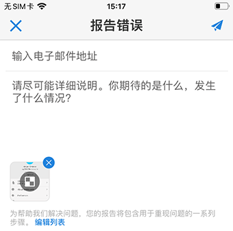

# Analytics 移动设备应用程序：执行用户快速入门指南

## 简介

Adobe Analytics 移动设备应用程序可随时随地提供来自 Adobe Analytics 的分析。该应用程序允许用户通过移动设备访问直观的记分卡。记分卡是关键量度和其他组件的集合，这些组件以平铺布局显示，您可以点击它们以获取更详细的划分和趋势报表。iOS 和 Android 操作系统均支持移动设备应用程序。

## 关于本指南

本指南旨在帮助执行用户阅读并理解 Analytics 移动设备应用程序上的记分卡。该应用程序使执行用户能够在自己的移动设备上快速、轻松地查看广泛呈现的重要摘要数据。

## 术语表

| 术语 | 定义 |
|--- |--- |
| 用户 | 在移动设备上查看 Analytics 中的关键量度和分析的执行人员 |
| 策划人 | 精通数据的人员，可从 Analytics 中查找和发布分析数据，并配置供用户查看的记分卡 |
| 策划 | 创建或编辑移动记分卡的操作，记分卡中包含用户的相关量度、维度和其他组件 |
| 记分卡 | 包含一个或多个图块的移动设备应用程序视图 |
| 图块 | 记分卡视图中量度的呈现方式 |
| 划分 | 一种辅助视图，点按记分卡中的图块可访问这种辅助视图。此视图将展开图块上显示的量度，并（可选）报告其他划分维度。 |
| 日期范围 | 移动设备应用程序报告的主要日期范围 |
| 比较日期范围 | 与主要日期范围进行比较的日期范围 |

## 在设备上设置应用程序

要有效地使用应用程序，您需要让记分卡策划人帮助您进行设置。本节将介绍有助于您在策划人的帮助下设置应用程序的信息。

### 获取访问权限

要在应用程序中访问记分卡，请确保：

* 您已有效登录 Adobe Analytics
* 您的策划人已正确创建了移动记分卡，并与您共享了这些记分卡

### 下载并安装应用程序

要下载并安装应用程序，请根据设备上的操作系统执行以下相应步骤。

**对于 iOS 设备：**

1. 单击以下公共链接（此链接也可在 Analytics 中的&#x200B;**工具** > **移动设备应用程序**&#x200B;下找到）：

   [iOS 链接](https://testflight.apple.com/join/WtXMQxlI)：`https://testflight.apple.com/join/WtXMQxlI`

   单击该链接后，会显示以下 Testflight 屏幕：

   

2. 点按屏幕上的&#x200B;**在 App Store 中查看**&#x200B;链接，以下载 Testflight 应用程序。

3. 安装 Testflight 应用程序后，从 Testflight 中找到并安装 Adobe Analytics 移动设备应用程序，如下所示：

   

**对于 Android 设备：**

1. 在用户设备上点按以下 Play Store 链接（此链接也可在 Analytics 中的&#x200B;**工具** > **移动设备应用程序**&#x200B;下找到）：

   [Android](https://play.google.com/apps/testing/com.adobe.analyticsmobileapp)：`https://play.google.com/apps/testing/com.adobe.analyticsmobileapp`

   点按该链接后，再点按以下屏幕上的“成为测试人员”链接：

   

2. 点按以下屏幕上的&#x200B;**在 Google Play 上下载**&#x200B;链接：

   

## 使用应用程序

要使用应用程序，请执行以下操作：

1. 登录应用程序。启动应用程序时，将显示登录屏幕。使用现有的 Adobe Analytics 凭据按照提示进行操作。我们同时支持 Adobe ID 和 Enterprise/Federated ID。

   

2. 选择一个公司。登录应用程序后，会显示&#x200B;**选择公司**&#x200B;屏幕。此屏幕会列出您所属的登录公司。点按与您共享的记分卡所关联的公司名称。

3. 然后，记分卡列表会显示与您共享的所有记分卡。点按要查看的记分卡。

   

   *注意：如果您登录后看到一条消息，指出尚未共享任何内容，请与策划人确认以下事项：*

   * *您可以登录到正确的 Analytics 实例*
   * *已与您共享记分卡*

      

4. 检查图块在记分卡中的显示方式。

   

   有关图块的其他信息：

   * 折线图的粒度取决于日期范围的长度：
   * 一天会显示每小时的趋势
   * 超过一天且不足一年会显示每日的趋势
   * 一年及以上会显示每周的趋势
   * 百分比值更改公式为：量度总计（当前日期范围）- 量度总计（比较日期范围）/ 量度总计（比较日期范围）。
   * 您可以通过下拉屏幕来刷新记分卡。

5. 点按图块以显示图块的详细划分方式。

   

6. 要更改记分卡的日期范围，请执行以下操作：

   

   *注意：您也可以按相同方式更改上面显示的“划分”视图中的日期范围。*

   根据点按的时间间隔（**日**、**周**、**月**&#x200B;或&#x200B;**年**），您将看到两个日期范围选项，即当前时间范围或紧随其前的时间范围。点按这两个选项之一，以选择第一个范围。在&#x200B;**比较对象**&#x200B;列表下，点按其中显示的一个选项，以将此时间段的数据与您选择的第一个日期范围进行比较。点按屏幕右上角的&#x200B;**完成**。**日期范围**&#x200B;字段和记分卡图块会更新以显示您选择的新范围中的新比较数据。

7. 获取记分卡更新。如果记分卡不包含您可能感兴趣的所有量度或划分，请联系您的 Analytics 团队来更新记分卡。更新后，您可以下拉屏幕上的记分卡进行刷新，并加载最近添加的数据。

8. 提供反馈。要提供反馈，请执行以下操作：

   1. 点按应用程序屏幕右上角的用户图标。
   2. 在&#x200B;**我的帐户**&#x200B;屏幕上，点按&#x200B;**反馈**&#x200B;选项。
   3. 点按以查看用于提供反馈的选项。
   
   

**要报告错误**，请执行以下操作：

点按相应选项，然后选择错误的子类别。在报告错误的表单中，在顶部字段中提供您的电子邮件地址，并在其下方的字段中提供错误说明。您帐户信息的屏幕快照会自动附加到消息中，但如果需要，您可以通过点按附件图像中的 **X** 来删除该屏幕快照。您还可以选择进行屏幕录制、添加更多屏幕快照或附加文件。要发送报告，请点按表单右上角的纸飞机图标。

**要提供改进建议**，请执行以下操作：

点按相应选项，然后选择建议的子类别。在建议表单中，在顶部字段中提供您的电子邮件地址，并在其下方的字段中提供建议说明。您帐户信息的屏幕快照会自动附加到消息中，但如果需要，您可以通过点按附件图像中的 **X** 来删除该屏幕快照。您还可以选择进行屏幕录制、添加更多屏幕快照或附加文件。要发送建议，请点按表单右上角的纸飞机图标。

**要咨询问题**，请执行以下操作：

点按相应选项，然后在顶部字段中提供您的电子邮件地址，并在其下方的字段中提供问题说明。屏幕快照会自动附加到消息中，但如果需要，您可以通过点按附件图像中的 **X** 来删除该屏幕快照。您还可以选择进行屏幕录制、添加更多屏幕快照或附加文件。要发送问题，请点按表单右上角的纸飞机图标。
