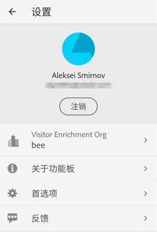

# 使用应用程序设置执行用户

在某些情况下，执行用户可能需要一些其他帮助才能访问和使用应用程序。本节将介绍有助于您提供该帮助的信息。

## 确保应用程序用户拥有 Adobe Analytics 访问权限

1. 在[Experience CloudAdmin Console](/help/admin/admin-console/permissions/product-profile.md)中设置新用户。

1. 要共享记分卡，您必须向应用程序用户授予访问记分卡组件的权限，这些组件包括Analysis Workspace、记分卡所基于的报表包以及区段、量度和维度。

## 应用程序用户的系统先决条件

要确保执行用户有权访问应用程序上的记分卡，请确保：

* 执行用户设备上的移动操作系统满足以下最低要求：iOS 版本 10 或更高版本，或者 Android 版本 4.4 (KitKat) 或更高版本
* 执行用户已有效登录 Adobe Analytics。
* 您已为他们正确创建了移动记分卡，并与他们共享了这些记分卡。
* 他们有权访问记分卡中包含的组件。 请注意，在将记分卡共享到&#x200B;**[!UICONTROL 共享嵌入的组件]**&#x200B;时，您可以选择一个选项。

## 帮助执行人员下载和安装应用程序

**对于 iOS 上的执行用户：**

单击以下链接（也可在 Analytics 的&#x200B;**[!UICONTROL 工具]** > **[!UICONTROL Analytics 功能板（移动应用程序）]**&#x200B;下找到该链接），然后按照相应提示下载、安装和打开应用程序：

`[iOS link](https://apple.co/2zXq0aN)`

**对于 Android 上的执行用户：**

单击以下链接（也可在 Analytics 的&#x200B;**[!UICONTROL 工具]** > **[!UICONTROL Analytics 功能板（移动应用程序）]**&#x200B;下找到该链接），然后按照相应提示下载、安装和打开应用程序：

`[Android link](https://bit.ly/2LM38Oo)`

下载并安装后，执行用户可以使用他们现有的 Adobe Analytics 凭据登录应用程序；我们同时支持 Adobe ID 和 Enterprise/Federated ID。

## 帮助执行人员访问您的记分卡

1. 让执行用户登录到应用程序。

   出现&#x200B;**[!UICONTROL 选择公司]**&#x200B;屏幕。 该屏幕列出了执行用户所属的登录公司。

1. 让他们点按应用于您共享的记分卡的登录公司或Experience Cloud组织的名称。

   然后，记分卡列表会显示与该登录公司下的执行用户共享的所有记分卡。

1. 让他们按&#x200B;**[!UICONTROL 最近修改的]**&#x200B;对此列表进行排序（如果适用）。

1. 让他们点按记分卡的名称以查看记分卡。

   

### 说明记分卡UI

向执行用户说明图块在您共享的记分卡中的显示方式。

有关图块的其他信息：

* 折线图的粒度取决于日期范围的长度：
* 一天会显示每小时的趋势
   * 超过一天且不足一年会显示每日的趋势
   * 一年及以上会显示每周的趋势
   * 百分比值更改公式为：量度总计（当前日期范围）- 量度总计（比较日期范围）/ 量度总计（比较日期范围）。
   * 您可以通过下拉屏幕来刷新记分卡。

1. 点按图块以显示图块的详细划分方式。

   

   * 点按折线图上的任一点，可查看与线上的这个点相关联的数据。

   * 将包含一个表以显示已添加到图块的各维度的数据。点按向下箭头以选择维度。如果未将维度添加到图块，则表将显示图表数据。

1. 要更改记分卡的日期范围，请单击“日期”标题，然后选择要查看的主要和比较日期范围组合。

   

## 更改应用程序首选项

要更改首选项，请点按上面显示的&#x200B;**[!UICONTROL 首选项]**&#x200B;选项。在“首选项”中，您可以打开生物识别登录，也可以将应用程序设置为深色模式，如下所示：

## 疑难解答

如果执行用户登录后看到一条消息，指出尚未共享任何内容，则：

* 执行用户可能选择了错误的Analytics实例，或者
* 可能尚未与执行用户共享记分卡。

确认执行用户可以登录到正确的Adobe Analytics实例，并且已共享记分卡。

### 报告错误

点按相应选项，然后选择错误的子类别。在报告错误的表单中，在顶部字段中提供您的电子邮件地址，并在其下方的字段中提供错误说明。您帐户信息的屏幕快照会自动附加到消息中，但如果需要，您可以通过点按附件图像中的 **X** 来删除该屏幕快照。您还可以选择进行屏幕录制、添加更多屏幕快照或附加文件。要发送报告，请点按表单右上角的纸飞机图标。

### 提供反馈

1. 点按应用程序屏幕右上方的设置图标。
1. 在&#x200B;**[!UICONTROL 设置]**&#x200B;屏幕上，点按&#x200B;**[!UICONTROL 反馈]**&#x200B;选项。
1. 点按以查看用于提供反馈的选项。

   

### 建议改进

点按相应选项，然后选择建议的子类别。在建议表单中，在顶部字段中提供您的电子邮件地址，并在其下方的字段中提供建议说明。您帐户信息的屏幕快照会自动附加到消息中，但如果需要，您可以通过点按附件图像中的 **X** 来删除该屏幕快照。您还可以选择进行屏幕录制、添加更多屏幕快照或附加文件。要发送建议，请点按表单右上角的纸飞机图标。

### 提问

点按相应选项，然后在顶部字段中提供您的电子邮件地址，并在其下方的字段中提供问题说明。屏幕快照会自动附加到消息中，但如果需要，您可以通过点按附件图像中的 **X** 来删除该屏幕快照。您还可以选择进行屏幕录制、添加更多屏幕快照或附加文件。要发送问题，请点按表单右上角的纸飞机图标。

>[!IMPORTANT]
>
>从 2020 年 10 月开始，Adobe 逐步推出一系列增强功能，以优化“Adobe Analytics 功能板”应用程序的性能。这些增强功能的重心在于缓存用于填充特定日期（不包括当天）记分卡的历史 Analytics 数据。该数据将在安全的 Microsoft Azure 公共云存储帐户中缓存长达 24 小时。如果您想要选择退出这些性能增强功能，请联系您的客户成功经理。
