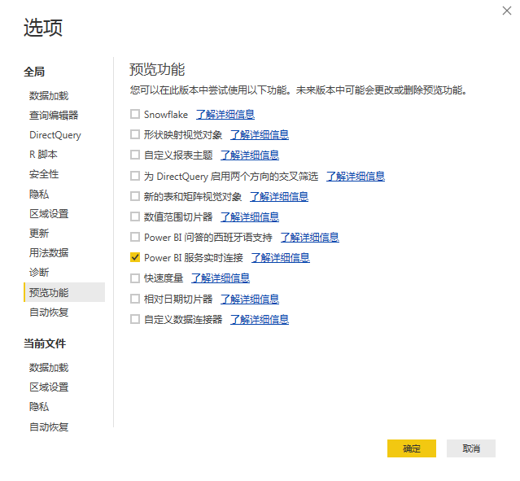

# 将已发布的资源拖入Power BI Desktop

介绍如何将 Report Builder 发布的资产提取到 Power BI Desktop

## 先决条件 {#section_BDFDAE1E300B429FB6EBCB21AD1383A0}

* 您需要安装最新的 Power BI Desktop 版本（2017 年 4 月版）
* 此过程假定您已将 Report Builder 格式的表或请求发布到 Power BI 服务。

## 过程 {#section_CB03E6E1B066457EA0F6FC08FFF5EFDD}

在 Power BI Desktop 的 2017 年 4 月更新中，Microsoft 发布了可连接到 Power BI 服务中数据集的功能。此功能允许您根据已发布到云的现有数据集创建新报表。您可以利用此功能加强团队间的协作并减少重复劳动。

1. In Power BI Desktop, go to **[!UICONTROL File]** &gt; **[!UICONTROL Options and settings]** &gt; **[!UICONTROL Options]** &gt; **[!UICONTROL Preview features.]**
1. Enable **[!UICONTROL Power BI Service Live Connection]** and click **[!UICONTROL OK]**. 

1. 重新启动 Power BI Desktop。
1. Once you have restarted the desktop, go to **[!UICONTROL Home]** &gt; **[!UICONTROL Get Data]** &gt; **[!UICONTROL More...]**.
1. Search for and select **[!UICONTROL Power BI service]**.
1. Under **[!UICONTROL Microsoft Power BI service]** &gt; **[!UICONTROL My Workspace]**, select the dataset that you had previously published from Report Builder.

有关详细信息，请参阅此 [Microsoft 博客文章](https://powerbi.microsoft.com/en-us/blog/connecting-to-datasets-in-the-power-bi-service-from-desktop/)。
