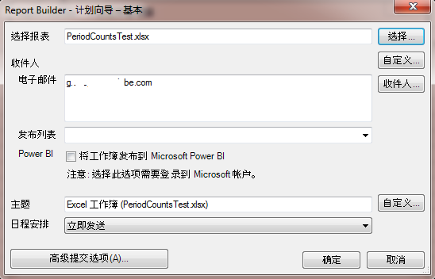
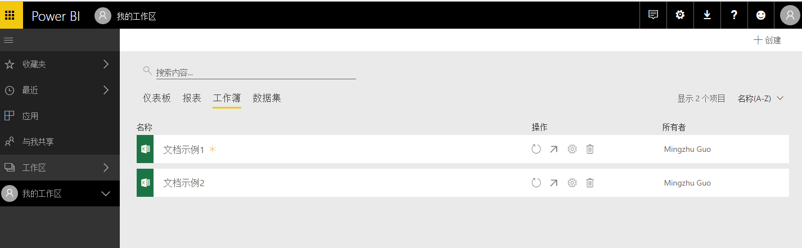
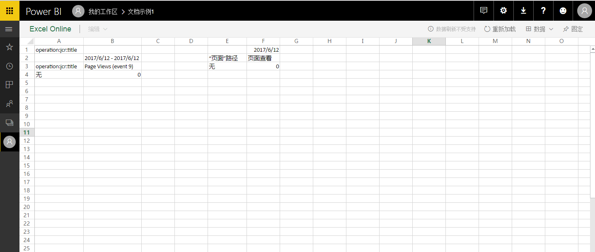
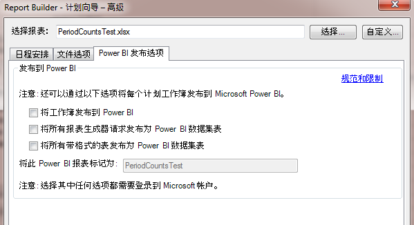
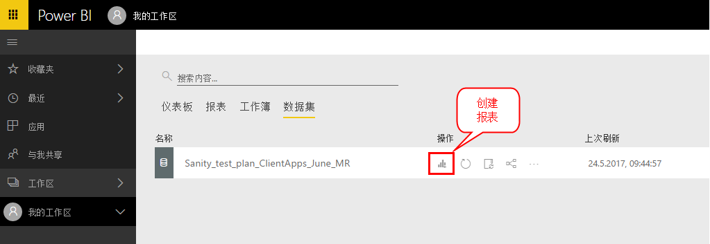
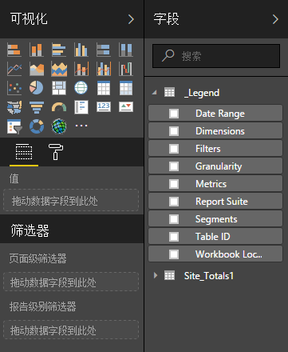
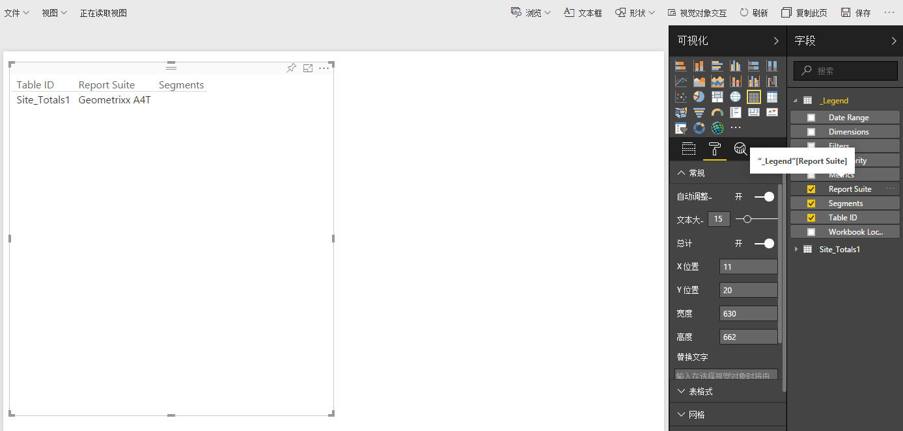
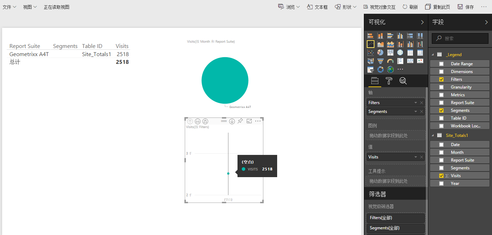
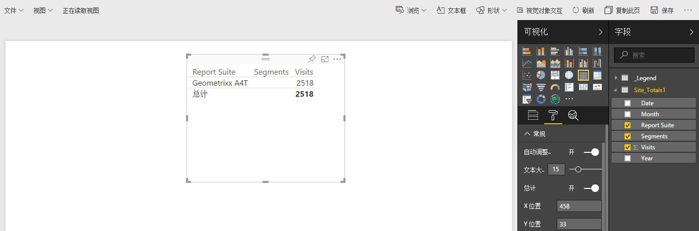
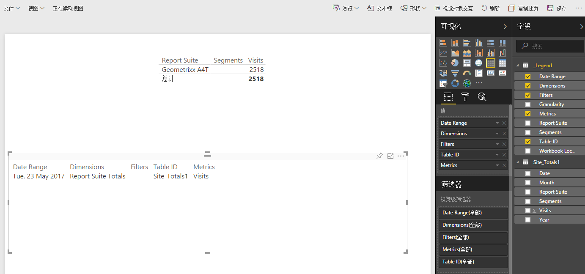

# 发布到Power BI-概述

Microsoft Power BI 是一组用来分析数据和共享分析的业务分析功能板。Adobe Analytics 与 Power BI 的集成允许您在 Microsoft Power BI 内可视化 Report Builder Analytics 数据，并在组织范围内轻松共享。

之前，您作为一名分析人员，一般通过电子邮件（或 ftp）计划待分发的 Report Builder 工作簿。现在您可以让您的业务用户利益相关方在一个基于 Web 的环境（可跨各类平台和设备访问）中，从他们的 Power BI 帐户内访问准确和最新的数据。

通过将 Report Builder 的报表生成功能与 Power BI 的可视化功能相结合，组织中的每个人都可以更加轻松地访问信息。通过 Power BI，您还可以将 Adobe Analytics 与其他数据源（如销售点、CRM）集成以发现独特的访客分析、关联和机会。

通过与 Adobe Report Builder 集成，您可以

* [将计划的 Report Builder 工作簿发布到 Power BI](../../../analyze/report-builder/whats-new-arb.md#section_21CA66229EC240D49594A9A7D3FBA687)
* [作为 Power BI 数据集表发布工作簿中所有带格式的表。](../../../analyze/report-builder/whats-new-arb.md#section_7C54A54E75184DD6BAEF4ACCE241239A)
* [作为 Power BI 数据集表发布所有 Report Builder 请求](../../../analyze/report-builder/whats-new-arb.md#section_0C26057C7DBB4068A643FDD688F6E463)

## 系统要求 {#section_0B71092D853446F38FA36447DAC0D32B}

* Adobe Report Builder 5.5 [installed](../../../analyze/report-builder/setup/t-install-arb.md#task_0CA66703882F469EB6DBD9298975D6C3)
* 有效的 Microsoft 帐户允许您登录到 Power BI

## Publish workbook to Power BI {#section_21CA66229EC240D49594A9A7D3FBA687}

计划工作簿是带格式的 Excel 电子表格，其中填充了来自 Adobe Analytics 的数据并且会按计划定期发送。

**在Report Builder中发布工作簿**

1. 在 Report Builder 中，生成并保存工作簿。
1. On the Report Builder Toolbar, click **[!UICONTROL Schedule]** &gt; **[!UICONTROL New]**.

1. In the Basic Scheduling Wizard, check the box next to **[!UICONTROL Publish Workbook to Microsoft Power BI]**.

   

1. 指定您的电子邮件并立即发送，或指定计划发布频率（每小时、每天等）。
1. 单击&#x200B;**[!UICONTROL 确定]继续。**
1. 系统随即将要求您登录到您的 Microsoft 帐户。提供您的凭据。
1. Report Builder 工作簿将被计划并发布到 Power BI。

   通过每个计划实例，在 Report Builder 计划过程已为工作簿刷新更新的 Analytics 数据之后，该工作簿将被发布到 Microsoft Power BI。

**在Power BI中查看Report Builder工作簿数据**

1. 在 Power BI 中，双击[!UICONTROL 工作簿]菜单下方的工作簿。

   

1. 现在您可以查看工作簿功能板数据。  

1. 您随后可以固定此工作簿的一个区域，以便将其包含在您的任意 Power BI 功能板中。

## Publish all formatted tables in the workbook as Power BI dataset tables {#section_7C54A54E75184DD6BAEF4ACCE241239A}

>[!NOTE]
>
>如果工作簿包含宏，则将禁用“将工作簿中的所有格式表发布为Power BI数据集表”。

您无需导入整个工作簿，只用导入工作簿内所有带格式的表的内容。

**用例：**&#x200B;您可以让一个 Excel 工作簿提取多个 Report Builder 请求中的数据并通过许多公式创建一个摘要表。您只需将此摘要表导入 Power BI 并为其创建一个可视化。

**在Report Builder中发布格式化的表**

1. 在 Report Builder 中，生成一个数据表，其中包含一个标题行，后面接有一个数据行。
1. 选择此表，然后从&#x200B;**[!UICONTROL 主页]菜单中选择**[!UICONTROL 套用表格式]。此表将得到默认命名（Table 1, Table 2 等），但是您可以在[!UICONTROL 设计]菜单中更改名称。

1. On the Report Builder Toolbar, click **[!UICONTROL Schedule]** &gt; **[!UICONTROL New]**.

1. In the Basic Scheduling Wizard, click **[!UICONTROL Advanced Scheduling Options]**.
1. In the [!UICONTROL Scheduling Wizard - Advanced], on the **[!UICONTROL Publishing Options]**tab, check the box next to **[!UICONTROL Publish all Formatted Tables as Power BI dataset tables]**.

   

1. （可选）您可以在 Power BI 中自定义已发布资产的名称。如果您在工作簿名称中使用版本控制（例如，myworkbook_v1.1.xlsx），但又不希望版本号在已发布的 Power BI 资产名称中显示，这一操作将非常有用。它的优势在于，已发布的资产不会随着版本号的更改而更改。（查看此处的[规范](../../../analyze/report-builder/c-publish-power-bi/specifications-limits.md#concept_1B6522B4D7A9482680198F125D94EEFD)。）

**查看Power BI中的表数据**

1. In Power BI, go to the **[!UICONTROL Workspaces]** &gt; **[!UICONTROL Datasets]** menu.

   

1. 选择已发布的数据集，并单击它旁边的[!UICONTROL 创建报表]图标。请注意，表将显示为字段。

   

1. 选择一个表及其关联的列。

   

1. 从[!UICONTROL 可视化]菜单中，您可以选择如何可视化 Power BI 中的表。例如，您可以选择以折线图的形式呈现您的数据：

   

1. 在这里，您可从该数据集表创建可视化。

## Publish all Report Builder requests as Power BI Dataset tables {#section_0C26057C7DBB4068A643FDD688F6E463}

您可以将所有的请求转变为数据集表并在其上构建可视化。

>[!IMPORTANT]
>
>如果工作簿包含100多个请求，则只有前100个请求将发布到Power BI。此外，对于发布到 Power BI 的每个请求，只有前 10,000 行数据将获得发布。因此，尽管这些请求将通过计划成功地提交，但发布到 Power BI 的范围却是有限的。

1. 在 Report Builder 中，通过 Report Builder 请求打开或创建一个工作簿。
1. On the Report Builder Toolbar, click **[!UICONTROL Schedule]** &gt; **[!UICONTROL New]**.

1. In the Basic Scheduling Wizard, click **[!UICONTROL Advanced Scheduling Options]**.
1. In the [!UICONTROL Scheduling Wizard - Advanced], on the **[!UICONTROL Publishing Options]**tab, check the box next to **[!UICONTROL Publish all Report Builder Requests as Power BI Dataset Tables]** 

1. Click **[!UICONTROL OK]**.

**查看Power BI中的请求数据**

每个计划的 Report Builder 请求都将作为数据集中的表发布。每个请求表均按照请求中的主要维度命名，并具有“[!UICONTROL 报表包]”和“[!UICONTROL 区段]”列。

1. In Power BI, go to the **[!UICONTROL Workspaces]** &gt; **[!UICONTROL Datasets]** menu.

1. 选择已发布的请求并单击它旁边的“[!UICONTROL 创建报表]”图标。

   请注意，请求会显示为“[!UICONTROL 字段]”菜单中的表。

   

   >[!NOTE]
   >
   >无论如何将Report Builder请求配置为在工作表上布置Report Builder请求(枢纽布局、自定义布局、某些列不可见)，Report Builder始终以相同的二维标题行格式发布请求：日期、维度、指标、报表包、区段。

1. Also notice that there is an additional table called **[!UICONTROL Legend]**. 如果有请求不属于 Report Builder 环境，则很难记住它代表的含义。图例表的目的包括，例如：显示每个请求在表 ID 下的名称。您还可以添加其他“图例”列，以全面了解请求。

   

