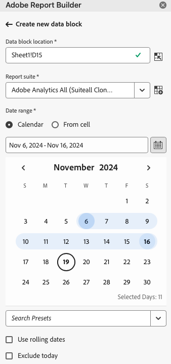
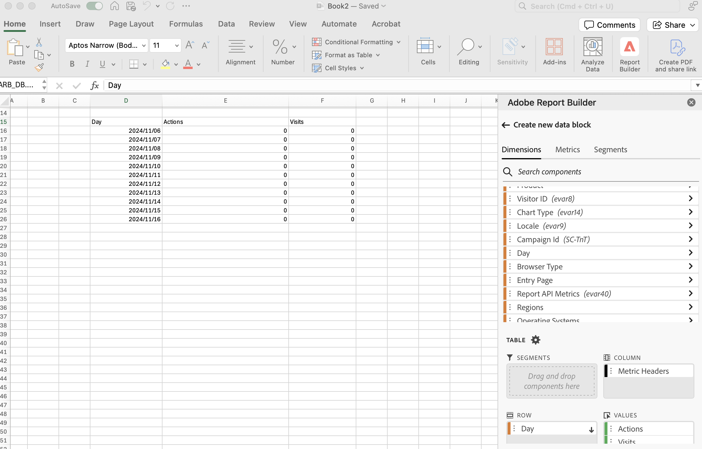

# 创建数据块

*数据块*&#x200B;是由单个数据请求创建的数据的表。Report Builder 工作簿可以包含多个数据块。创建数据块时，首先配置数据块，然后构建数据块。

## 配置数据块

为数据块位置、报表包和日期范围配置初始数据块参数。

1. 单击&#x200B;**[!UICONTROL 创建]**。

   

1. 设置&#x200B;**[!UICONTROL 数据块位置]**。

   数据块位置选项定义 Report Builder 将数据添加到工作表时的工作簿位置。

   要指定数据块位置，请选择工作表中的单个单元格，然后单击&#x200B;**[!UICONTROL 数据块位置]**&#x200B;旁边的图标：

   还可以输入单元格地址，如a3、\\\$a3、a\\\$3或sheet1！a2。 指定的单元格在检索数据时标记数据块的左上角。

1. 选择&#x200B;**报表包**。

   使用报表包选项，您可以从下拉菜单中选择报表包，或从单元格位置引用报表包。

1. 设置&#x200B;**[!UICONTROL 日期范围]**。

   您可以使用日期范围选项选择日期范围。日期范围可以固定，也可以是滚动的。有关日期范围选项的信息，请参阅[选择日期范围](select-date-range.md)。

1. 单击&#x200B;**[!UICONTROL 下一步]**。

   

   配置数据块后，您可以选择维度、量度和区段来构建数据块。 “维度”、“量度”和“筛选器”选项卡显示在表生成器窗格的上方。

## 构建数据块

要构建数据块，请选择报表组件，然后自定义版面。

1. 添加维度、量度和区段。

   滚动组件列表或使用&#x200B;**[!UICONTROL 搜索]**&#x200B;字段来查找组件。 将组件拖放到“表”窗格，或者在列表中双击组件名称以自动将组件添加到“表”窗格。

   双击组件以将其添加到表的默认部分。

   - 维度组件将添加到“行”部分，如果列中已有维度，则添加到“列”部分。
   - 日期组件将添加到“列”部分。
   - 区段组件将添加到“区段”部分。

   **开始日期为Dimension**

   将&#x200B;**[!UICONTROL 开始日期]**&#x200B;设置为维度，以清楚地标识数据块的开始日期。 如果您有一个具有滚动日期范围的定期计划报表，或者如果您有一个非常规日期范围并且需要在开始日期清除，则此功能非常有用。

   {width="30%"}

1. 在“表”窗格中排列项目以自定义数据块的版面。

   在“表”窗格中拖放组件以重新排序组件，或者右键单击组件名称并从选项菜单中选择。

   将组件添加到表时，数据块的预览显示在工作表中的“数据块”位置。在表中添加、移动或删除项目时，数据块版面的预览自动更新。

   

   **显示或隐藏行和列标题**

1. 单击&#x200B;**[!UICONTROL 表设置]**&#x200B;图标。

   {width="35%"}

1. 选中或取消选中“显示行和列标题”选项。 默认显示标题。

   **隐藏或显示维度标签和量度标题**

1. 单击维度或列标题上的省略号图标以显示设置。

   {width="35%"}

1. 单击隐藏或显示以切换维度标签或列标题。 默认显示所有标签。

1. 单击&#x200B;**[!UICONTROL 完成]**。

   在检索分析数据时将显示正在处理消息。

   Report Builder 检索数据并在工作表中显示已完成的数据块。

   
