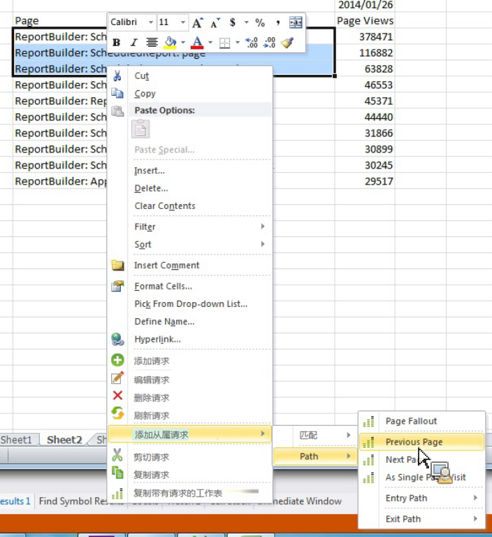

# 通过添加从属请求过滤路径报告

描述如何创建带有预定义过滤器的路径报表。

市场营销 Reports &amp; Analytics 提供了一些独立的报表，这些报表为带有预定义过滤器的顶级路径报表，例如[!UICONTROL “下一个网站区域”]和[!UICONTROL “上一个网站区域”]报表、“登入网站区域”和[!UICONTROL “退出网站区域”]报表以及[!UICONTROL “单个网站区域”]报表。

Report Builder does not offer these as standalone reports, but you can create them through the **[!UICONTROL Add dependent request]** &gt; **[!UICONTROL Path]** context menus. 下面提供了可创建的报表：

* “路径”&gt;“页面流失”
* “路径”&gt;“登入路径”
* “路径”&gt;“退出路径”
* “路径”&gt;“下一页”
* “路径”&gt;“登入路径”&gt;“下一页”
* “路径”&gt;“上一页”
* “路径”&gt;“退出路径”&gt;“上一页”
* “路径”&gt;“登入路径”&gt;“作为登入页”
* “路径”&gt;“退出路径”&gt;“作为退出页”

1. Select multiple rows from an existing request, then right-click **[!UICONTROL Add Dependent Request]** &gt; **[!UICONTROL Path]**.

   （请注意，如果您希望看到&#x200B;**[!UICONTROL 页面流失]菜单项，则必须至少选择 3 行。）**

   

1. Select the predefined filter, for example **[!UICONTROL Previous Page]**.

   此时会出现“请求向导”，其中已选定“上一页”量度。1. 继续在请求向导中调整请求并生成请求。
